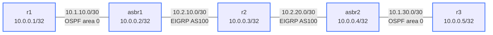

# Redistribution Tags — Loop Prevention — Practice Lab

Mutual redistribution between two protocols at *two* border routers is one
of the classic ways to melt a network: a route can bounce
OSPF→EIGRP→OSPF→EIGRP forever. The fix is route tags — stamp a route's
origin on the way in, refuse it on the way back. In this lab you build the
dual-ASBR sandwich, *create the loop on purpose*, then kill it with tags.

## Topology



Two separate OSPF area-0 domains with one EIGRP AS 100 domain between them,
joined by two ASBRs (asbr1, asbr2) that each speak both protocols.

| Node  | Loopback   | Touches            |
|-------|------------|--------------------|
| r1    | 10.0.0.1   | OSPF (left)        |
| asbr1 | 10.0.0.2   | OSPF + EIGRP       |
| r2    | 10.0.0.3   | EIGRP              |
| asbr2 | 10.0.0.4   | EIGRP + OSPF       |
| r3    | 10.0.0.5   | OSPF (right)       |

## How to use this lab

This is a **practice lab**, not a tutorial. Each task gives you an
**objective** and **hints** — your job is to produce the configuration.

- **Predict before you configure**, **open hints before the solution**,
  and **verify** routes and tags after each step.

## Deploy

```bash
./scripts/lab.sh deploy redistribution-tags
./scripts/lab.sh cli redistribution-tags r1
```

---

## Task 1 — Build the two protocol domains

**Objective:** OSPF area 0 in the left domain (r1, asbr1) and right domain
(asbr2, r3); EIGRP AS 100 across the middle (asbr1, r2, asbr2). No
redistribution yet. Success: each protocol island is internally
reachable.

<details markdown="1">
<summary>Hints</summary>

- OSPF: `router ospf` + `network ... area 0` on r1/asbr1 and asbr2/r3.
- EIGRP: `router eigrp 100` + `network` for loopback and EIGRP links on
  asbr1/r2/asbr2.
- Verify `show ip ospf neighbor` and `show ip eigrp neighbors`.

</details>

<details markdown="1">
<summary>Check your work</summary>

Each island converges, but r1 cannot yet reach r3 — the two OSPF domains
are isolated by the EIGRP core, with no route exchange between protocols.
That's the gap redistribution fills, and the trap it sets when done at two
points.

</details>

---

## Task 2 — Mutual redistribution, no tags: make the loop

**Objective:** On *both* ASBRs, redistribute EIGRP↔OSPF with plain
permit-everything route-maps, then hunt for evidence of the loop.

**Predict first:** r1's own loopback 10.0.0.1 originates in the left OSPF
domain. After dual redistribution, do you expect to see 10.0.0.1 come
*back* to asbr1 as an external/EIGRP route — i.e. the network learning
about its own prefix from the far side?

<details markdown="1">
<summary>Hints</summary>

- Permit-only maps: `route-map EIGRP-TO-OSPF permit 10` and
  `route-map OSPF-TO-EIGRP permit 10`, applied via `redistribute eigrp
  route-map ...` (under OSPF) and `redistribute ospf route-map ...`
  (under EIGRP). Same on both ASBRs.
- Look at `show ip eigrp topology` and `show ip ospf database external`
  on the ASBRs — find prefixes that should only exist on the *other*
  side coming back around.

</details>

<details markdown="1">
<summary>Solution</summary>

On **asbr1** and **asbr2** (identical):

```text
route-map EIGRP-TO-OSPF permit 10
route-map OSPF-TO-EIGRP permit 10
!
router ospf
 redistribute eigrp route-map EIGRP-TO-OSPF
router eigrp 100
 redistribute ospf route-map OSPF-TO-EIGRP
```

</details>

<details markdown="1">
<summary>Check your work</summary>

Reachability *appears* to work (r1 sees r3's prefixes), but the danger is
in the feedback: a route that originated in left-OSPF gets redistributed
into EIGRP by asbr1, picked up by asbr2, pushed into right-OSPF, and — if
nothing stops it — fed back into EIGRP and around again. You'll see
prefixes appearing as externals where they shouldn't, sometimes with
climbing metrics. With native OSPF↔OSPF the administrative distance can
mask it; with two protocols and two ASBRs the mutual redistribution has
no built-in split horizon. This is a real outage pattern, not a
curiosity.

</details>

---

## Task 3 — Fix it with origin tags

**Objective:** Replace the permit maps with tagging logic: stamp tag 100
on OSPF→EIGRP routes and tag 200 on EIGRP→OSPF routes, and on each ASBR
**deny** the opposite tag from re-crossing.

**Predict first:** write the four route-map stanzas on paper first. What
*exactly* must the EIGRP-TO-OSPF map deny, and what tag must it set?

<details markdown="1">
<summary>Hints</summary>

- Convention: tag 100 = "was OSPF, now in EIGRP"; tag 200 = "was EIGRP,
  now in OSPF."
- EIGRP-TO-OSPF: `deny` routes already tagged 100 (they started in
  OSPF — don't send them back), then `permit` + `set tag 200`.
- OSPF-TO-EIGRP: `deny` tag 200, then `permit` + `set tag 100`.
- Apply identically on both ASBRs.

</details>

<details markdown="1">
<summary>Solution</summary>

On **asbr1** and **asbr2** (identical):

```text
no route-map EIGRP-TO-OSPF permit 10
no route-map OSPF-TO-EIGRP permit 10
!
route-map EIGRP-TO-OSPF deny 10
 match tag 100
route-map EIGRP-TO-OSPF permit 20
 set tag 200
!
route-map OSPF-TO-EIGRP deny 10
 match tag 200
route-map OSPF-TO-EIGRP permit 20
 set tag 100
```

</details>

<details markdown="1">
<summary>Check your work</summary>

On r1: r3's prefixes appear as `O E2` with **tag 200**, and r1's own
10.0.0.1 no longer shows up as an external coming back around. On r3, the
mirror. `show ip ospf database external` shows the tags; `ping 10.0.0.5
source 10.0.0.1` works cleanly. The deny stanza is the whole defense: a
route carrying tag 100 means "I already entered EIGRP from OSPF once," so
the EIGRP-TO-OSPF map refuses to send it back into OSPF — breaking the
bounce regardless of which ASBR sees it. Tags are the manual split-horizon
that mutual redistribution lacks.

</details>

---

## Task 4 — Break it: forget one ASBR's tags

**Objective:** Remove the tagging maps from asbr2 only (leave asbr1
correct) and observe whether the loop returns.

**Predict first:** asbr1 still tags and filters correctly. Is one
correctly-configured ASBR enough to prevent the loop, or do both need the
logic?

<details markdown="1">
<summary>What you should observe</summary>

The loop comes back. Tag-based loop prevention only works if **every**
redistribution point honors it — asbr1 dutifully tags and denies, but
asbr2 happily re-injects whatever it sees, so the bounce path reopens
through asbr2. This is the operational lesson: redistribution policy is a
property of the *whole boundary*, not a single router. A consistent tag
scheme applied at all mutual-redistribution points (often templated
exactly to avoid this) is the only safe way. Restore asbr2's maps and
re-verify.

</details>

---

## Verification Commands

```text
show ip route                     # routing table per node
show ip ospf database external    # external LSAs with tags
show ip eigrp topology            # EIGRP topology with tags
show route-map                    # route-map hit counters
ping 10.0.0.5 source 10.0.0.1
```

---

## Challenge questions

No answers provided — reason them through.

1. Tags broke the loop, but administrative distance is the *other*
   classic tool. Explain how mismatched ADs between OSPF-external and
   EIGRP-external could create a sub-optimal path (or a different loop)
   even with tags in place, and how you'd tune AD to complement the tags.
2. A third ASBR is added to the same two domains. Does the tag 100/200
   scheme still work unchanged, or does it need extending? Reason about
   what "origin" a tag really encodes when there are three crossing
   points.
3. Without looking at config, you suspect a redistribution loop in a live
   network: metrics on certain external routes keep climbing. Describe the
   exact `show` evidence that distinguishes a redistribution loop from a
   simple flapping link.
4. OSPF carries the tag in external LSAs; EIGRP carries it in the topology
   table. What happens to your tag if a route is redistributed through a
   *third* protocol (say BGP) that didn't preserve it — and what does
   that imply about multi-protocol redistribution chains?

## Teardown

```bash
./scripts/lab.sh destroy redistribution-tags
```
