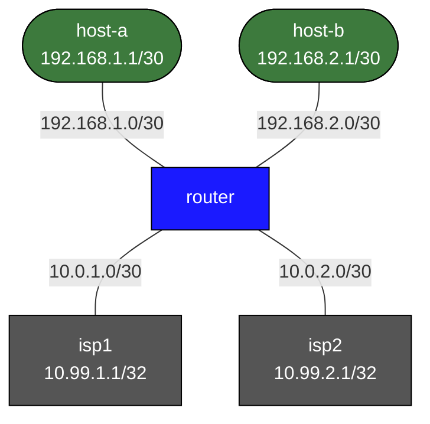

# Policy-Based Routing (PBR) — Practice Lab

The routing table forwards on destination only. PBR overrides it — routing
on *source* (or port, protocol, ToS) before the table lookup ever happens.
In this lab a router with two ISPs steers host-a's traffic out isp1 and
host-b's out isp2, to the same destinations, and you prove the routing
table never changed.

## Topology



router faces host-a on Eth1 (192.168.1.2), host-b on Eth2 (192.168.2.2),
isp1 on Eth3 (10.0.1.1), isp2 on Eth4 (10.0.2.1). Each ISP has a loopback
(10.99.1.1, 10.99.2.1) as an "internet" target.

## How to use this lab

This is a **practice lab**, not a tutorial. Each task gives you an
**objective** and **hints** — your job is to produce the configuration.

- **Predict before you configure**, **open hints before the solution**,
  and **verify** with traceroute and `show ip policy`.

## Deploy

```bash
./scripts/lab.sh deploy route-maps-pbr
./scripts/lab.sh cli route-maps-pbr router
```

---

## Task 1 — Baseline: one default route, both hosts use isp1

**Objective:** Add a default route via isp1 on the router, then traceroute
from both hosts to *isp2's* loopback (10.99.2.1) and confirm both take the
isp1 path.

**Predict first:** with only `0.0.0.0/0 → isp1`, what path will host-b's
traffic to 10.99.2.1 take — out isp1 or isp2? Why does the destination
being "isp2's address" not matter?

<details markdown="1">
<summary>Hints</summary>

- `ip route 0.0.0.0/0 10.0.1.2` on router.
- `traceroute 10.99.2.1 source 192.168.1.1` from host-a;
  `... source 192.168.2.1` from host-b.

</details>

<details markdown="1">
<summary>Check your work</summary>

Both hosts exit via isp1 (first hop 10.0.1.1) — the routing table has one
default, and destination-based forwarding sends *everything* there
regardless of source or which ISP "owns" the target address. This uniform
behavior is exactly the limitation PBR exists to break: the table can't
say "this *source* goes that way."

</details>

---

## Task 2 — Steer by source with PBR

**Objective:** Force host-a's traffic out isp1 and host-b's out isp2,
based on source subnet, applied inbound on the interfaces where each host
arrives.

**Predict first:** PBR is applied *inbound* on the ingress interface. Why
inbound and not outbound — at what point relative to the routing-table
lookup does PBR act?

<details markdown="1">
<summary>Hints</summary>

- One extended ACL per source subnet (`permit ip 192.168.1.0/30 any`,
  etc.).
- A route-map per host with `match ip address <ACL>` +
  `set ip next-hop <isp>`.
- Apply with `ip policy route-map <NAME>` on Eth1 (host-a) and Eth2
  (host-b).

</details>

<details markdown="1">
<summary>Solution</summary>

On **router**:
```text
ip access-list extended HOST-A
 permit ip 192.168.1.0/30 any
ip access-list extended HOST-B
 permit ip 192.168.2.0/30 any
!
route-map PBR-ISP1 permit 10
 match ip address HOST-A
 set ip next-hop 10.0.1.2
!
route-map PBR-ISP2 permit 10
 match ip address HOST-B
 set ip next-hop 10.0.2.2
!
interface Ethernet1
 ip policy route-map PBR-ISP1
interface Ethernet2
 ip policy route-map PBR-ISP2
```

</details>

<details markdown="1">
<summary>Check your work</summary>

host-b's traceroute to 10.99.1.1 now exits via **isp2** (first hop
10.0.2.1) even though the default still points at isp1. `show ip policy`
shows the maps bound to the interfaces, and `show route-map` shows hit
counters climbing. Prediction answer: PBR is inbound because it must
intercept the packet *before* the destination-based routing lookup —
it's a pre-lookup override on the interface where the packet arrives.
Outbound would be too late; the routing decision is already made.

</details>

---

## Task 3 — Prove the routing table is untouched

**Objective:** Show that PBR steered traffic without adding or changing a
single route.

**Predict first:** after Task 2, how many routes to host-b's ISP path are
in `show ip route` — a new one for isp2, or still just the isp1 default?

<details markdown="1">
<summary>Check your work</summary>

`show ip route` still shows only `S>* 0.0.0.0/0 via 10.0.1.2`. PBR lives
entirely outside the RIB — it forces a next-hop per-packet and the table
is none the wiser. This is the double-edged nature of PBR: invisible to
anyone reading the routing table, so it's powerful *and* a notorious
"the routes look fine but traffic goes somewhere weird" debugging trap.
`show ip policy` is the only place it shows up.

</details>

---

## Task 4 — Break it: next-hop goes dark

**Objective:** Simulate isp2 failing (shut router's Eth4, or isp2's link)
and observe what happens to host-b's PBR'd traffic. Then explore `set ip
next-hop verify` / a fallback.

**Predict first:** plain `set ip next-hop 10.0.2.2` forces that next-hop
unconditionally. If isp2 is unreachable, does host-b's traffic fall back
to the isp1 default, or get black-holed?

<details markdown="1">
<summary>What you should observe</summary>

With a plain `set ip next-hop`, host-b's traffic is **black-holed** when
isp2 dies — PBR forces the next-hop whether or not it's reachable, and
because it bypasses the RIB it never falls back to the working default.
That's the classic PBR outage. The mitigations: `set ip next-hop verify`
(use the next-hop only if it's in the routing table) or a tracked/
recursive next-hop so PBR yields to normal routing when the path fails.
Restore isp2 and, optionally, re-add the map with `verify` to confirm
fallback works. The lesson: PBR's RIB-bypass is the feature *and* the
failure mode — pair it with reachability verification in production.

</details>

---

## Reference

```text
set ip next-hop 10.0.1.2      # force this next-hop (no fallback)
set ip next-hop verify        # use only if next-hop is in the RIB
set interface Ethernet3       # force egress interface (use with care)
ip local policy route-map MAP # apply PBR to router-originated traffic too
```

```text
show ip policy        # interfaces with PBR bound
show route-map        # route-map detail + hit counters
show ip access-list   # ACL match counters
debug ip pbr          # live PBR decisions (noisy)
```

---

## Challenge questions

No answers provided — reason them through.

1. host-a's forward path now exits isp1, but the *return* traffic from a
   server on the internet could come back via either ISP. Explain how
   this asymmetry breaks a stateful firewall or NAT, and what matching
   policy you'd need where to keep flows symmetric.
2. PBR runs before the RIB lookup; that's why it can black-hole (Task 4).
   Compare PBR with simply installing more-specific static routes for the
   host subnets — what can PBR express that statics can't, and what does
   PBR give up by living outside the RIB?
3. You want only HTTPS (tcp/443) from host-a steered to isp1 and
   everything else from host-a to use normal routing. Sketch the ACL and
   route-map, and explain what happens to host-a's non-443 traffic given
   route-map fall-through semantics.
4. The router itself originates BGP/management traffic that you also want
   pinned to isp1. Interface PBR won't catch it — why, and what's the one
   command that will?

## Teardown

```bash
./scripts/lab.sh destroy route-maps-pbr
```
