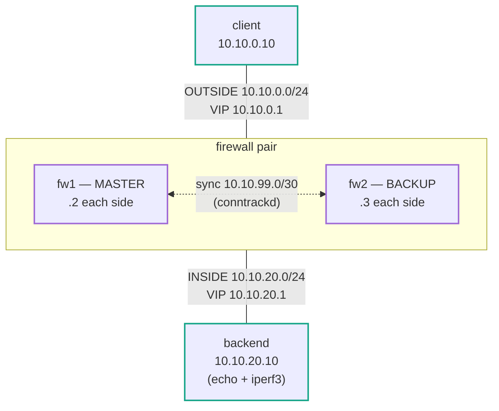

# Stateful Firewall HA — Practice Lab

A single firewall or load balancer in the traffic path is a single point of
failure, so enterprises run them in **active/backup pairs**. Two things have
to move on failover: the **address** (so clients keep sending to the same
place) and the **connection state** (so flows already in progress don't
break). keepalived handles the first with a VRRP virtual IP; **conntrackd**
handles the second by replicating the kernel's connection-tracking table to
the standby. This lab builds both and then proves why you need the second
one: a long-lived TCP flow through the pair **dies** on failover without
state sync and **survives** with it.

It's the HA answer to the single LB you built in
`load-balancer-basics` — that lab's LB
was one box; here the box is a pair, and the interesting failures are in the
handoff between them.

## Topology



### Addressing

| Segment  | Subnet          | fw1        | fw2        | VIP        | Host                |
|----------|-----------------|------------|------------|------------|---------------------|
| OUTSIDE  | 10.10.0.0/24    | .2 (eth1)  | .3 (eth1)  | 10.10.0.1  | client .10          |
| INSIDE   | 10.10.20.0/24   | .2 (eth2)  | .3 (eth2)  | 10.10.20.1 | backend .10         |
| SYNC     | 10.10.99.0/30   | .1 (eth3)  | .2 (eth3)  | —          | (direct fw1↔fw2)    |

### Node reference

| Node    | Role                                    |
|---------|-----------------------------------------|
| fw1     | firewall — default **MASTER** (prio 150)|
| fw2     | firewall — default **BACKUP** (prio 100)|
| client  | reaches the backend via the OUTSIDE VIP |
| backend | protected service (echo :9999, iperf3)  |
| outsw / insw | plain L2 bridges for the two segments |

`setup.sh` addresses every interface and sets two sysctls
(`ip_forward=1`, `nf_conntrack_tcp_loose=0`). **keepalived, the nftables
ruleset, and conntrackd are all yours to build.** The conntrackd
primary/backup glue script (`notify.sh`) is shipped as scaffolding.

## How to use this lab

This is a **practice lab**, not a tutorial. Each task gives you an
**objective** and **hints** — your job is to produce the configuration.

- **Predict before you configure.** When a task asks for a prediction,
  commit to an answer before touching the CLI. Being wrong and finding out
  why is the point.
- **Open the hints before the solution.** The solution toggle is the answer
  key — use it to check your work or when genuinely stuck, not as step one.
- **Verify like an operator.** After each task, prove the state is what you
  think it is before moving on.

## Deploy

Build the image once (`docker build -t service-ha:local
labs/service-ha/`), then:

```bash
./scripts/lab.sh deploy service-ha
```

Open a shell on the nodes (VRRP/keepalived need a real shell):

```bash
./scripts/lab.sh bash service-ha fw1
./scripts/lab.sh bash service-ha client
```

Destroy when done:

```bash
./scripts/lab.sh destroy service-ha
```

---

## Task 1 — Survey the pair (guided)

**Objective:** confirm the starting point — interfaces addressed, forwarding
on, `tcp_loose=0`, but no VIP, no firewall rules, and no HA daemons.

On fw1:

```bash
ip -4 addr show | grep 10.10
sysctl net.ipv4.ip_forward net.netfilter.nf_conntrack_tcp_loose
nft list ruleset            # docker's own tables may show; no 'fw' table yet
pgrep -a keepalived; pgrep -a conntrackd    # nothing
```

From client, try to reach the backend:

```bash
ping -c2 10.10.20.10        # fails — no VIP, so no gateway
```

<details markdown="1">
<summary>Check your work</summary>

fw1 has 10.10.0.2, 10.10.20.2, 10.10.99.1 on eth1/eth2/eth3. `ip_forward`
is 1 and `nf_conntrack_tcp_loose` is **0** (remember that number — Task 3
turns on the behavior it enables). There is no `table inet fw`, no
keepalived, no conntrackd. The client's ping fails: its default route is via
10.10.0.1, which no one owns yet. Everything that makes this a *highly
available* path, you're about to build.

</details>

## Task 2 — Float the VIPs with keepalived

**Objective:** run keepalived on both firewalls so fw1 owns both VIPs
(10.10.0.1 and 10.10.20.1) as MASTER and fw2 stands by, and the VIPs move
to fw2 when fw1 fails — atomically, both sides together.

**Predict first:** the client's gateway is a VIP on the OUTSIDE segment, but
the backend's gateway is a VIP on the INSIDE segment. Why must both VIPs
live on the **same** firewall at all times — what breaks if the outside VIP
is on fw1 and the inside VIP on fw2?

<details markdown="1">
<summary>Hints</summary>

- Two `vrrp_instance` blocks (one per interface: eth1 → 10.10.0.1,
  eth2 → 10.10.20.1), each with a `virtual_router_id`, `priority`, and
  `virtual_ipaddress`.
- Bind them together with a `vrrp_sync_group` so they fail over as a unit —
  that's the answer to the prediction.
- fw1 higher `priority` (e.g. 150) and `state MASTER`; fw2 lower (100),
  `state BACKUP`.
- Wire the group's `notify_master`/`notify_backup`/`notify_fault` to
  `/etc/conntrackd/notify.sh primary|backup|fault` now — it's harmless
  until conntrackd exists (Task 5), and saves editing this file later.
- Start it: `keepalived -f /etc/keepalived/keepalived.conf -D`.

</details>

<details markdown="1">
<summary>Solution</summary>

`/etc/keepalived/keepalived.conf` on **fw1** (`state MASTER`,
`priority 150`); on fw2 use `state BACKUP` and `priority 100`:

```text
global_defs {
    enable_script_security
    script_user root
}
vrrp_sync_group FW {
    group {
        OUTSIDE
        INSIDE
    }
    notify_master "/etc/conntrackd/notify.sh primary"
    notify_backup "/etc/conntrackd/notify.sh backup"
    notify_fault  "/etc/conntrackd/notify.sh fault"
}
vrrp_instance OUTSIDE {
    state MASTER
    interface eth1
    virtual_router_id 10
    priority 150
    advert_int 1
    virtual_ipaddress {
        10.10.0.1/24
    }
}
vrrp_instance INSIDE {
    state MASTER
    interface eth2
    virtual_router_id 20
    priority 150
    advert_int 1
    virtual_ipaddress {
        10.10.20.1/24
    }
}
```

Start on both: `keepalived -f /etc/keepalived/keepalived.conf -D`.

</details>

<details markdown="1">
<summary>Check your work</summary>

On fw1, `ip -4 addr show` lists `10.10.0.1/24` on eth1 and `10.10.20.1/24`
on eth2 as `secondary` addresses; on fw2 they're absent. `ping 10.10.20.10`
from the client now works — routed through fw1. The prediction: a stateful
firewall only works if a flow's forward and return packets pass through the
**same** box (it has to see both directions to track the connection). If the
two VIPs split across fw1/fw2, client→backend goes through one firewall and
backend→client through the other — each sees half a conversation, marks it
invalid, and drops it. The `vrrp_sync_group` exists precisely to make that
split impossible: both VIPs are always on one node.

Don't skip the failover check: `docker stop clab-service-ha-fw1` (or down
its data interfaces) and watch fw2 pick up both VIPs within ~2 s
(`ip -4 addr show` on fw2), then restore fw1. Address failover works — but
that's only half of HA, as the next tasks show.

</details>

## Task 3 — Make the firewall stateful

**Objective:** an nftables ruleset on both firewalls that forwards traffic
based on connection **state** — accept packets belonging to an established
connection, accept new connections, and **drop anything invalid**.

**Predict first:** `setup.sh` already set `nf_conntrack_tcp_loose=0`. With
that ruleset in place, what happens to a TCP packet from the *middle* of a
connection (an ACK, not a SYN) that arrives at a firewall which has **no
conntrack entry** for it? Would your answer change if `tcp_loose` were 1?

<details markdown="1">
<summary>Hints</summary>

- One `table inet fw` with a `chain forward { type filter hook forward
  priority filter; policy drop; ... }`.
- Three rules: `ct state established,related accept`, `ct state invalid
  drop`, `ct state new accept`.
- Load it: `nft -f /etc/nftables.conf`. Verify with `nft list ruleset` and
  watch counters with `nft list ruleset` after traffic.

</details>

<details markdown="1">
<summary>Solution</summary>

`/etc/nftables.conf` on both firewalls:

```text
table inet fw {
    chain forward {
        type filter hook forward priority filter; policy drop;
        ct state established,related accept
        ct state invalid drop
        ct state new accept
    }
}
```

`nft -f /etc/nftables.conf` on fw1 and fw2.

</details>

<details markdown="1">
<summary>Check your work</summary>

`ping` and a fresh TCP connection from client to backend still work — new
flows match `ct state new accept`, their subsequent packets match
`established`. The prediction is the crux of the whole lab: a mid-stream
packet with **no conntrack entry** is classified `invalid` (because
`tcp_loose=0` tells conntrack *not* to adopt connections it didn't see start)
and hits `ct state invalid drop`. If `tcp_loose` were **1**, conntrack would
happily "pick up" that orphaned packet as a brand-new established flow and
`ct state established accept` would pass it — which would completely mask the
failover problem you're about to see. `tcp_loose=0` is the honest setting for
an HA firewall, and it's exactly why state sync becomes mandatory.

</details>

## Task 4 — Watch a live flow die on failover (no state sync)

**Objective:** establish a long-lived TCP flow through the pair, fail the
active firewall, and observe the flow break — with keepalived working
perfectly. conntrackd is **not** running yet.

Start a 20-second measured flow from the client and fail fw1 partway
through:

```bash
# on backend (if not already): iperf3 -s &
# on client:
iperf3 -c 10.10.20.10 -t 20 -i 1 --forceflush
#   ...after ~8 seconds, from your host, fail the active firewall:
docker stop clab-service-ha-fw1        # or: ip link set eth1 down; eth2 down
```

**Predict first:** keepalived will move the VIPs to fw2 in ~2 s. Will the
iperf flow (a) keep going, (b) pause ~2 s then resume, or (c) go to zero and
stay there? Commit before you run it.

<details markdown="1">
<summary>Hints</summary>

- Watch the per-second `iperf3` bitrate around the failover moment.
- After the VIPs move, check fw2: does it have a conntrack entry for the
  flow? `conntrack -L | grep 5201`.
- The flow's packets are now arriving at fw2 mid-stream. Re-read your Task 3
  prediction.

</details>

<details markdown="1">
<summary>Check your work</summary>

The flow runs at full rate until the failover, then drops to **0.00
bits/sec and stays there** for the rest of the test — answer (c). Verified
output around the failover at t≈8:

```text
[  5]   7.00-8.00   sec  1.97 GBytes  16.9 Gbits/sec    0
[  5]   8.00-9.00   sec   565 MBytes  4.73 Gbits/sec    2   9.23 KBytes
[  5]   9.00-10.00  sec  0.00 Bytes  0.00 bits/sec      1   9.23 KBytes
[  5]  10.00-11.01  sec  0.00 Bytes  0.00 bits/sec      0   9.23 KBytes
```

keepalived did its job — fw2 owns the VIPs and `ping` to the backend works,
so a *new* connection would succeed. But fw2 has **no conntrack entry** for
the flow that fw1 was carrying, so every in-flight packet is `invalid` and
dropped (Task 3). The client's TCP just retransmits into a black hole; the
congestion window collapses to one segment and never recovers. **This is the
failure the rest of the lab fixes:** the address moved, the state didn't.
Restore fw1 (`docker start clab-service-ha-fw1`, then re-run its `setup.sh`
sysctls/keepalived if you stopped the container — or simply bring its
interfaces back up if you used the `ip link` method).

</details>

## Task 5 — Sync the state with conntrackd, and watch the flow survive

**Objective:** run conntrackd on both firewalls so the kernel's
connection-tracking table is replicated to the standby over the sync link.
Then repeat the failover — the flow should survive.

**Predict first:** conntrackd keeps a replicated copy of fw1's flows in an
"external cache" on fw2. When fw2 becomes MASTER, something has to move
those entries into fw2's *kernel* so its forwarding path accepts the
in-flight packets. What runs that step, and when?

<details markdown="1">
<summary>Hints</summary>

- conntrackd config (`/etc/conntrackd/conntrackd.conf`): a `Sync { Mode
  FTFW }` block with a `Multicast` section bound to the **sync** interface
  (eth3) and this node's sync IP (10.10.99.1 / 10.10.99.2), plus a
  `General` block with a `Filter From Userspace { Protocol Accept { TCP } }`.
- Start it *before* keepalived so the master-transition can prime it:
  `conntrackd -d`.
- The commit-on-takeover step is already written for you — it's the
  `primary` case in `notify.sh` (`conntrackd -c`), which the keepalived
  `notify_master` you wired in Task 2 calls. That's the answer to the
  prediction.
- Inspect the caches: `conntrackd -i` (internal, this node's own flows),
  `conntrackd -e` (external, replicated from the peer).

</details>

<details markdown="1">
<summary>Solution</summary>

`/etc/conntrackd/conntrackd.conf` — on fw1 use `IPv4_interface 10.10.99.1`,
on fw2 `10.10.99.2`:

```text
Sync {
    Mode FTFW { }
    Multicast {
        IPv4_address 225.0.0.50
        Group 3780
        IPv4_interface 10.10.99.1
        Interface eth3
        SndSocketBuffer 1249280
        RcvSocketBuffer 1249280
        Checksum on
    }
}
General {
    Systemd off
    HashSize 32768
    HashLimit 131072
    Syslog on
    LockFile /var/lock/conntrack.lock
    UNIX { Path /var/run/conntrackd.ctl }
    NetlinkBufferSize 2097152
    NetlinkBufferSizeMaxGrowth 8388608
    Filter From Userspace {
        Protocol Accept { TCP }
        Address Ignore { IPv4_address 127.0.0.1 }
    }
}
```

Start conntrackd on both (`conntrackd -d`), then (re)start keepalived so the
master fires `notify_master` → `notify.sh primary` and primes the sync.

</details>

<details markdown="1">
<summary>Check your work</summary>

With a fresh flow running (`iperf3 ... -t 20`), check the standby **before**
failing over: `conntrackd -e` on fw2 shows the flow (port 5201) in its
external cache — replicated live over eth3. Now fail fw1 again and watch the
client's iperf:

```text
[  5]   7.00-8.00   sec  2.00 GBytes  17.2 Gbits/sec    0
[  5]   8.00-9.01   sec   996 MBytes  8.31 Gbits/sec    1   9.23 KBytes
[  5]  10.00-11.00  sec  0.00 Bytes  0.00 bits/sec      0   9.23 KBytes
[  5]  11.00-12.00  sec   698 MBytes  5.86 Gbits/sec   92    618 KBytes
[  5]  12.00-13.00  sec  1.98 GBytes  17.0 Gbits/sec    0    738 KBytes
```

A ~2 s dip during the VRRP transition, then the flow **recovers to full
throughput** — the same failover that killed it in Task 4. The mechanism,
answering the prediction: conntrackd replicated the flow to fw2's external
cache continuously; when fw2 became MASTER, keepalived's `notify_master` ran
`notify.sh primary`, whose `conntrackd -c` **committed** the external cache
into fw2's kernel conntrack table. So when the in-flight packets arrived,
fw2 already had an `established` entry for them and forwarded them instead of
dropping them. Address *and* state moved together — that is stateful HA.

Run `./labs/service-ha/check.sh` from the host to confirm the full end
state (it runs the failover survival test automatically and restores fw1).

</details>

---

## Verification

End state, all asserted by `./labs/service-ha/check.sh`:

- [ ] All six containers running
- [ ] fw1 is MASTER (holds both VIPs); fw2 is BACKUP (holds neither)
- [ ] fw1's nftables forward chain drops `invalid`; `tcp_loose=0`
- [ ] conntrackd is running on both firewalls
- [ ] The client reaches the backend through the active firewall
- [ ] A live flow on fw1 is replicated into fw2's conntrackd external cache
- [ ] The flow **survives** a fw1 failover (post-failover throughput > 0)

## Challenge questions

No answers provided — argue them from what you built.

1. In Task 4 the flow went to `0.00 bits/sec` rather than getting a TCP
   RST. Explain the difference an application sees between "connection reset"
   and "packets silently dropped," and why the silent-drop failure mode of a
   stateful firewall is *worse* for a client than an outright reset.
2. `tcp_loose=0` is what makes the orphaned flow `invalid`. A colleague
   proposes "just set `tcp_loose=1` so failover always works without
   conntrackd." What does that actually trade away — what class of attack or
   misrouting does adopting mid-stream flows re-open?
3. conntrackd here syncs over a dedicated link (eth3). What happens to the
   pair if *only* the sync link fails but both firewalls stay up — and how
   does `vrrp_sync_group` plus VRRP on the data interfaces keep that from
   becoming split-brain? What would split-brain look like for the backend?
4. This design is a routed stateful firewall (no NAT). Add SNAT on the way
   to the backend and re-reason the failover: what *extra* state must
   conntrackd carry for an in-flight NATed flow to survive, and why is
   getting that wrong worse than the no-NAT case?
5. Compare this pair's failover with the anycast approach in
   `anycast-dns` and the ECMP approach in
   `k8s-fabric`. For a *stateful* service, why
   can't you just anycast/ECMP the VIP across both firewalls and skip VRRP
   entirely — what does active/backup give you that active/active can't,
   without a lot more machinery?

## Troubleshooting

| Symptom | Cause | Fix |
|---------|-------|-----|
| No VIP on either firewall | keepalived not started, or config syntax error | `keepalived -f ... -n` in the foreground to see parse errors; check `virtual_router_id` is unique per instance |
| Both firewalls claim the VIP (split-brain) | VRRP adverts not reaching the peer (different `virtual_router_id`, or the bridge blocking multicast) | Match VRIDs; confirm fw1/fw2 are on the same segment; `tcpdump -ni eth1 vrrp` |
| VIP fails over but `ping` still breaks after | The two VIPs split across nodes (no `vrrp_sync_group`) → asymmetric path | Put both instances in one sync group so they move together |
| Flow dies on failover even with conntrackd running | Flow started *before* conntrackd; or `notify_master` not wired; or the sync filter drops it | Start conntrackd *before* the flow; verify `conntrackd -e` on the standby shows the flow; check keepalived `notify_master` → `notify.sh primary` |
| `conntrackd` warns `getprotobyname() cannot find protocol 'tcp'` | `/etc/protocols` missing (no `netbase`) so the TCP filter can't resolve | The lab image ships `netbase`; if you rebuilt, keep it |
| Failover works but the flow *pauses* several seconds | Normal — VRRP `advert_int` + TCP recovery; lower `advert_int` or use BFD-style tuning to shrink it | Expected; the point is survival, not zero-loss |

## Extensions

- Replace `docker stop` with a `vrrp_script` health check (e.g. track the
  backend's reachability or an interface) so the pair fails over on a
  *service* fault, not just a node death — and watch a flapping check cause
  a flapping VIP.
- Add SNAT (challenge question 4) and confirm the NAT conntrack state
  replicates and the flow still survives.
- Shrink the failover gap: drop `advert_int` to sub-second and measure the
  new dip in the iperf trace; find where the floor is and what sets it.
- Break the sync link mid-flow (`ip link set eth3 down` on fw1) and then
  fail over — quantify how stale the standby's state gets and what that
  means for very long-lived flows.
