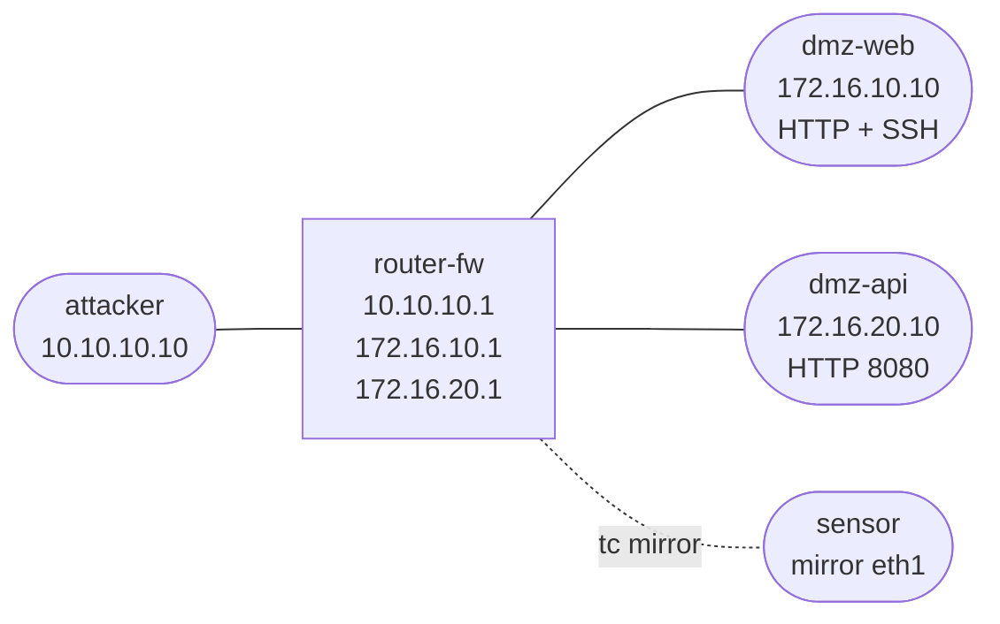

# soc-dmz-foundation — DMZ Visibility Foundation

Build the shared DMZ/SOC topology used by the Security Infrastructure track. The lab focuses on routed segmentation, high-value DMZ services, and a mirror feed into a sensor.

## Topology



## Build And Deploy

```bash
docker build -t soc-endpoint:local images/soc-endpoint/
docker build -t soc-sensor:local images/soc-sensor/
docker build -t soc-attacker:local images/soc-attacker/

./scripts/lab.sh deploy soc-dmz-foundation
./scripts/lab.sh check soc-dmz-foundation
```

## What Is Prebuilt

- `attacker` can route to both DMZ hosts through `router-fw`.
- `dmz-web` serves HTTP on `172.16.10.10:80` and SSH on TCP 22.
- `dmz-api` serves HTTP on `172.16.20.10:8080`.
- `router-fw` mirrors ingress traffic from attacker and DMZ interfaces to `sensor:eth1`.
- `sensor` has deterministic SOC artifacts under `/var/log/zeek`, `/var/log/suricata`, `/var/log/yara`, and `/var/log/soc`.

## Workflow

Generate baseline traffic:

```bash
docker exec clab-soc-dmz-foundation-attacker /opt/soc-lab/run-attack-sequence.sh
```

Watch mirrored frames:

```bash
docker exec clab-soc-dmz-foundation-sensor tcpdump -ni eth1 -c 20
```

Verify service reachability:

```bash
docker exec clab-soc-dmz-foundation-attacker curl -s http://172.16.10.10/
docker exec clab-soc-dmz-foundation-attacker curl -s http://172.16.20.10:8080/
```

## Outcome

You have a repeatable DMZ topology with a working sensor mirror. Later labs reuse the same design and add Zeek, Suricata, YARA, SIEM, packet search, threat intel, and case workflow layers.
