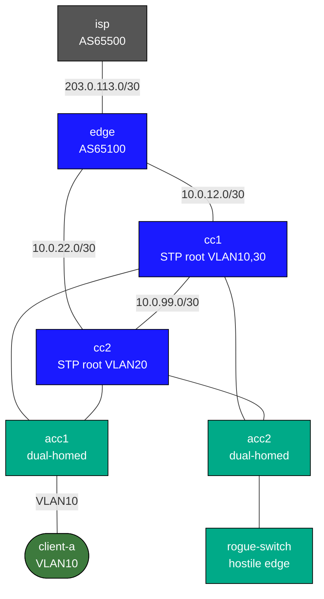

# STP Operations Lab

This is a focused Layer 2 campus lab for spanning-tree operations and failure handling.

## Deploy

```bash
sudo containerlab deploy -t labs/stp-operations/topology.clab.yml
```

## How to use this lab

This is a **practice lab**, not a tutorial. The foundation is pre-built;
you produce the configuration from the objectives. **Predict each result
before you verify**, use the success criteria to grade yourself, and treat
the break-it steps and challenge questions as the real test.

## Topology



## What Is Different Here

Unlike the other campus labs, `acc1` and `acc2` are dual-homed to `cc1` and `cc2`, so STP has a real redundant Layer 2 topology to control.

Nodes to focus on:

- `cc1`, `cc2`: collapsed-core pair
- `acc1`, `acc2`: dual-homed access switches
- `client-a`: legitimate edge host
- `rogue-switch`: unexpected switch connected at the edge

## What You Configure

- root and secondary-root placement
- PortFast on true host ports only
- BPDU Guard on edge ports
- Root Guard where you want to reject a superior root
- trunk consistency checks and VLAN pruning awareness

## Exercises

### 1. Understand the Existing Tree

```text
show spanning-tree
show spanning-tree vlan 10
show spanning-tree blockedports
```

### 2. Move the Root Intentionally

Change the root for VLAN 10 between `cc1` and `cc2` and watch which uplink blocks on `acc1` and `acc2`.

### 3. Protect Host Ports

Treat `acc2 Ethernet3` as a user-facing port. Configure PortFast plus BPDU Guard. The goal is to ensure a switch never stays safely connected on a host port.

### 4. Use Root Guard

Decide where a superior root must never appear and apply Root Guard there. Then use `rogue-switch` as the “bad actor” side of the design.

### 5. Break a Trunk Deliberately

Create an allowed-VLAN mismatch and explain the symptoms with:

```text
show interfaces trunk
show spanning-tree inconsistentports
show logging last 20
```

## Verification

```text
show spanning-tree
show spanning-tree vlan 10 detail
show spanning-tree blockedports
show spanning-tree inconsistentports
show interfaces trunk
show logging last 20
```

From the host:

```bash
docker exec clab-stp-operations-client-a ping -c 3 10.10.10.1
```

## What This Lab Teaches

- STP is about enforcing design intent, not just preventing loops
- the useful operational questions are: who is root, which uplink is blocked, and which edge ports must never accept BPDUs

## Challenge questions

No answers provided — reason them through.

1. Root bridge election is by lowest bridge ID. Walk through how you'd force
   a *specific* switch to be root deterministically, and why leaving it to
   default MACs is an operational hazard.
2. RSTP converges far faster than classic STP. What roles/states did RSTP
   add or remove to achieve that, and what's the role of edge (portfast)
   ports?
3. A link flaps repeatedly. Trace what STP does on each flap and why
   topology-change notifications can briefly disrupt unrelated VLANs.
4. Per-VLAN STP lets different VLANs have different roots. Explain how that
   enables load-sharing across redundant uplinks, and the failure if two
   switches disagree on a VLAN's root.
