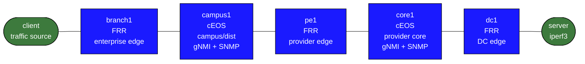

# telemetry-monitoring-hybrid

This lab is a small but realistic network monitoring practicum. It is built to run on a laptop, but it is opinionated enough to teach how a network engineer actually uses monitoring platforms:

- onboard devices into a classic NMS
- configure routers for SNMP, telemetry, LLDP, and syslog
- compare inventory/polling against streaming telemetry
- correlate faults across Grafana, Prometheus, OpenNMS, and logs

The lab has one main path: `full`.

## What This Lab Is For

This is not meant to be a router configuration grind. Routing is already there. The useful work is the management plane:

- getting devices under management
- deciding what the NMS should watch
- configuring telemetry targets
- making topology and logs visible
- learning which tool answers which question best

Think of the tools this way:

- OpenNMS: discovery, node inventory, interfaces, polling, outages, events, long-lived operational state
- Prometheus: raw time-series storage and query engine
- Grafana: dashboards and rapid visual confirmation
- gNMIc: collector that turns gNMI telemetry into Prometheus metrics
- syslog collector: device-generated event context

## How to use this lab

This is a **practice lab**, not a tutorial. The environment is pre-built;
you produce the configuration or the diagnosis from the objectives.
**Predict each result before you verify**, and treat the challenge
questions as the real test.

## Topology



Roles:

- `branch1`: enterprise edge
- `campus1`: campus/distribution and telemetry-capable edge
- `pe1`: provider edge
- `core1`: provider/core and telemetry-capable core
- `dc1`: data-center edge
- `client`: traffic source
- `server`: traffic sink and `iperf3` server

Management stack:

- `gnmic`
- `prometheus`
- `grafana`
- `syslog`
- `postgres`
- `opennms`

Why this shape:

- FRR/Linux keeps the footprint small
- two cEOS nodes provide more realistic network management features without overrunning the laptop
- one end-to-end path is enough to teach inventory, telemetry, alerts, and failure drills

## What Is Prebuilt

Prebuilt network state:

- client to server routing via OSPF
- FRR nodes already forwarding and exporting SNMP
- FRR nodes already advertising LLDP
- `server` already running `iperf3`

Intentionally left for you:

- SNMP on `campus1` and `core1`
- gNMI on `campus1` and `core1`
- LLDP on `campus1` and `core1`
- syslog export on `campus1` and `core1`
- OpenNMS discovery ranges and credentials
- OpenNMS inventory organization and surveillance views
- Grafana query interpretation and dashboard extension

That split is deliberate. This is a monitoring lab, not just a prewired demo.

## Build

```bash
docker build -t telemetry-lab:local labs/telemetry-monitoring-hybrid/
```

## Deploy

```bash
./scripts/lab.sh deploy telemetry-monitoring-hybrid
```

OpenNMS takes a little longer than the rest of the stack on first boot.

## Access

From the lab host:

- Grafana: `http://127.0.0.1:3000`
- Prometheus: `http://127.0.0.1:9090`
- OpenNMS: `http://127.0.0.1:8980/opennms`

Credentials:

- Grafana: `admin` / `admin`
- OpenNMS: `admin` / `admin`
- cEOS: `admin` / `admin`

From another machine, use SSH port forwarding:

```bash
ssh -L 3000:127.0.0.1:3000 -L 9090:127.0.0.1:9090 -L 8980:127.0.0.1:8980 joe@LAB_HOST
```

## Useful Helper Scripts

The main path is through the products, not the scripts. The scripts are there to reduce friction during drills.

- `scripts/scenario-status.sh`
- `scripts/traffic-start.sh 30`
- `scripts/link-down-campus-pe.sh`
- `scripts/link-up-campus-pe.sh`
- `scripts/opennms-summary.sh`
- `scripts/prom-query.sh 'up{job="gnmic"}'`
- `scripts/check-discovery.sh`
- `scripts/check-campus1.sh`
- `scripts/check-core1.sh`
- `scripts/syslog-summary.sh`
- `scripts/restart-gnmic.sh`
- `scripts/ceos-cli.sh campus1`
- `scripts/ceos-cli.sh core1`

## Lab Workflow

Use the lab in this order:

1. Bring the lab up and confirm basic reachability.
2. Configure management features on `campus1` and `core1`.
3. Discover the routed nodes in OpenNMS.
4. Make SNMP useful in OpenNMS.
5. Explore telemetry in Prometheus and Grafana.
6. Generate traffic and investigate it.
7. Trigger a failure and compare telemetry, logs, and NMS state.
8. Organize inventory and build a critical-path operator view.

## 1. Baseline Checks

Run:

```bash
cd labs/telemetry-monitoring-hybrid
./scripts/scenario-status.sh
```

What to expect:

- all containers running
- `client -> server` ping succeeds
- Prometheus can scrape `gnmic`
- telemetry may be thin until you enable gNMI on both EOS nodes

OpenNMS expectation at this stage:

- only the self-monitoring localhost node is present

Verify:

```bash
./scripts/check-discovery.sh
```

You should see the routed lab nodes reported as missing. That is correct at this point.

## 2. Configure The EOS Devices For Management

Use:

```bash
./scripts/ceos-cli.sh campus1
./scripts/ceos-cli.sh core1
```

### Configure `campus1`

<details markdown="1">
<summary>Show configuration</summary>

Apply this in the `campus1` CLI:

```text
enable
configure
snmp-server community public ro
snmp-server location telemetry-monitoring-hybrid
management api gnmi
   transport grpc default
      no ssl profile
      no shutdown
lldp run
interface Ethernet1
   lldp transmit
   lldp receive
interface Ethernet2
   lldp transmit
   lldp receive
logging host 172.31.30.34
logging local-interface Management0
end
copy running-config startup-config
```
</details>

### Configure `core1`

<details markdown="1">
<summary>Show configuration</summary>

Apply this in the `core1` CLI:

```text
enable
configure
snmp-server community public ro
snmp-server location telemetry-monitoring-hybrid
management api gnmi
   transport grpc default
      no ssl profile
      no shutdown
lldp run
interface Ethernet1
   lldp transmit
   lldp receive
interface Ethernet2
   lldp transmit
   lldp receive
logging host 172.31.30.34
logging local-interface Management0
end
copy running-config startup-config
```

What you are learning:

- NMS and telemetry platforms depend on device-side configuration
- not all visibility appears by magic
- syslog, SNMP, LLDP, and telemetry are separate management features

Quick checks:

```bash
./scripts/restart-gnmic.sh
./scripts/prom-query.sh 'count by (target) (interfaces_interface_state_counters_in_octets{interface_name=~"Ethernet.*"})'
./scripts/syslog-summary.sh
```

Expected result:

- after the collector restart, Prometheus begins showing Ethernet counters for `campus1` and `core1`
- syslog files for the EOS nodes appear after they generate messages

</details>

## 3. Discover The Network In OpenNMS

OpenNMS does not pre-import the routed nodes. You onboard them yourself.

In OpenNMS:

1. Go to the discovery configuration area.
2. Add the routed management addresses:
   - `172.31.30.11`
   - `172.31.30.12`
   - `172.31.30.13`
   - `172.31.30.14`
   - `172.31.30.15`
3. Trigger discovery or wait for the discovery cycle.

Verify:

```bash
./scripts/check-discovery.sh
```

What you are learning:

- discovery starts with scope
- the NMS only sees what you tell it to scan

## 4. Make SNMP Useful

In OpenNMS:

1. Add the SNMP community `public`.
2. Associate it with the discovered nodes.
3. Rescan `campus1` and `core1` after you configured SNMP on them.

Verify:

```bash
./scripts/check-campus1.sh
./scripts/check-core1.sh
```

What to look for in the UI:

- node detail page
- IP interfaces
- SNMP interfaces
- system identity and metadata

What you are learning:

- reachability gives you a node
- SNMP gives you usable network inventory

## 5. Explore Telemetry

Start with Prometheus before Grafana:

```bash
./scripts/prom-query.sh 'up{job="gnmic"}'
./scripts/prom-query.sh 'sum by (target) (rate(interfaces_interface_state_counters_in_octets{target=~"campus1|core1",interface_name=~"Ethernet.*"}[1m])) * 8'
```

Then open Grafana:

- `Telemetry Overview`
- `Traffic Investigation`
- `Failure Drill`

What each dashboard is for:

- `Telemetry Overview`: quick health and “do I have live metrics from the targets I expect?”
- `Traffic Investigation`: drill into traffic across `campus1` and `core1`
- `Failure Drill`: confirm what changed immediately during a fault

What you are learning:

- Prometheus is query-first
- Grafana is interpretation-first
- telemetry is strongest for fast-moving behavior

## 6. Generate Traffic

Run:

```bash
./scripts/traffic-start.sh 30
```

Then in Grafana:

1. Open `Traffic Investigation`.
2. Set the time range to `Last 15 minutes`.
3. Compare:
   - `Campus1 Per-Interface Ingress`
   - `Core1 Per-Interface Ingress`
   - `Aggregate Path Rate By Telemetry Target`

Questions to answer:

- Which interface on `campus1` is carrying the traffic?
- Which interface on `core1` is carrying the traffic?
- Does the traffic appear on both devices as expected?
- Which view is more useful for “what is happening right now?”: OpenNMS or Grafana?

What you are learning:

- counters become operationally useful after `rate()`
- labels such as `target` and `interface_name` are how you slice telemetry data

## 7. Trigger A Failure

Run:

```bash
./scripts/link-down-campus-pe.sh
```

While the link is down:

- refresh `Failure Drill` in Grafana
- inspect OpenNMS node detail, interfaces, events, and outages
- inspect logs:

```bash
./scripts/syslog-summary.sh
```

Restore:

```bash
./scripts/link-up-campus-pe.sh
```

Questions to answer:

- Which signal changed first?
- Which tool was best for immediate confirmation?
- Which tool gave the most durable record of the incident?
- Did you see a log, a metric change, an OpenNMS event, or all three?

What you are learning:

- telemetry is fast symptom confirmation
- syslog gives device-side event context
- OpenNMS gives node/service/interface state and history

## 8. Organize OpenNMS For Operations

OpenNMS becomes much more useful after you shape the inventory.

Create categories such as:

- `branch`
- `campus`
- `pe`
- `core`
- `datacenter`
- `telemetry-native`

Assign:

- `branch1` -> `branch`
- `campus1` -> `campus`, `telemetry-native`
- `pe1` -> `pe`
- `core1` -> `core`, `telemetry-native`
- `dc1` -> `datacenter`

Then create a critical-path operational view around:

- `branch1`
- `campus1`
- `pe1`
- `core1`
- `dc1`

What you are learning:

- a real NMS is shaped for operators
- raw discovery is not the same as usable operations views

## 9. Topology Learning

This lab includes LLDP on the FRR nodes and asks you to enable it on both EOS nodes.

The important lesson is not “the map is always perfect.” The important lesson is:

- topology systems infer links from management data
- if LLDP is not enabled or not collected, the topology view will be sparse
- discovery and topology are related, but they are not the same feature

Use this lab to ask:

- did OpenNMS learn the nodes?
- did it learn useful interfaces?
- did LLDP make the topology story better?

If topology feels incomplete, that is still instructive. Real systems often have partial topology because the input data is partial.

## Suggested Exercises

### Exercise A: Discovery First

Goal:

- learn how an NMS goes from empty to useful

Do:

- deploy the lab
- configure SNMP on both EOS nodes
- add discovery scope in OpenNMS
- verify nodes appear

### Exercise B: Inventory Quality

Goal:

- learn what SNMP changes in the NMS

Do:

- compare `campus1` before and after SNMP credential setup
- inspect interfaces and metadata

### Exercise C: Real-Time Traffic Question

Goal:

- answer “where is the traffic right now?”

Do:

- run `./scripts/traffic-start.sh 30`
- use `Traffic Investigation`
- verify your understanding with a Prometheus query

### Exercise D: Fault Correlation

Goal:

- compare telemetry, logs, and NMS state for the same failure

Do:

- run `./scripts/link-down-campus-pe.sh`
- inspect Grafana
- inspect `./scripts/syslog-summary.sh`
- inspect OpenNMS events and outages
- restore with `./scripts/link-up-campus-pe.sh`

## Residual Limitations

- The lab is deliberately small; it teaches workflows, not scale.
- The telemetry pipeline is built around interface ingress counters because that path is stable in this environment.
- OpenNMS topology learning is educational here, but not guaranteed to be perfect or fully mapped on first boot.
- OpenNMS is stronger in this lab for node/interface/service thinking than for polished topology visualization.

## Fast Reset

```bash
./scripts/lab.sh destroy telemetry-monitoring-hybrid
docker build -t telemetry-lab:local labs/telemetry-monitoring-hybrid/
./scripts/lab.sh deploy telemetry-monitoring-hybrid
```

## Challenge questions

No answers provided — reason them through.

1. Streaming telemetry vs. SNMP polling: compare them on latency,
   granularity, and load on the device. Give a failure that streaming
   catches in seconds and polling misses for a minute.
2. This lab is "hybrid" — multiple collection methods. Why not standardize
   on one, and what does each method uniquely see?
3. A dashboard shows green but users complain. Walk through how metric
   choice, aggregation interval, and alert thresholds can all hide a real
   problem, and how you'd close each gap.
4. Design the three or four alerts you'd actually page on for this topology
   (vs. merely record), and justify why each is symptom-of-user-impact, not
   just a raw counter.

## Extensions

These are optional follow-on ideas to deepen the lab. They are not part of the validated base workflow.

- Tune alert thresholds and polling intervals, then compare how quickly OpenNMS and Prometheus surface the same fault.
- Capture one failure event through SNMP, streaming telemetry, and syslog, then document which tool gives the fastest and richest answer.
- Add your own Grafana panel for interface or path health instead of relying only on the seeded dashboards.
- Trigger a short flap and then a sustained outage to compare how logs, event history, and time-series data differ.
