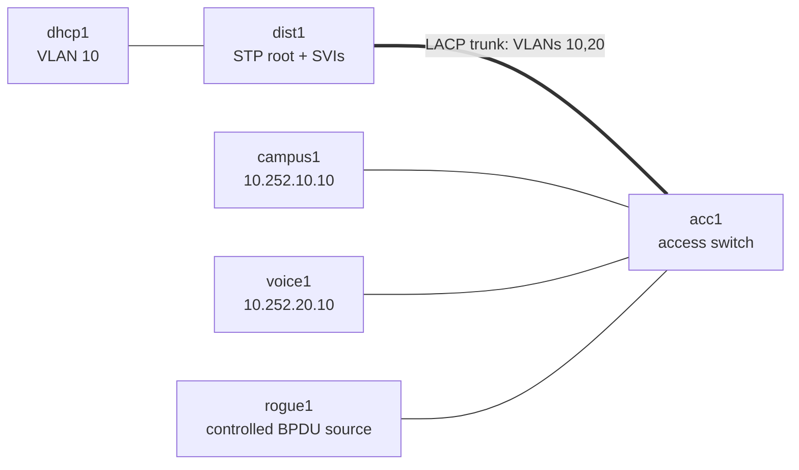

# Campus Troubleshooting Range — Proctored Assessment Lab

This standalone assessment range covers the evidence patterns that matter in a
real campus: redundant Layer 2 forwarding, root-bridge intent, edge protection,
VLAN reachability, and DHCP trust boundaries. It is deliberately deployed
separately from the enterprise and advanced-edge ranges.

## Topology



`dist1` is the RSTP root for corporate VLAN 10 and voice VLAN 20. Its SVI
addresses are `10.252.10.1` and `10.252.20.1`. The LACP bundle between the
distribution and access switches carries both VLANs.

## Ticket catalog

| Tier | Ticket | Domain | Time band |
|---|---|---|---:|
| T1 | Protected meeting-room port goes offline | BPDU Guard / errdisable | 15 min |
| T2 | Campus root bridge changed unexpectedly | STP root intent | 35 min |
| T2 | Campus uplink redundancy is degraded | LACP member consistency | 35 min |
| T2 | Voice endpoints cannot reach their gateway | Trunk VLAN allowance | 35 min |

## Assessment workflow

```bash
./range.sh deploy
./range.sh status
./range.sh start --tier 2
./range.sh verify
./range.sh reset
```

The proctor starts a symptom-only ticket. Engineers investigate with normal
EOS and Linux operational commands, make the smallest defensible repair, and
provide evidence from the affected endpoint and the switching control plane.
Do not inspect `scenarios/*/rubric.md` during an assessment.

## Known-good behavior

- Both LACP members are bundled on each switch.
- `dist1` is root for VLAN 10 and VLAN 20.
- Corporate and voice endpoints reach their own gateway and each other.
- The protected edge is not errdisabled.
- `dhcp1` is running the authorized DHCP service for VLAN 10.

DHCP-snooping/DAI, first-hop redundancy, and storm-scale tickets remain in the
Wave B roadmap. The current cEOS image exposes DHCP-snooping configuration but
does not make it operational or support the required per-interface trust
control; it also has no usable VRRP/HSRP interface mode. Those incidents are
intentionally not represented as live tickets until a capable image or a
dedicated Linux high-availability range is available.
