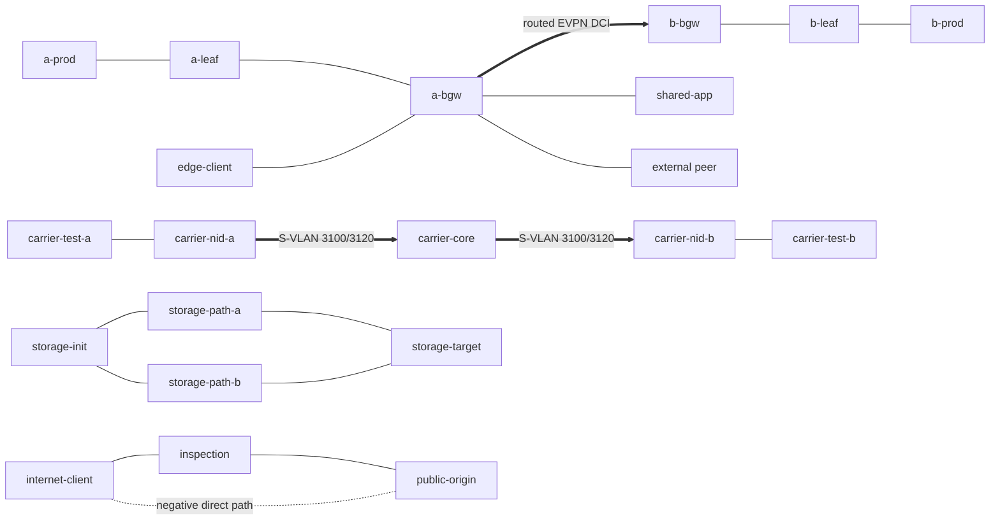

# DCI Edge Range Design

**Topology version:** `1.0.0` (frozen 2026-07-29)

This is the authoritative topology, address, path, and safe-mutation reference
for the range. The installed ticket-authoring skill points to
`labs/troubleshooting-range/references/range-routing.md`; that legacy file is
absent, so this document supplies the equivalent map.

## Fidelity and boundaries

The range retains the source packages' live mechanisms where they carry the
assessment:

- cEOS 4.35.2F eBGP EVPN, routed type-5 exchange, tenant VRFs, route targets,
  ordered policy, and an external IPv4 peer;
- the carrier lab's validated OVS 3.1.0 userspace QinQ fallback with distinct
  customer/provider tags and a 1600-byte service MTU;
- Linux forwarding policy, positive/negative origin paths, dual 9000-byte
  storage sentinels, and TCP service probes.

It does not claim a commercial EVPN Multi-Site feature, ASIC forwarding,
hardware CFM/Y.1731, optics, real iSCSI/multipath, a production WAF/NGFW,
live RPKI/IRR, or hardware storage QoS. Those mechanisms remain source-lab or
evidence work until a later ticket implements and health-gates them honestly.

## Topology

Five cEOS nodes establish the control-plane boundary. The other 16 containers
are lightweight service, demarcation, storage-sentinel, and security-policy
roles. All management uses the isolated `172.30.252.0/24` network.

## Node and address map

| Domain | Node / link | Address or service | Healthy role |
|---|---|---|---|
| Site A | `a-leaf` loopback / underlay | `10.10.0.1/32`, `10.11.0.1/30` | Site A PROD VTEP |
| Site A | `a-bgw` loopback / underlay / DCI | `10.10.0.3/32`, `10.11.0.2/30`, `10.255.10.1/30` | Site A border |
| Site B | `b-bgw` loopback / underlay / DCI | `10.20.0.3/32`, `10.21.0.1/30`, `10.255.10.2/30` | Site B border |
| Site B | `b-leaf` loopback / underlay | `10.20.0.1/32`, `10.21.0.2/30` | Site B PROD VTEP |
| PROD | `a-prod`, `b-prod` | `172.16.10.10`, `172.17.10.10`; TCP/8080 | Site-local and inter-site apps |
| Shared | `shared-app` | `172.31.10.10`; TCP/8080 | PROD shared service |
| Peering | `a-bgw` — `peer` | `203.0.113.0/30` | eBGP AS65012—AS65501 |
| Peering | peer loopbacks | `198.51.100.10/32`, `.20/32` | Approved app and peer-health prefixes |
| Peering | `edge-client` | `10.80.10.10/24` | Enterprise edge perspective |
| Carrier Gold | tester VLAN 110 | `192.0.2.0/30`, S-VLAN 3100, PCP 5 | 1600-byte service |
| Carrier Silver | tester VLAN 120 | `198.51.100.0/30`, S-VLAN 3120, PCP 3 | Independent service |
| Storage A | init—path-a—target | `10.92.10.0/24`, TCP/3260 | 9000-byte sentinel |
| Storage B | init—path-b—target | `10.92.20.0/24`, TCP/3260 | Independent 9000-byte sentinel |
| Inspection | outside—inspection—origin | `192.0.2.0/24`, `10.90.20.0/24`; TCP/8080 | Required inspected path |
| Origin negative | direct test link | `203.0.113.10`—`.20`; TCP/8443 | Must remain denied |

PROD uses L3VNI 50010. Each site exports its own RT (`65010:50010` or
`65020:50010`) and imports the remote RT. DEV VNI 50020 is site-local and
health-gated against remote leakage.

## Golden health and policy

The 26-assertion health gate covers:

- four local/inter-site EVPN sessions plus the external peer;
- remote PROD VTEP routes, bidirectional applications, shared service, and DEV
  isolation;
- both approved peer prefixes;
- Gold/Silver QinQ paths, exact 1600-byte Gold acceptance, and explicit distinct
  service mappings;
- two exact 9000-byte storage paths and both TCP sentinels;
- inspected application success, direct-origin denial, default-deny forwarding;
- absence of scenario policy or netem state and bounded assessment clock skew.

## Golden reset and safe mutation map

`range.sh deploy` saves each cEOS running configuration to writable in-container
flash only after health is green. Reset applies `configure replace` in parallel,
runs read-only-bound Linux/OVS reset scripts, performs soft BGP refresh, and
waits for end-to-end health. It never restarts a container.

| State | Safe runtime mutation | Golden restoration |
|---|---|---|
| cEOS BGP/EVPN/VRF policy | CLI-only route map, RT, prefix, or neighbor policy | Parallel `configure replace flash:range-golden.cfg` |
| Carrier mapping / MTU | OVS flows or interface MTU/qdisc | Recreate explicit QinQ flows and MTU in place |
| Linux routes / policy | `ip route`, link, iptables, writable runtime process | Per-role reset script |
| Storage sentinels | Link MTU/admin/qdisc or service process | Rebuild bridges, addresses, MTU, and TCP sentinel |
| Inspection/origin | Ordered runtime rules or local service process | Rebuild default-deny and direct-origin-negative policy |

Future tickets may use only a mutation already covered here or must extend the
health/reset contract without changing nodes, links, addressing, or the healthy
architecture.

## Catalog uniqueness and frozen boundary

Only `t1-carrier-svlan-map` and `t3-dci-maintenance-policy` are installed. They
differ in symptom, root-cause family, affected path, diagnostic distance, and
evidence pattern. The other ten WP-16 rows remain placeholders.

Version `1.0.0` was frozen only after clean build/deploy, 26/26 health,
both reference dry runs and workaround rejection, two idempotent resets, scoped
destroy/redeploy repeatability, resource compliance, and complete cleanup.
