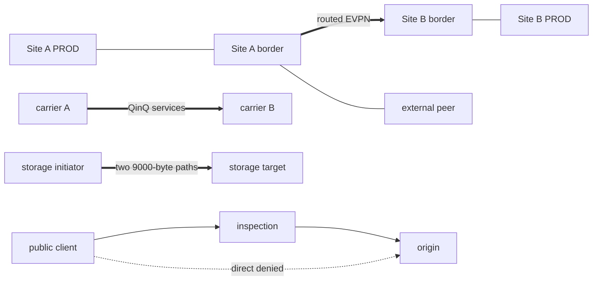

# DCI Edge Troubleshooting Range

This persistent, proctored range assesses routed DCI, carrier handoff, peering,
storage-path, and inspected-edge troubleshooting. Engineers receive only a
symptom ticket, make the smallest runtime repair, and must pass an architectural
verifier.

## Healthy architecture



The frozen `DESIGN.md` contains the complete node/address map, healthy policy,
safe-mutation table, and fidelity limits.

## Build and deploy

```bash
docker build -t ops-lab:local ../../images/ops-lab/
docker build -t carrier-ethernet-tools:1.0.0 ../carrier-ethernet-handoff/
./range.sh deploy
./range.sh status
```

`status` runs 26 positive and negative assertions across EVPN, peering, QinQ,
storage sentinels, inspection/origin policy, clean runtime state, and clock skew.

## Engineer workflow

```bash
./range.sh start --tier 1
# or
./range.sh start t3-dci-maintenance-policy

./range.sh shell carrier-test-a
./range.sh shell a-bgw
./range.sh verify
```

During an assessment, do not inspect scenario injectors, clear scripts, rubrics,
or golden reset files. Do not restart a container. The write-up must show symptom
scope, decisive evidence, the minimal change, and positive plus negative
verification.

## Proctor workflow and golden reset

```bash
./range.sh deploy
./range.sh status
./range.sh start t1-carrier-svlan-map
# Follow the confidential rubric and apply its minimal repair.
./range.sh verify
./range.sh reset
./range.sh status
./range.sh destroy
```

Reset clears the active fault, applies parallel cEOS configuration replacement,
rebuilds Linux/OVS runtime state, soft-refreshes BGP, and requires health to
return green. It never restarts a container. Attempts live outside the repository
under the user's XDG state directory.

## Catalog

This foundation installs exactly one reference T1 and one reference T3. The
remaining ten WP-16 rows are planned placeholders, not completed tickets.

| Tier | Ticket symptom | Root-cause family | Status |
|---:|---|---|---|
| T1 | One carrier service unavailable | Wrong UNI/S-VLAN map | **Installed:** `t1-carrier-svlan-map` |
| T1 | Storage path degraded | One path admin/MTU state | Planned; not implemented |
| T1 | Peer prefix missing | Stale approved-prefix object | Planned; not implemented |
| T1 | Public app works only direct | WAF/origin policy | Planned; not implemented |
| T2 | Remote PROD absent, EVPN sessions up | Route-target mismatch | Planned; not implemented |
| T2 | Large circuit tests fail | Service MTU mismatch | Planned; not implemented |
| T2 | New peer prefix rejected | IRR/RPKI/max-prefix distinction | Planned; not implemented |
| T2 | Storage session up, large transfer stalls | Intermediate MTU | Planned; not implemented |
| T3 | Site-local apps healthy, inter-site fails after maintenance | Border/DCI policy | **Installed:** `t3-dci-maintenance-policy` |
| T3 | Public path bypasses inspection silently | Shadow rule/asymmetry | Planned; not implemented |
| T3 | Peering blackhole exceeds intended scope | Community/prefix scope | Planned; not implemented |
| T3 | Healthy service withdrawn at one site | Health/OAM evidence disagreement | Planned; not implemented |

Rubric time bands are provisional until a real human blind pilot. This foundation
does not claim that pilot or promote source topics to coverage level 5.

## Scope and limitations

- cEOS EVPN/type-5, external BGP, OVS QinQ, Linux policy, exact-MTU packets, and
  TCP sentinels are live.
- EVPN Multi-Site vendor features, L2 stretch/mobility, ESI, hardware CFM/optics,
  real iSCSI/multipath, production WAF/NGFW, and live RPKI/IRR are not claimed.
- Future ticket PRs may add one scenario at a time but may not change frozen
  topology version 1.0.0's nodes, links, addressing, or healthy architecture.
- Use only `./range.sh destroy`; never remove unrelated containers or networks.
