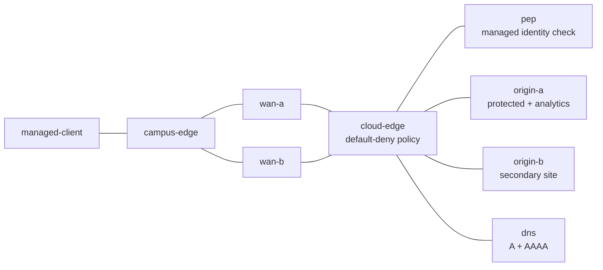

# Hybrid Access Range Design

**Topology version:** `1.0.0` (frozen 2026-07-29)

This document is the authoritative topology/address/routing reference for the
range. The installed ticket-authoring skill points to
`labs/troubleshooting-range/references/range-routing.md`; that file is absent,
so this range records the equivalent contract here rather than inventing a
reference.

## Fidelity and topology

The range is a live, provider-neutral Linux network model. It exercises
dual-stack forwarding, two independent WAN transports, authoritative DNS,
ordered stateful cloud policy, two application sites, and an identity-policy
enforcement proxy (PEP) in nine lightweight containers. It does not claim a
public cloud control plane, real RF, a commercial SD-WAN controller, or
production PKI/GSLB behavior.

WAN A is the normal path with metric 10. WAN B is installed as a live standby
with metric 100. Both transports and both address families are health-gated.

## Address and service map

| Link / node | IPv4 | IPv6 | Healthy role |
|---|---|---|---|
| managed-client — campus-edge | `10.70.10.0/24` | `2001:db8:70:10::/64` | Managed user perspective |
| campus-edge — wan-a | `10.70.12.0/30` | `2001:db8:70:12::/64` | Preferred WAN A |
| campus-edge — wan-b | `10.70.13.0/30` | `2001:db8:70:13::/64` | Standby WAN B |
| wan-a — cloud-edge | `10.70.24.0/30` | `2001:db8:70:24::/64` | Preferred cloud transit |
| wan-b — cloud-edge | `10.70.25.0/30` | `2001:db8:70:25::/64` | Standby cloud transit |
| PEP | `10.70.30.30/24` | `2001:db8:70:30::30/64` | Port 9443; managed identity header required |
| origin A | `10.70.41.40/24` | `2001:db8:70:41::40/64` | Analytics 8080, health 8081, protected origin 8443 |
| origin B | `10.70.42.40/24` | `2001:db8:70:42::40/64` | Secondary application 8080, health 8081 |
| DNS | `10.70.53.53/24` | `2001:db8:70:53::53/64` | Authoritative local A/AAAA answers |

All prefixes are documentation or private space. They are reachable only
inside the ContainerLab topology.

## Healthy policy and negative assertions

`cloud-edge` uses runtime iptables/ip6tables state with default-deny forwarding.
The golden rules allow:

- ICMP/ICMPv6 and established return traffic;
- managed-client DNS requests;
- managed-client access to both application and health ports;
- managed-client access to the PEP;
- PEP-to-origin-A protected application traffic.

Direct managed-client access to the protected origin is explicitly rejected.
The health gate proves valid-identity success, invalid-identity denial, direct
origin denial, A/AAAA answers, both WAN links, primary path selection, absence
of netem state, clean scenario markers, and clock alignment.

## Golden reset and safe mutation map

Every bind-mounted source file is read-only. `range.sh reset` first runs the
active scenario's idempotent clear, then invokes `/opt/range/golden/reset.sh`
inside each container. Reset replaces addresses, routes, neighbor state,
filter policy, DNS process state, and local application/PEP process state. It
does not restart a container.

| State | Safe scenario mutation | Golden restoration |
|---|---|---|
| Ordered cloud policy | Add/delete specifically commented runtime rules | `cloud-edge` reset rebuilds both rulesets |
| Routes and link state | Runtime `ip route`, `ip -6 route`, or link changes | Router role reset replaces routes and addresses |
| DNS answers/cache | Writable in-container dnsmasq state only | DNS reset restarts the local process from read-only config |
| Application/PEP state | Writable runtime process or cache state | Service reset restores the baseline process |
| Queue/MTU | Runtime `tc` or `ip link` state | Router reset plus health-gated absence of netem |

No repair may use a container restart. A future ticket must extend the health
gate before using state not covered by this table.

## Catalog uniqueness and frozen-version boundary

Only `t1-workload-policy-port` and `t3-origin-bypass` are installed in this
foundation. They deliberately differ in symptom, root cause, affected service
path, diagnostic distance, and evidence pattern. The other ten WP-16 catalog
rows are planned only. Future scenario PRs may add service behavior and
scenario scripts but may not change nodes, links, addressing, the healthy
positive paths, or the negative PEP/origin architecture under topology 1.0.0.

The frozen-version criteria passed on 2026-07-29: clean deploy, green health,
both reference dry runs, adversarial verifier checks, golden reset,
destroy/redeploy repeatability, resource target, and complete scoped cleanup.
Metadata is pinned to `1.0.0`.
