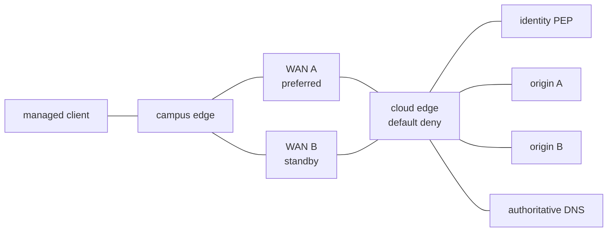

# Hybrid Access Troubleshooting Range

This persistent, proctored assessment range covers dual-stack hybrid access,
cloud workload policy, identity-aware application access, two WAN transports,
DNS, and lightweight multi-site application delivery. Engineers receive only
a symptom ticket and must diagnose, make the smallest runtime repair, and pass
an end-to-end verifier.

## Topology and healthy architecture



The range uses the local `ops-lab:local` image for nine lightweight Linux
nodes. WAN A is preferred and WAN B remains live. DNS provides local A and
AAAA data. The PEP accepts the managed identity and reaches the protected
origin; direct origin access is denied. The range's `DESIGN.md` is the full
topology, address, policy, and golden-reset contract.

## Build and deploy

```bash
docker build -t ops-lab:local ../../images/ops-lab/
./range.sh deploy
./range.sh status
```

`status` runs the health gate, including both transports, both address
families, authoritative DNS, both application sites, managed/unmanaged
identity outcomes, negative direct-origin policy, queue state, and clock
state.

## Engineer workflow

```bash
./range.sh start --tier 1
# or: ./range.sh start t3-origin-bypass

./range.sh shell managed-client
./range.sh shell campus-edge
./range.sh shell cloud-edge

./range.sh verify
```

Do not inspect `scenarios/*/rubric.md`, injectors, clear scripts, or reset
implementation during an assessment. Do not restart a container. Your write-up
must show the symptom, scope, decisive evidence, minimal change, and positive
plus negative verification.

## Proctor workflow and golden reset

```bash
./range.sh deploy
./range.sh status
./range.sh start t1-workload-policy-port
# Follow the confidential rubric and apply its minimal repair.
./range.sh verify
./range.sh reset
./range.sh status
./range.sh destroy
```

`reset` clears the active injector and restores addresses, routes, neighbor
state, forwarding policy, DNS, and local services from read-only golden
scripts. It does not restart containers. Attempt metadata is stored outside
the repository under the user's XDG state directory.

## Catalog

This first range PR installs exactly one T1 and one T3 reference ticket. The
remaining ten WP-16 rows are catalog placeholders, not completed assessments.

| Tier | Ticket symptom | Root-cause family | Status |
|---:|---|---|---|
| T1 | One cloud app denied, routing healthy | Workload policy / service port | **Installed:** `t1-workload-policy-port` |
| T1 | Managed user denied protected route | Client certificate lifecycle | Planned; not implemented |
| T1 | IPv6 client lacks DNS/default | RA/RDNSS or DHCPv6 flag | Planned; not implemented |
| T1 | GSLB marks one site down | Probe-source policy | Planned; not implemented |
| T2 | Hybrid route present, replies absent | Transit association / return table | Planned; not implemented |
| T2 | Corp access visible, EAP fails | RADIUS/EAP trust chain | Planned; not implemented |
| T2 | Guest breakout works, private segment leaks | WAN segment policy | Planned; not implemented |
| T2 | AAAA clients stall, A clients work | IPv6 PMTUD / return path | Planned; not implemented |
| T3 | PEP tests pass but app is exposed | Direct origin bypass | **Installed:** `t3-origin-bypass` |
| T3 | App intermittently chooses dead site | DNS cache / health timing | Planned; not implemented |
| T3 | Underlays green, branch routes absent | Edge certificate / control lifecycle | Planned; not implemented |
| T3 | Cloud app works but inspection sees one direction | Asymmetric policy propagation | Planned; not implemented |

Time bands in the two proctor rubrics are provisional. They must be adjusted
after a real human blind pilot; this foundation does not claim that pilot or
promote source topics to coverage level 5.

## Scope and limitations

- The live mechanisms are Linux routing, iptables/ip6tables policy, dnsmasq,
  Python HTTP services, and a provider-neutral identity PEP model.
- There is no RF/SSID, public cloud fabric, commercial SD-WAN controller,
  Internet GSLB, or production certificate authority claim.
- The topology reserves stable node, link, address, DNS, PEP, multi-origin,
  and dual-transport roles for future one-ticket PRs. Those tickets must extend
  their own service health assertions without changing frozen topology 1.0.0.
- Use only the scoped `./range.sh destroy`; do not remove unrelated containers
  or networks.
