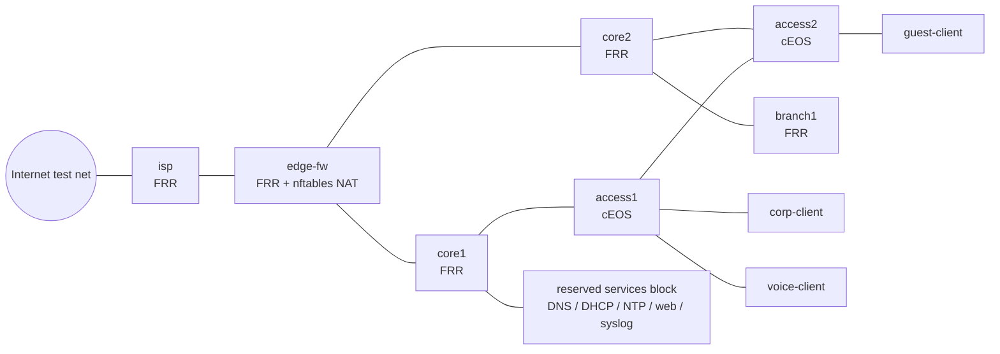

# Troubleshooting Range Design

**Topology version:** `1.0.0-draft`

This is the design contract for the persistent assessment topology. It reserves
the service block from day one, but Wave 1 deploys only the network functions
needed for pure-networking tickets. A scenario must pin this topology version
in its metadata once the scenario framework lands.

## Topology



The core and WAN roles are FRR containers. `access1` and `access2` are the two
cEOS nodes retained for switch CLI realism. The first production topology will
use routed access uplinks; this avoids making MLAG a prerequisite for every
ticket while still allowing L2/VLAN scenarios at the access layer.

## Address reservation

| Purpose | Prefix | Notes |
|---|---:|---|
| Core/access routed transit | `10.250.0.0/24` | `/31` links, allocated in ascending order |
| Core/edge/ISP/branch transit | `10.250.1.0/24` | `/31` links |
| Corporate VLAN | `10.250.10.0/24` | gateway `.1` |
| Voice VLAN | `10.250.20.0/24` | gateway `.1` |
| Guest VLAN | `10.250.30.0/24` | gateway `.1` |
| Infrastructure services | `10.250.40.0/24` | reserved from Wave 1 |
| Branch users | `10.250.50.0/24` | gateway `.1` |
| Loopbacks | `10.250.255.0/24` | router IDs and management probes |
| Internet test segment | `198.18.0.0/24` | RFC 2544 benchmark space, local-only |

## Golden-state and reset contract

Golden files are source-controlled under `golden/<node>/`; deployment copies
them into each node's writable filesystem. Fault injectors may mutate only
those in-container copies or runtime state—never a source file mounted from
the repository.

| Node type | Golden copy | Reset mechanism | Extra runtime cleanup |
|---|---|---|---|
| cEOS | `flash:golden.cfg` | `configure replace flash:golden.cfg` | clear ARP/MAC where required by a scenario |
| FRR | `/opt/range/golden/frr.conf` | `frr-reload.py --reload … --overwrite` | flush dynamic routes/neighbours where relevant |
| Linux service/endpoint | `/opt/range/golden/reset.sh` | run node reset script | flush addresses/routes, neighbour cache, nftables and conntrack; restart only the affected in-container process |

The Phase 0 reset prototype validates the first three mechanisms. Its measured
results and the remaining state caveats are recorded in
`prototypes/reset/RESULTS.md` after each validation run.

## Resource budget

The lab host has 16 GiB RAM. The steady-state range must stay below 8 GiB,
leaving capacity for an engineer's tools, transcripts, and conservative
headroom during fault recovery.

| Component | Count | Planning allowance | Total |
|---|---:|---:|---:|
| cEOS access switches | 2 | 1.5 GiB | 3.0 GiB |
| FRR network nodes | 5 | 200 MiB | 1.0 GiB |
| Linux endpoints + services | 7–9 | 150 MiB | 1.35 GiB |
| Docker/ContainerLab overhead + bursts | — | — | 1.5 GiB |
| **Budget** | **14–16 nodes** | — | **≤ 6.9 GiB** |

Do not add a third cEOS node unless the measured steady state still leaves at
least 5 GiB available on the 16 GiB host.

## CCNP expansion decision

The version 1 topology should remain the fast, single-area assessment range.
It still has enough independent paths and client perspectives for OSPF state,
metric, route-origination, ARP, DNS, and service-policy tickets. Wave 2 uses
those capabilities without adding nodes, which keeps startup time, memory use,
and the reset contract unchanged.

A separate version 2 topology is justified for technologies whose healthy
state cannot be represented honestly in version 1. Do not bolt these onto the
current range as one-off injectors; give them explicit golden-state and health
assertions from the start.

| Version 2 capability | Minimum topology addition | Candidate fault families |
|---|---|---|
| eBGP internet edge | ISP router plus expected-prefix and path-policy gates | AS mismatch, prefix-list direction, local preference, MED, next-hop reachability |
| Redundant switched campus | L2 triangle, trunk links, and a second host per VLAN | native/allowed VLAN mismatch, STP root drift, BPDU guard, EtherChannel inconsistency |
| First-hop redundancy | dual routed SVIs with VRRP/VARP and tracked uplinks | priority/preemption, virtual IP, failed tracking, asymmetric gateway state |
| Stateful edge policy and NAT | dedicated firewall namespace and inside/outside probes | ACL order, missing return rule, NAT exemption, overload pool, PMTUD/ICMP filtering |
| Enterprise services | DHCP relay/server, NTP, syslog, and AAA probes | helper address, scope exhaustion, time source, logging destination, AAA fallback |
| Dual stack and QoS | IPv6 addressing plus controlled traffic generators | RA/default route, OSPFv3, IPv6 ACL, DSCP trust, classification and queuing |

Recommended sequence: land the version 1 Wave 2 tickets first, then fork a
`troubleshooting-range-advanced` lab around the BGP edge and switched-campus
additions. Those two additions unlock the largest number of distinct CCNP
diagnostic patterns without requiring a third cEOS node.

## Attempts and evidence

Each assessment attempt is stored outside the lab directory at
`~/.local/state/troubleshooting-range/attempts/<attempt-id>/`:

```text
<attempt-id>/
  metadata.env                 # scenario id, topology version, start/end UTC
  ticket.md                    # exact ticket shown to the engineer
  sessions/
    <utc>-<node>.typescript    # script(1) output
    <utc>-<node>.timing        # script(1) timing data
```

The proctor tool will create and close this directory. The student does not
need write access to rubrics or scenario implementation files.
