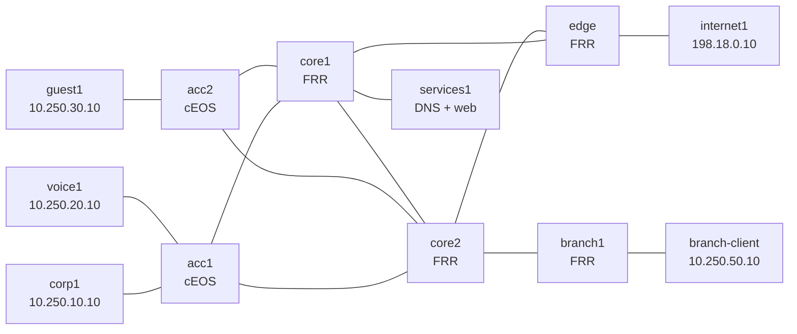

# Troubleshooting Range — Proctored Assessment Lab

This is a persistent enterprise troubleshooting range, not a guided practice
lab. A proctor starts a ticket with a reported symptom; you investigate the
live network, make the smallest defensible repair, verify from the affected
user perspective, and document what you did. Your interactive node sessions
are captured for review.

Do not read `scenarios/*/rubric.md` during an assessment. Those are proctor
materials. The normal tools deliberately show you the ticket, not the cause.

## Topology



All routing adjacencies use OSPF area 0. `acc1` and `acc2` are retained as
cEOS switches for access-layer CLI realism; the core, edge, and branch are FRR.

## Engineer reference

| Segment / purpose | Network | Gateway / key address |
|---|---|---|
| Corporate | `10.250.10.0/24` | `10.250.10.1` on acc1 |
| Voice | `10.250.20.0/24` | `10.250.20.1` on acc1 |
| Guest | `10.250.30.0/24` | `10.250.30.1` on acc2 |
| Services | `10.250.40.0/24` | services1 `10.250.40.10` |
| Branch | `10.250.50.0/24` | branch1 `10.250.50.1` |
| Internet test | `198.18.0.0/24` | edge `198.18.0.1` |
| Routed fabric | `10.250.0.0/24` | `/31` links |
| Router IDs | `10.250.255.0/24` | documented in `DESIGN.md` |

`services1` resolves `web.range.test` to `10.250.40.10` and serves a simple
HTTP endpoint on TCP/8080. The `internet1` segment is local-only test space; it
is not the public Internet.

## Ticket catalog

| Tier | Ticket | Domain | Time band |
|---|---|---|---:|
| T1 | Corporate desk offline | Access port | 15 min |
| T1 | Guest internet access failure | Endpoint gateway | 15 min |
| T1 | Voice endpoint unreachable | Access port | 15 min |
| T1 | Corporate desk lost connectivity | VLAN assignment | 15 min |
| T2 | Corporate users cannot reach branch | Route preference | 35 min |
| T2 | Branch isolated from headquarters | OSPF interface state | 35 min |
| T2 | Guest external access failure | Route preference | 35 min |
| T2 | Core-to-edge routing alert | OSPF adjacency | 35 min |
| T3 | Internal web portal unavailable | Services-link routing / DNS symptom | 60 min |
| T3 | Internal portal appears down | Service return path | 60 min |
| T3 | Corporate portal outage | Core return-path routing | 60 min |
| T3 | Branch portal failure | Branch return-path routing | 60 min |
| T1 | Corporate workstation intermittently isolated | ARP / neighbor cache | 15 min |
| T1 | Readdressed corporate desk offline | Duplicate IPv4 / gateway address | 15 min |
| T1 | Voice provisioning name failure | Endpoint DNS | 15 min |
| T1 | Portal refusing remote connections | TCP listener scope | 15 min |
| T2 | Core transit adjacency stuck | OSPF MTU negotiation | 35 min |
| T2 | Voice subnet missing from remote sites | OSPF advertisement | 35 min |
| T2 | Corporate services path drift | OSPF metric / path selection | 35 min |
| T2 | Corporate client cannot open new sessions | TCP ephemeral ports | 35 min |
| T2 | Portal listener stops taking sessions | TCP accept queue | 35 min |
| T3 | Guest portal resolves incorrectly | DNS data | 60 min |
| T3 | Voice-only portal timeout | Service policy / ACL | 60 min |
| T3 | Internal portal fails intermittently | Services-path packet loss | 60 min |

## Assessment workflow

The proctor deploys and starts a ticket. As an engineer, use only the ticket,
this README, `known-good/`, and normal operational commands.

```bash
# The proctor starts a ticket; this prints only the symptom report.
./range.sh start --tier 1

# Every interactive session is transcript-wrapped.
./range.sh shell corp1
./range.sh shell acc1
./range.sh shell core1
```

Use `bash` on Linux nodes. On cEOS nodes, `range.sh shell` opens the EOS CLI.
Do not use `range.sh reset`, scenario scripts, or proctor-only material during
an attempt. When you believe the incident is resolved, provide your write-up
to the proctor; they run the scenario verifier and close the attempt.

Your write-up should contain:

1. The observed symptom and scope.
2. The evidence that separated likely causes.
3. The exact corrective change and why it was minimal.
4. A client-side and infrastructure-side verification result.

## Known-good reference outputs

These are intentionally narrow operational references, not configuration
answers. They establish normal service expectations without revealing ticket
causes.

- `known-good/ospf-neighbours.txt` — OSPF neighbour expectations
- `known-good/services.txt` — service checks
- `known-good/access-ports.txt` — access-port reference
- `known-good/tcp-services.txt` — listener and client ephemeral-port expectations

## Proctor quick reference

```bash
./range.sh deploy                 # deploy + health gate + golden snapshots
./range.sh status                 # inventory and health gate
./range.sh start --tier 1         # blind ticket draw
./range.sh attempt show           # current attempt metadata
./range.sh reset                  # clear + no-restart golden reset + health gate
./range.sh destroy                # only with no active attempt
```

See `scenarios/AUTHORING.md` for the scenario contract and the assessment
guide for proctor scoring rules.
