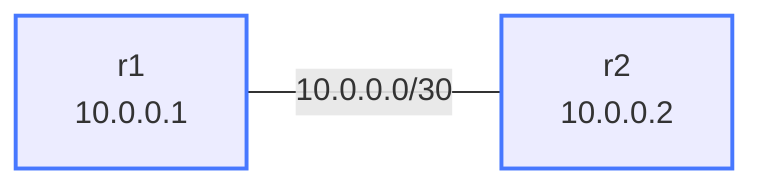

# Two Routers — Starter Lab

The simplest possible ContainerLab lab — two cEOS routers connected
back-to-back with OSPF already configured. Use it to learn the ContainerLab
workflow (deploy, exec, destroy) and to *observe* an OSPF adjacency forming —
every other lab in this collection builds on these mechanics.

## Topology



| Link | Subnet | r1 IP | r2 IP |
|------|--------|-------|-------|
| r1:eth1 -- r2:eth1 | 10.0.0.0/30 | .1 | .2 |

## How to use this lab

This lab is pre-configured (a *reference* lab) — your job is to observe and
explain, not to configure. Answer each prediction **before** running the
command that checks it.

## Deploy / Destroy

```bash
./scripts/lab.sh deploy two-routers
./scripts/lab.sh destroy two-routers
```

## Connect to Nodes

```bash
# Access r1's cEOS CLI
./scripts/lab.sh cli two-routers r1

# Or run a single command
./scripts/lab.sh cmd two-routers r1 -- Cli -c "show ip ospf neighbor"
```

## Task 1 — Verify the adjacency and explain each field

**Objective:** Confirm r1 and r2 are fully adjacent and that each learned the
other's routes.

**Predict first:** before running anything — how many OSPF neighbors should
each router have, and what state should the adjacency settle in?

```text
show ip ospf neighbor       # expect r2 as Full neighbor
show ip ospf interface eth1 # OSPF state on link
show ip route ospf          # learned routes
ping 10.0.0.2               # basic connectivity
```

<details markdown="1">
<summary>Check your work</summary>

One neighbor each, state `Full` (possibly `Full/DR` or `Full/BDR` — on a
broadcast-type link the two routers elect a Designated Router even though
there are only two of them). `Full` means the link-state databases are
synchronized — anything less (`Init`, `2-Way`, `ExStart`) means the
adjacency is stuck partway through the state machine.

</details>

## Task 2 — Break it: watch the adjacency die

**Objective:** Shut r2's eth1 (`interface Ethernet1` → `shutdown`), and
observe from **r1**.

**Predict first:** how long until r1 notices the neighbor is gone — instant,
or after a timeout? Which timer controls it?

<details markdown="1">
<summary>Check your work</summary>

With the veth link still up at the container level, r1 only notices when the
**dead interval** (40 s by default — 4× the 10 s hello) expires and the
neighbor is flushed. Re-enable with `no shutdown` and watch the adjacency
walk back up to `Full`. This hello/dead detection delay is the motivation
for BFD (see the `bfd-ospf` lab).

</details>

## Concepts

This lab demonstrates the core ContainerLab + cEOS workflow:

- **topology.clab.yml**: defines nodes and links; ContainerLab creates veth pairs between containers
- **startup-config**: bind-mounted; cEOS reads this at startup
- **Cli**: `docker exec -it clab-<lab>-<node> Cli` is how you reach every router in every lab

OSPF forms an adjacency over the point-to-point link and each router learns
the other's routes. This is the foundation that all other labs in this
collection build on. When you're comfortable here, move to `ospf-multiarea`
— there you configure OSPF yourself.
