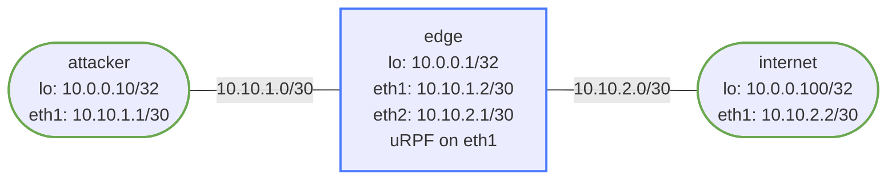

# uRPF Anti-Spoofing Lab

Unicast Reverse Path Forwarding (uRPF) is a router feature that drops packets with source IP addresses that fail a reverse-path lookup. It is one of the primary tools for mitigating IP spoofing attacks at network edges.

## Background

### Why IP Spoofing Matters

An attacker can craft packets with a forged (spoofed) source IP address. Without source validation at the network edge, these packets traverse the network normally. This enables:

- **DDoS amplification attacks** — send a small request with a victim's IP as source; large responses flood the victim
- **Blind TCP injection** — forge source IP to hijack sessions
- **Traceback evasion** — hide the true origin of an attack

BCP 38 (RFC 2827) recommends that all ISPs and enterprise edge routers perform source address validation using mechanisms like uRPF.

### How uRPF Works

When a packet arrives on an interface, the router performs a **reverse path lookup**: it looks up the packet's **source IP** in the routing table and asks "which interface would I use to reach this source?" If the answer does not match the interface the packet arrived on (strict mode), or if there is no route at all (loose mode), the packet is dropped.

```
Packet arrives on eth1 with source 10.99.99.1
  -> RIB lookup for 10.99.99.1
  -> No route found (or route points to eth2, not eth1)
  -> STRICT: DROP   LOOSE: DROP (no route) / PASS (any route exists)
```

### Strict Mode vs Loose Mode

```
STRICT MODE  (reachable-via rx)
  Pass:  source IP has a route pointing back out the same interface the packet arrived on
  Drop:  source IP has no route, or route points to a different interface

LOOSE MODE  (reachable-via any)
  Pass:  source IP has ANY route in the RIB (any interface, any path)
  Drop:  source IP has no route at all (not in RIB)
```

**When to use strict:** Single-homed customer edge links. The path to the customer is always via the single access interface. Very effective.

**When to use loose:** Multi-homed environments where asymmetric routing is expected (traffic comes in one link, goes out another). Strict would drop legitimate traffic; loose still catches completely bogus source addresses.

## How to use this lab

This is a **practice lab**, not a tutorial. The foundation is pre-built;
you produce the configuration from the objectives. **Predict each result
before you verify**, use the success criteria to grade yourself, and treat
the break-it steps and challenge questions as the real test.

## Topology



- **attacker** — simulates a malicious host that can send packets with spoofed source IPs
- **edge** — the internet edge router where uRPF will be configured on the attacker-facing interface (eth1)
- **internet** — represents the legitimate internet; loopback 10.0.0.100/32 is the "victim host"

## Pre-configured

- All IP addresses on all nodes
- OSPF area 0 on edge and internet (for routing context; attacker uses a static default route)
- uRPF is **not** configured — that is your task

## Deploy

```bash
# Build image first if not already done
docker build -t frr-lab:local images/frr/

./scripts/lab.sh deploy urpf-antispoofing
```

---

## Task 1: Verify Baseline Connectivity

Confirm all nodes can reach each other before enabling any filtering.

```bash
# From attacker — ping the internet host (legitimate source IP)
./scripts/lab.sh cmd urpf-antispoofing attacker -- ping -c3 10.0.0.100

# From attacker — ping edge loopback
./scripts/lab.sh cmd urpf-antispoofing attacker -- ping -c3 10.0.0.1

# Verify OSPF is up on edge
./scripts/lab.sh cmd urpf-antispoofing edge -- vtysh -c "show ip ospf neighbor"
./scripts/lab.sh cmd urpf-antispoofing edge -- vtysh -c "show ip route"
```

Expected: all pings succeed, edge has OSPF adjacency with internet, routing table shows 10.0.0.100/32.

---

## Task 2: Enable uRPF Strict Mode on edge eth1

**Predict first:** strict uRPF checks the packet's *source* against the FIB's best path out that interface. Before enabling it, predict which of the later test cases (legitimate, spoofed, asymmetric) will pass and which will drop — and why.

Connect to the edge router and enable uRPF strict mode on the attacker-facing interface:

```bash
./scripts/lab.sh cli urpf-antispoofing edge
```

<details markdown="1">
<summary>Show configuration</summary>

```
configure
interface eth1
 ip verify unicast source reachable-via rx
end
write memory
```

</details>

Verify configuration:

```bash
./scripts/lab.sh cmd urpf-antispoofing edge -- vtysh -c "show running-config interface eth1"
```

You should see `ip verify unicast source reachable-via rx` under the interface.

> Note: FRR implements uRPF in the kernel via the `rpfilter` netfilter module or via zebra's forwarding plane depending on version. The `ip verify unicast source reachable-via rx` command instructs FRR/zebra to enable strict RPF checking on that interface.

---

## Task 3: Test Legitimate Traffic (Should Pass)

With strict uRPF enabled, traffic sourced from 10.10.1.1 should still pass. The edge router has a route to 10.10.1.0/30 via eth1 (directly connected), so the reverse path check passes.

```bash
# From attacker — use legitimate source IP (eth1 address)
./scripts/lab.sh cmd urpf-antispoofing attacker -- ping -c5 -I 10.10.1.1 10.0.0.100
```

Expected: **all pings succeed**. The source 10.10.1.1 is in the subnet directly reachable via eth1, so strict uRPF passes it.

```bash
# Also test from loopback (10.0.0.10) — does this pass?
./scripts/lab.sh cmd urpf-antispoofing attacker -- ping -c5 -I 10.0.0.10 10.0.0.100
```

This will likely **fail** because the edge router has no route to 10.0.0.10/32 via eth1 (attacker's loopback is not advertised into OSPF — only a static default route exists). This is expected behavior — the attacker's loopback is not known to edge.

To make the loopback reachable and allow it through uRPF, you would need to advertise it (e.g., redistribute the connected loopback into OSPF on attacker — but attacker doesn't run OSPF in this lab by design).

---

## Task 4: Test Spoofed Traffic (Should Fail)

Now test with a spoofed source IP that is **not** reachable via eth1.

**Step 1: Add a spoofed address to the attacker**

```bash
./scripts/lab.sh bash urpf-antispoofing attacker
ip addr add 10.99.99.1/32 dev lo
```

**Step 2: Send traffic with the spoofed source**

```bash
# Still inside attacker bash shell
ping -c5 -I 10.99.99.1 10.0.0.100
```

Expected: **all pings fail** (100% packet loss). The edge router looks up 10.99.99.1 in its routing table. There is no route for 10.99.99.0/24 via eth1, so strict uRPF drops the packets.

**Step 3: Check drop counters on edge**

```bash
./scripts/lab.sh cmd urpf-antispoofing edge -- vtysh -c "show interface eth1"
./scripts/lab.sh cmd urpf-antispoofing edge -- vtysh -c "show ip traffic"
```

Look for uRPF drops or input drops incrementing.

**Step 4: Confirm with a tcpdump**

Open a second terminal and watch on the edge's eth1 vs eth2:

```bash
# Terminal 1: watch what arrives on edge eth1 (should see ICMP requests)
./scripts/lab.sh cmd urpf-antispoofing edge -- tcpdump -i eth1 icmp -n

# Terminal 2: watch edge eth2 (should see nothing — packets dropped before forwarding)
./scripts/lab.sh cmd urpf-antispoofing edge -- tcpdump -i eth2 icmp -n

# Terminal 3: send the spoofed pings from attacker
./scripts/lab.sh cmd urpf-antispoofing attacker -- ping -c5 -I 10.99.99.1 10.0.0.100
```

You should see ICMP requests on eth1 (they arrive) but nothing on eth2 (they are dropped by uRPF before forwarding).

---

## Task 5: Switch to Loose Mode

Loose mode (`reachable-via any`) drops only packets whose source has no route anywhere in the RIB. Change the mode and repeat the spoofed traffic test.

```bash
./scripts/lab.sh cli urpf-antispoofing edge
```

<details markdown="1">
<summary>Show configuration</summary>

```
configure
interface eth1
 ip verify unicast source reachable-via any
end
write memory
```

</details>

Now repeat the spoofed ping:

```bash
./scripts/lab.sh cmd urpf-antispoofing attacker -- ping -c5 -I 10.99.99.1 10.0.0.100
```

Expected: **pings still fail** — 10.99.99.1 has no route in edge's RIB at all (not just no route via eth1). Loose mode drops packets with completely unknown source IPs.

**Add a route for the spoofed prefix to demonstrate loose mode passing it:**

```bash
# On edge — add a route for the "spoofed" network (simulating a route learned from somewhere)
./scripts/lab.sh cmd urpf-antispoofing edge -- vtysh -c "configure" -c "ip route 10.99.99.0/24 10.10.2.2"
```

Now repeat:

```bash
./scripts/lab.sh cmd urpf-antispoofing attacker -- ping -c5 -I 10.99.99.1 10.0.0.100
```

Expected with loose mode: **pings now succeed** — 10.99.99.1 matches the 10.99.99.0/24 route (via eth2), so loose mode allows it even though the traffic arrived on eth1. This demonstrates why loose mode is weaker than strict.

Clean up the static route afterward:

```bash
./scripts/lab.sh cmd urpf-antispoofing edge -- vtysh -c "configure" -c "no ip route 10.99.99.0/24 10.10.2.2"
```

---

## Task 6: The `allow-default` Option

By default, uRPF does **not** count a default route (0.0.0.0/0) as a valid reverse path. This is intentional — if it did, any source IP would pass loose-mode uRPF as long as a default route exists, making it useless.

The `allow-default` option explicitly allows the default route to satisfy the RPF check.

**Demonstrate the default route interaction:**

First, add a default route on the edge pointing to internet:

```bash
./scripts/lab.sh cmd urpf-antispoofing edge -- vtysh -c "configure" -c "ip route 0.0.0.0/0 10.10.2.2"
```

With loose mode (no allow-default), spoofed 10.99.99.1 still fails even though a default route exists:

```bash
./scripts/lab.sh cmd urpf-antispoofing attacker -- ping -c3 -I 10.99.99.1 10.0.0.100
# Expected: FAIL (default route does not count)
```

Now enable `allow-default`:

```bash
./scripts/lab.sh cli urpf-antispoofing edge
```

<details markdown="1">
<summary>Show configuration</summary>

```
configure
interface eth1
 ip verify unicast source reachable-via any allow-default
end
```

</details>

Repeat:

```bash
./scripts/lab.sh cmd urpf-antispoofing attacker -- ping -c3 -I 10.99.99.1 10.0.0.100
# Expected: PASS (default route now satisfies loose-mode uRPF)
```

`allow-default` dramatically weakens uRPF when a default route is present. Use it only when explicitly needed (e.g., provider edge routers that must accept traffic from customers who only have a default route in the provider's RIB).

**Clean up:**

```bash
./scripts/lab.sh cli urpf-antispoofing edge
```

<details markdown="1">
<summary>Show configuration</summary>

```
configure
interface eth1
 ip verify unicast source reachable-via rx
 no ip verify unicast source reachable-via any allow-default
end
no ip route 0.0.0.0/0 10.10.2.2
```

</details>

---

## Task 7: Asymmetric Routing Scenario

Strict uRPF breaks in asymmetric routing environments — where traffic takes a different path inbound vs outbound. This is common in multi-homed networks.

**Simulate asymmetric routing:**

Imagine edge has two upstream links and traffic from a legitimate host arrives inbound on eth1 but the route to that host's network points to eth2 (due to policy routing or unequal ECMP). Strict uRPF would drop these legitimate packets.

To observe this in the lab, advertise attacker's loopback (10.0.0.10/32) via OSPF so edge learns it — but change the route to point to eth2 instead of eth1:

```bash
# On edge — add a static route for attacker loopback pointing to eth2 (wrong interface)
./scripts/lab.sh cmd urpf-antispoofing edge -- vtysh -c "configure" -c "ip route 10.0.0.10/32 10.10.2.2"
```

Now with strict uRPF on eth1, ping from attacker using its loopback:

```bash
./scripts/lab.sh cmd urpf-antispoofing attacker -- ping -c5 -I 10.0.0.10 10.0.0.100
# Expected: FAIL — strict uRPF sees route for 10.0.0.10 points to eth2, but packet arrived on eth1
```

Switch to loose mode:

```bash
./scripts/lab.sh cmd urpf-antispoofing edge -- vtysh -c "configure" -c "interface eth1" -c " ip verify unicast source reachable-via any"
```

```bash
./scripts/lab.sh cmd urpf-antispoofing attacker -- ping -c5 -I 10.0.0.10 10.0.0.100
# Expected: PASS — loose mode only checks that a route exists, not which interface
```

This is why strict uRPF is only suitable for single-homed customer-facing interfaces, while loose mode is used on peering links or multi-homed edges.

**Clean up:**

```bash
./scripts/lab.sh cmd urpf-antispoofing edge -- vtysh -c "configure" -c "no ip route 10.0.0.10/32 10.10.2.2"
```

---

## Verification Commands Reference

| Command | Purpose |
|---------|---------|
| `show running-config interface eth1` | Confirm uRPF config |
| `show interface eth1` | Interface counters including drops |
| `show ip traffic` | Global IP traffic stats |
| `show ip route` | Routing table (used for RPF lookups) |
| `show ip rpf <address>` | Show RPF check result for a specific source IP |

### Key `show ip rpf` usage

```bash
# On edge — what would uRPF do with source 10.10.1.1?
./scripts/lab.sh cmd urpf-antispoofing edge -- vtysh -c "show ip rpf 10.10.1.1"

# What about a spoofed source?
./scripts/lab.sh cmd urpf-antispoofing edge -- vtysh -c "show ip rpf 10.99.99.1"
```

The output shows the RPF interface and next-hop. If the RPF interface does not match the interface the packet arrived on, strict uRPF drops it.

---

## Summary

| Mode | Command | Behavior |
|------|---------|----------|
| Strict | `ip verify unicast source reachable-via rx` | Source must have a route via the same interface the packet arrived on |
| Loose | `ip verify unicast source reachable-via any` | Source must have any route in the RIB |
| Loose + default | `ip verify unicast source reachable-via any allow-default` | Default route also satisfies the check |

**Best practices:**

- Use strict mode on all single-homed customer/access interfaces
- Use loose mode on multi-homed or peering interfaces
- Never use `allow-default` unless you understand the security tradeoff
- uRPF is most effective when deployed close to the source (ingress filtering at the edge)

## Cleanup

```bash
./scripts/lab.sh destroy urpf-antispoofing
```

## Challenge questions

No answers provided — reason them through.

1. Strict vs. loose uRPF: define each precisely and give a legitimate
   topology (asymmetric routing / multihoming) where strict mode drops
   valid traffic and loose mode is required.
2. uRPF checks the *source* against the FIB. Walk through exactly how that
   blocks a spoofed-source DDoS at the edge, and what it cannot stop.
3. Where in the network is uRPF appropriate (edge/access) and where is it
   dangerous (core/transit)? Justify from the asymmetry of real routing.
4. An attacker spoofs a source inside your own prefix. Does uRPF catch it?
   What additional filtering (BCP 38) is required and where?
