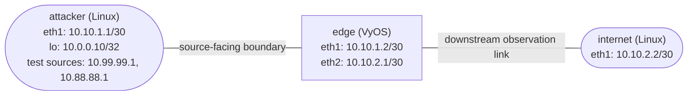

# Unicast RPF Anti-Spoofing — Practice Lab

Build source-address validation at a routed trust boundary with VyOS. You
will use packet capture and kernel rule counters to distinguish strict and
loose unicast Reverse Path Forwarding (uRPF), expose the risk of a default
route in loose mode, and diagnose a deliberately broken reverse path. The
central question is not whether a spoofed ping gets a reply, but whether the
edge forwards the spoofed request at all.

| Attribute | Value |
|-----------|-------|
| Lab type | Build |
| Learned platform | VyOS `vyos:local` |
| Incidental endpoints | Linux `ops-lab:local` |
| Estimated time | 45–60 minutes |
| Starting policy | uRPF disabled |
| Final policy | Strict source validation on `edge:eth1` |

## Topology



| Node | Interface | Address | Role |
|------|-----------|---------|------|
| `attacker` | eth1 | `10.10.1.1/30` | Packet source on the source-facing link |
| `attacker` | lo | `10.0.0.10/32` | Legitimate alternate source with a reverse route |
| `attacker` | lo | `10.99.99.1/32`, `10.88.88.1/32` | Controlled spoof-test sources |
| `edge` | eth1 | `10.10.1.2/30` | VyOS trust-boundary ingress |
| `edge` | eth2 | `10.10.2.1/30` | VyOS downstream egress |
| `internet` | eth1 | `10.10.2.2/30` | Capture and reply endpoint |

| Link | Subnet | Forward direction under test | Reverse-path fact |
|------|--------|------------------------------|-------------------|
| `attacker:eth1` ↔ `edge:eth1` | `10.10.1.0/30` | Packets enter `edge:eth1` | `10.0.0.10/32` initially resolves through eth1 |
| `edge:eth2` ↔ `internet:eth1` | `10.10.2.0/30` | Accepted packets leave `edge:eth2` | `internet` defaults to `10.10.2.1` |

## How to use this lab

This is a **practice lab**, not a tutorial. Each task gives you an
**objective** and **hints** — your job is to produce the configuration.

- **Predict before you configure.** When a task asks for a prediction,
  commit to an answer before touching the CLI. Being wrong and finding out
  why is the point.
- **Open the hints before the solution.** The solution toggle is the answer
  key — use it to check your work or when genuinely stuck, not as step one.
- **Verify like an operator.** After each task, prove the state is what you
  think it is with `show` commands before moving on.

## Deploy

This lab needs a locally imported VyOS image and the repository's small
Linux endpoint image. Follow the
[VyOS platform notes](../../docs/platforms/vyos.md) to build and tag the
router image for your host architecture:

```bash
docker build -t ops-lab:local images/ops-lab/

./scripts/lab.sh deploy urpf-antispoofing
./scripts/lab.sh status urpf-antispoofing
```

The supplied feature probe sampled about 399.3 MiB total: 397.3 MiB for
`edge`, 612 KiB for `attacker`, and 1.379 MiB for `internet`.

Open the VyOS administrative shell when a task calls for configuration:

```bash
./scripts/lab.sh cli urpf-antispoofing edge
```

## Initial state and success criteria

The addressing in the tables is pre-configured. `edge` has a static reverse
route for legitimate source `10.0.0.10/32` through `10.10.1.1`; it has no
data-plane default route and no route for either spoof-test prefix. Its
ContainerLab management interface is isolated in VRF `MGMT`, so the
management default cannot accidentally satisfy a data-plane uRPF lookup.
Source validation is deliberately absent at startup.

Your final state must satisfy all of these conditions:

- strict IPv4 source validation is active only where test packets enter,
  `edge:eth1`;
- `10.0.0.10/32` resolves through `10.10.1.1` on eth1 and can reach
  `10.10.2.2`;
- strict-mode spoof requests increment a drop counter and do not appear in
  an `internet:eth1` capture;
- the temporary `10.99.99.0/24` route and data-plane default route are gone;
- VRF `MGMT` retains table 100 and its management-only default route.

## Task 1 — Establish the unfiltered evidence path

**Objective:** Prove the initial routing state and capture a request sourced
from `10.99.99.1` at `internet:eth1` while source validation is disabled.
Record capture evidence separately from the ping command's exit status.

**Predict first:** Will the spoofed ping report success? Independently, will
its echo request cross `edge` and appear in the downstream capture?

Inspect the main and management routing tables on `edge`:

```bash
./scripts/lab.sh cmd urpf-antispoofing edge -- ip -4 route show table main
./scripts/lab.sh cmd urpf-antispoofing edge -- ip -4 route show table 100
```

Then use two terminals. Start this bounded capture first:

```bash
# Terminal 1
./scripts/lab.sh cmd urpf-antispoofing internet -- \
  timeout 8 tcpdump -lnni eth1 -c 1 \
  'icmp[icmptype] == icmp-echo and src host 10.99.99.1'
```

Generate the request in the other terminal:

```bash
# Terminal 2
./scripts/lab.sh cmd urpf-antispoofing attacker -- \
  ping -c 2 -W 1 -I 10.99.99.1 10.10.2.2
```

Build a results table as you progress through the lab. Do not collapse
"ping failed" and "request was filtered" into the same observation.

| Stage | Source | Reverse route at edge | Internet capture sees request? | Ping gets reply? | Relevant drop counter delta |
|-------|--------|-----------------------|-------------------------------|------------------|-----------------------------|
| Baseline, disabled | `10.99.99.1` | none | | | n/a |
| Strict, legitimate | `10.0.0.10` | eth1 | | | |
| Strict, unrouted | `10.99.99.1` | none | | | |
| Strict, wrong interface | `10.99.99.1` | eth2 | | | |
| Loose, wrong interface | `10.99.99.1` | eth2 | | | |
| Loose, unrouted | `10.88.88.1` | none | | | |
| Loose, main default | `10.88.88.1` | main default | | | |

<details markdown="1">
<summary>Check your work</summary>

The main table has the two connected data subnets and a route for
`10.0.0.10/32`, but no default. Table 100 has the management default. The
capture sees the echo request from `10.99.99.1`, proving that the disabled
edge forwards it. The ping still fails because the edge lacks a return route
to that spoofed source. A failed spoofed ping is therefore not drop evidence.

</details>

## Task 2 — Enforce and observe strict uRPF

**Objective:** Configure strict source validation on the source-facing VyOS
interface. Prove that a legitimate alternate source passes, an unrouted
source is dropped, and fresh spoof traffic changes the strict rule counter.

**Predict first:** Does strict mode require the source address to be assigned
to the incoming subnet, or does it require the best reverse route to select
the same incoming interface?

<details markdown="1">
<summary>Hint 1 — Find the configuration hierarchy</summary>

In VyOS configuration mode, explore below `interfaces ethernet eth1 ip ?`.
The feature name describes validation of the packet's source.

</details>

<details markdown="1">
<summary>Hint 2 — Choose and inspect the mode</summary>

Use `?` after the source-validation node to compare its supported values.
After committing, inspect both `show configuration commands` and the
`vyos_rpfilter` chain in nftables. The strict rule combines source-FIB and
incoming-interface information.

</details>

<details markdown="1">
<summary>Solution</summary>

```text
configure
set interfaces ethernet eth1 ip source-validation strict
commit
save
exit
```

</details>

Test the legitimate source, then repeat Task 1's bounded downstream capture
for `10.99.99.1`. Take an nftables snapshot before and after the spoof:

```bash
./scripts/lab.sh cmd urpf-antispoofing attacker -- \
  ping -c 3 -W 2 -I 10.0.0.10 10.10.2.2
./scripts/lab.sh cmd urpf-antispoofing edge -- \
  nft list chain ip raw vyos_rpfilter
```

<details markdown="1">
<summary>Check your work</summary>

The `10.0.0.10` ping succeeds because the edge's best reverse path selects
eth1, even though that address is not in the directly connected `/30`.
The downstream capture times out for `10.99.99.1`, while the eth1 strict-drop
rule's packet count increases. Together those observations prove the request
was dropped at the learned VyOS boundary.

</details>

## Task 3 — Separate strict from loose mode

**Objective:** Add a temporary route that makes `10.99.99.0/24` reachable
through the wrong interface. Show that strict mode still drops its packet,
then change only the uRPF mode and show that loose mode forwards it.

**Predict first:** When a source exists in the FIB through eth2 but arrives
on eth1, which result changes between strict and loose mode?

<details markdown="1">
<summary>Hint 1 — Create the controlled asymmetry</summary>

Use a temporary static route for `10.99.99.0/24` whose next hop is the Linux
node on the eth2 link. Confirm the installed route and selected interface
before generating traffic.

</details>

<details markdown="1">
<summary>Hint 2 — Change one variable</summary>

Keep the route and packet source unchanged. Replace the value under
`interfaces ethernet eth1 ip source-validation`, commit, then repeat the
same downstream capture. Compare the rendered nftables rule: strict includes
the incoming-interface comparison; loose asks only whether the source FIB
lookup resolves to an output.

</details>

<details markdown="1">
<summary>Solution</summary>

First add the controlled route and test while strict remains active:

```text
configure
set protocols static route 10.99.99.0/24 next-hop 10.10.2.2
commit
exit
```

After recording strict-mode evidence, change only the mode:

```text
configure
set interfaces ethernet eth1 ip source-validation loose
commit
exit
```

</details>

<details markdown="1">
<summary>Check your work</summary>

Strict mode does not forward the request: its best reverse path is eth2, not
the eth1 interface on which the packet arrived. Loose mode does forward the
same request because the source is reachable somewhere in the main FIB. A
one-way `internet:eth1` capture—not ping success—is the deciding evidence.

</details>

## Task 4 — Expose the loose-mode default-route caveat

**Objective:** With loose mode active, show that truly unrouted source
`10.88.88.1` is initially dropped. Add a temporary main-table default route,
repeat the exact probe, and explain why the same source is now forwarded.
Remove both experiment routes and restore the strict final policy.

**Predict first:** If every unknown source matches `0.0.0.0/0`, can loose
mode still distinguish a plausible source from an arbitrary one?

<details markdown="1">
<summary>Hint 1 — Prove the negative before changing routing</summary>

Capture echo requests sourced by `10.88.88.1` downstream. Snapshot the loose
drop counter, send the packet, and check the counter again. Verify that there
is currently no main-table default; table 100 is a separate VRF and does not
satisfy this lookup.

</details>

<details markdown="1">
<summary>Hint 2 — Add, compare, and clean up</summary>

Use the eth2 neighbor as a temporary next hop for `0.0.0.0/0`. Change no
other variable before repeating the capture. Afterward, remove the two
temporary routes, restore the strict mode chosen for the final target, and
inspect the main table rather than assuming cleanup succeeded.

</details>

<details markdown="1">
<summary>Solution</summary>

After proving the no-default result, add only the experiment default:

```text
configure
set protocols static route 0.0.0.0/0 next-hop 10.10.2.2
commit
exit
```

When your comparison is complete, return to the final policy shape:

```text
configure
delete protocols static route 0.0.0.0/0
delete protocols static route 10.99.99.0/24
set interfaces ethernet eth1 ip source-validation strict
commit
save
exit
```

</details>

<details markdown="1">
<summary>Check your work</summary>

Without a main default, loose mode drops `10.88.88.1` and its loose-rule
counter increases. With the main default present, the same request appears
at `internet:eth1`: the source FIB lookup now resolves, which is all loose
mode requires. At cleanup, the main table again has no default or spoof
prefix, strict mode is active on eth1, and VRF table 100 still owns the
management default.

</details>

## Task 5 — Diagnose and repair a legitimate-source outage

**Objective:** Inject the supplied fault into the otherwise solved strict
policy. Diagnose why the previously legitimate `10.0.0.10` source stops
working by locating the last observation point that sees its request and
correlating that boundary with policy counters. Make the smallest repair and
pass the automated checker.

Run the idempotent fault helper:

```bash
./labs/urpf-antispoofing/break.sh
```

**Predict first:** Which two capture locations and one counter can
distinguish a source-generation failure, rejection at the edge, and a
downstream or reply-path failure?

<details markdown="1">
<summary>Hint 1 — Observe before changing</summary>

- Inspect the edge's exact route for `10.0.0.10/32` and note the chosen
  output interface.
- Capture the legitimate request first on edge eth1, then on internet eth1.
- Compare the strict nft drop counter around one fresh request.

</details>

<details markdown="1">
<summary>Hint 2 — Repair the invariant</summary>

The final topology table tells you where a reverse packet destined for
`10.0.0.10` must leave the edge. Repair only the route that violates that
invariant; do not weaken strict validation to make the symptom disappear.

</details>

<details markdown="1">
<summary>Solution</summary>

Replace the incorrect reverse-path next hop with the attacker-facing next
hop, then commit and save:

```text
configure
delete protocols static route 10.0.0.10/32
set protocols static route 10.0.0.10/32 next-hop 10.10.1.1
commit
save
exit
```

</details>

<details markdown="1">
<summary>Check your work</summary>

Before repair, the legitimate request reaches edge eth1 but strict uRPF
drops it because the best reverse route selects a different interface. After
the minimal route repair, `10.0.0.10` again reaches `10.10.2.2` while strict
spoof traffic still increments the drop counter and remains absent from the
downstream capture. The checker verifies both positive and negative evidence.

</details>

## Verification

Run the end-state checker from the repository root:

```bash
./scripts/lab.sh check urpf-antispoofing
```

It verifies the node roles and images, addressing, exact strict policy,
reverse route, absence of experiment routes in the main table, management
VRF isolation, rendered strict nftables rules, legitimate forwarding, a
fresh drop-counter increase, and a bounded downstream negative capture.

Manual final checklist:

```text
show configuration commands
show ip route 10.0.0.10/32
```

```bash
./scripts/lab.sh cmd urpf-antispoofing edge -- ip -4 route show table main
./scripts/lab.sh cmd urpf-antispoofing edge -- ip -4 route show table 100
./scripts/lab.sh cmd urpf-antispoofing edge -- \
  nft list chain ip raw vyos_rpfilter
```

## Challenge questions

1. A multihomed customer legitimately receives traffic on either uplink but
   advertises its source prefix through only one best path. Where would
   strict mode fail, and what routing or validation designs preserve
   anti-spoofing without breaking the asymmetry?
2. Rank strict uRPF, loose uRPF with no default, and loose uRPF with a default
   from strongest to weakest for this edge. What legitimate traffic pattern
   might reverse the operational preference?
3. If equal-cost routes to a source exist through eth1 and eth2, what exact
   behavior would you test before enabling strict mode on a production NOS?
4. Design an IPv6 version of this experiment. Which packet types and control
   traffic would you protect from an overly broad source-validation rule?
5. Where in a real network would an ACL or source-prefix policy add assurance
   beyond uRPF, and what maintenance tradeoff would it introduce?

## Troubleshooting

| Symptom | Likely cause | Operator response |
|---------|--------------|-------------------|
| No baseline packet appears downstream | Addressing, link state, or destination route is broken before uRPF is involved | Check both endpoint addresses, edge connected routes, link state, then repeat the bounded capture |
| Spoofed ping fails but capture sees its request | Return routing is absent; forwarding was not blocked | Treat downstream capture as the forward-path evidence and inspect the source route separately |
| Strict mode drops a legitimate alternate source | Best reverse route selects a different interface or is absent | Inspect the exact source prefix in the main FIB and repair the routing invariant; do not immediately weaken the mode |
| Loose mode unexpectedly forwards an arbitrary source | A covering route, often a default, makes the source reachable | Inspect longest-prefix resolution in the same VRF and decide whether route policy or stricter validation is required |
| Counter does not change during a probe | Wrong ingress interface, wrong source selection, or stale observation | Capture on edge eth1, confirm `ping -I` chose the intended address, then take before/after counter snapshots |
| Checker reports the main default is present | Task 4 experiment was not removed, or management routing leaked into main | Remove the data-plane experiment and verify the management default exists only in table 100 |

## Stretch challenge

Without changing the final checker target, design a fourth source prefix and
an additional return path that creates equal-cost multipath at the edge.
Write a test plan that can tell whether this VyOS build accepts strict uRPF
when any ECMP member matches the ingress interface or only when the selected
member does. Predict first, then capture and count; do not infer the result
from generic vendor documentation.

## Cleanup

```bash
./scripts/lab.sh destroy urpf-antispoofing
```
