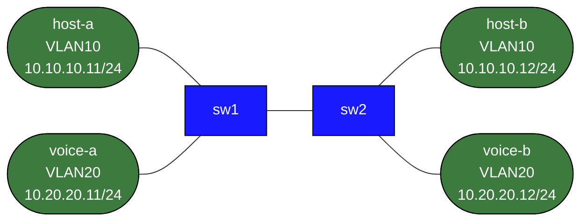

# vlan-trunks-switchport-basics

This lab isolates the access-layer mechanics that get buried inside larger campus topologies:

- VLAN creation
- access ports
- inter-switch trunks
- allowed VLAN lists
- failure symptoms when one VLAN is missing from the trunk

## How to use this lab

This is a **practice lab**, not a tutorial. The foundation is pre-built;
you produce the configuration from the objectives. **Predict each result
before you verify**, use the success criteria to grade yourself, and treat
the break-it steps and challenge questions as the real test.

## Topology



## Build and Deploy

```bash
docker build -t frr-lab:local images/frr/
docker import cEOS-lab-4.35.2F.tar ceos:4.35.2F
sudo containerlab deploy -t labs/vlan-trunks-switchport-basics/topology.clab.yml
```

## What Is Prebuilt

- host IP addressing
- physical cabling
- switch interface descriptions
- no VLAN, access-port, or trunk configuration yet

## Tasks

### 1. Build VLAN 10 end to end

On both switches:

- create VLAN 10
- put `host-a` and `host-b` ports in access VLAN 10
- make the inter-switch link a trunk that carries VLAN 10

Verify:

```bash
docker exec clab-vlan-trunks-switchport-basics-host-a ping -c 3 10.10.10.12
```

### 2. Add VLAN 20

On both switches:

- create VLAN 20
- put `voice-a` and `voice-b` in access VLAN 20
- allow VLAN 20 across the trunk

Verify:

```bash
docker exec clab-vlan-trunks-switchport-basics-voice-a ping -c 3 10.20.20.12
```

### 3. Prove VLAN pruning behavior

Deliberately remove VLAN 20 from the trunk allowed list on one switch.

Expected outcome:

- VLAN 10 users still work
- VLAN 20 voice hosts fail across the trunk

Use:

```text
show interfaces trunk
show vlan
show spanning-tree vlan 10
show spanning-tree vlan 20
```

### 4. Explore a native-VLAN mismatch

Change the native VLAN on one side of the trunk only and inspect logs and trunk state.
The goal is not to memorize a command; it is to connect symptoms to tagging mistakes.

## Verification Commands

```text
show interfaces status
show interfaces trunk
show vlan
show running-config interfaces Ethernet1
show running-config interfaces Ethernet2
show running-config interfaces Ethernet3
```

## What This Lab Teaches

- VLANs do not exist on a link until you carry them explicitly
- same-subnet failure across switches is often a trunk or access-port problem, not an IP problem
- allowed-VLAN pruning creates selective failure, which is why it is useful and dangerous

## Challenge questions

No answers provided — reason them through.

1. An access port and a trunk port both carry VLAN 10 frames — what's
   actually different on the wire, and what happens if you cable two
   switches access-port-to-access-port instead of trunk-to-trunk?
2. The native VLAN is sent untagged on a trunk. Describe the VLAN-hopping
   attack this enables and the one-line config that defeats it.
3. A host in VLAN 10 can't reach VLAN 20 even though both are "up." What's
   missing, and at which layer — and why is that *by design*?
4. You add VLAN 30 to one switch but forget the trunk allowed-list. Predict
   exactly which hosts can talk and which can't, and the show command that
   exposes it.
