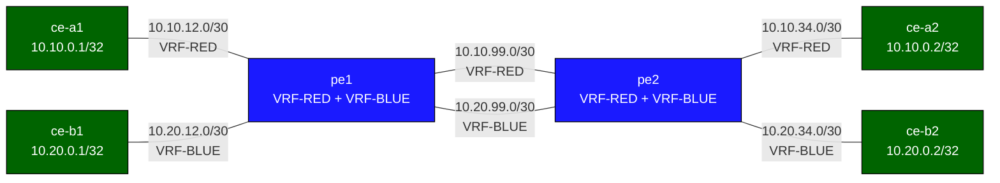

# VRF-Lite — Practice Lab  (Arista cEOS)

Configure VRF-Lite (Virtual Routing and Forwarding without MPLS) to isolate two customers on a shared provider infrastructure. Two PEs share physical links but maintain completely separate routing tables per VRF — all configured directly in the EOS CLI.

---

## Topology



pe1 and pe2 each maintain two VRFs. Two separate inter-PE links carry each VRF (this is "VRF-Lite" — no MPLS label switching).

### Link addressing

| Link            | Subnet        | Left      | Right     | VRF       |
|-----------------|---------------|-----------|-----------|-----------|
| ce-a1 — pe1     | 10.10.12.0/30 | 10.10.12.1| 10.10.12.2| VRF-RED   |
| pe1 — pe2 (RED) | 10.10.99.0/30 | 10.10.99.1| 10.10.99.2| VRF-RED   |
| pe2 — ce-a2     | 10.10.34.0/30 | 10.10.34.1| 10.10.34.2| VRF-RED   |
| ce-b1 — pe1     | 10.20.12.0/30 | 10.20.12.1| 10.20.12.2| VRF-BLUE  |
| pe1 — pe2 (BLU) | 10.20.99.0/30 | 10.20.99.1| 10.20.99.2| VRF-BLUE  |
| pe2 — ce-b2     | 10.20.34.0/30 | 10.20.34.1| 10.20.34.2| VRF-BLUE  |

### Node reference

| Node  | Loopback     | Role          |
|-------|--------------|---------------|
| ce-a1 | 10.10.0.1/32 | Cust A Site 1 |
| ce-a2 | 10.10.0.2/32 | Cust A Site 2 |
| ce-b1 | 10.20.0.1/32 | Cust B Site 1 |
| ce-b2 | 10.20.0.2/32 | Cust B Site 2 |
| pe1   | 192.168.0.1  | Provider Edge |
| pe2   | 192.168.0.2  | Provider Edge |

---

## Deploy and access

```bash
sudo containerlab deploy -t labs/vrf-lite/topology.clab.yml

# Access PE nodes (EOS CLI)
docker exec -it clab-vrf-lite-pe1 Cli
docker exec -it clab-vrf-lite-pe2 Cli
```

---

## Step 1 — Create VRFs and enable routing on pe1

<details>
<summary>Show configuration</summary>

```
pe1# configure terminal

! Create the VRF instances
pe1(config)# vrf instance VRF-RED
pe1(config)# vrf instance VRF-BLUE

! Enable IP routing in each VRF
pe1(config)# ip routing vrf VRF-RED
pe1(config)# ip routing vrf VRF-BLUE
pe1(config)# end
```

Verify:
```
pe1# show vrf
```

Expected: VRF-RED and VRF-BLUE appear, no interfaces yet.

---

</details>

## Step 2 — Assign interfaces to VRFs on pe1

<details>
<summary>Show configuration</summary>

```
pe1# configure terminal

pe1(config)# interface Ethernet1
pe1(config-if)# no switchport
pe1(config-if)# vrf VRF-RED
pe1(config-if)# ip address 10.10.12.2/30
pe1(config-if)# no shutdown

pe1(config)# interface Ethernet2
pe1(config-if)# no switchport
pe1(config-if)# vrf VRF-RED
pe1(config-if)# ip address 10.10.99.1/30
pe1(config-if)# no shutdown

pe1(config)# interface Ethernet3
pe1(config-if)# no switchport
pe1(config-if)# vrf VRF-BLUE
pe1(config-if)# ip address 10.20.12.2/30
pe1(config-if)# no shutdown

pe1(config)# interface Ethernet4
pe1(config-if)# no switchport
pe1(config-if)# vrf VRF-BLUE
pe1(config-if)# ip address 10.20.99.1/30
pe1(config-if)# no shutdown

pe1(config)# end
```

Verify:
```
pe1# show vrf
```

Expected: VRF-RED shows Ethernet1, Ethernet2; VRF-BLUE shows Ethernet3, Ethernet4.

```
pe1# show ip route vrf VRF-RED
```

Expected: 10.10.12.0/30 and 10.10.99.0/30 as directly connected.

---

</details>

## Step 3 — Configure static routes on pe1

<details>
<summary>Show configuration</summary>

```
pe1# configure terminal
pe1(config)# ip route vrf VRF-RED  10.10.0.1/32 10.10.12.1
pe1(config)# ip route vrf VRF-RED  10.10.0.2/32 10.10.99.2
pe1(config)# ip route vrf VRF-BLUE 10.20.0.1/32 10.20.12.1
pe1(config)# ip route vrf VRF-BLUE 10.20.0.2/32 10.20.99.2
pe1(config)# end
```

---

</details>

## Step 4 — Configure pe2 (mirror of pe1, different subnets)

<details>
<summary>Show configuration</summary>

Repeat Steps 1–3 on pe2. Key differences:
- Ethernet1 → VRF-RED, 10.10.99.2/30 (inter-PE)
- Ethernet2 → VRF-RED, 10.10.34.1/30 (to ce-a2)
- Ethernet3 → VRF-BLUE, 10.20.99.2/30 (inter-PE)
- Ethernet4 → VRF-BLUE, 10.20.34.1/30 (to ce-b2)

Static routes for pe2:
```
ip route vrf VRF-RED  10.10.0.1/32 10.10.99.1
ip route vrf VRF-RED  10.10.0.2/32 10.10.34.2
ip route vrf VRF-BLUE 10.20.0.1/32 10.20.99.1
ip route vrf VRF-BLUE 10.20.0.2/32 10.20.34.2
```

---

</details>

## Verification

```
! On pe1 — separate routing tables
pe1# show ip route vrf VRF-RED
pe1# show ip route vrf VRF-BLUE

! On pe1 — ping within a VRF
pe1# ping vrf VRF-RED 10.10.12.1        ! ce-a1 directly attached
pe1# ping vrf VRF-RED 10.10.0.1         ! ce-a1 loopback (needs static route)
pe1# ping vrf VRF-RED 10.10.0.2         ! ce-a2 loopback (via pe2)

! End-to-end within VRF-RED (on ce-a1)
ce-a1# ping 10.10.0.2 source 10.10.0.1    ! should SUCCEED

! Isolation test — cross-VRF (on ce-a1)
ce-a1# ping 10.20.0.1 source 10.10.0.1    ! should FAIL — different VRF
```

---

## Experiment A — OSPF per VRF (replace statics)

Instead of static routes, run OSPF within each VRF. In EOS, each VRF gets its own OSPF instance number.

<details>
<summary>Show configuration</summary>

On **pe1** (and mirror on pe2):
```
pe1# configure terminal

pe1(config)# router ospf 1 vrf VRF-RED
pe1(config-router)# router-id 10.10.99.1
pe1(config-router)# passive-interface Ethernet1

pe1(config)# interface Ethernet1
pe1(config-if)# ip ospf area 0.0.0.0

pe1(config)# interface Ethernet2
pe1(config-if)# ip ospf area 0.0.0.0

pe1(config)# router ospf 2 vrf VRF-BLUE
pe1(config-router)# router-id 10.20.99.1
pe1(config-router)# passive-interface Ethernet3

pe1(config)# interface Ethernet3
pe1(config-if)# ip ospf area 0.0.0.0

pe1(config)# interface Ethernet4
pe1(config-if)# ip ospf area 0.0.0.0
```
</details>

Remove static routes first: `no ip route vrf VRF-RED 10.10.0.1/32 10.10.12.1` etc.

Each VRF runs a completely independent OSPF process. VRF-RED's OSPF has no awareness of VRF-BLUE's OSPF.

---

## Experiment B — Route leaking between VRFs

VRF isolation is useful for customers, but sometimes a shared service (e.g., a DNS server) needs to be reachable from both VRFs. In production, route leaking is controlled with BGP import/export route-targets (see `mpls-sr-isis-bgp` or `evpn-border-ceos` for examples).

For a quick lab experiment, EOS supports cross-VRF static route nexthop resolution:
```
! Leak ce-a1's loopback (10.10.0.1/32) into VRF-BLUE on pe1
! The nexthop 10.10.12.1 is resolved in VRF-RED
pe1(config)# ip route vrf VRF-BLUE 10.10.0.1/32 10.10.12.1 vrf VRF-RED
```

Verify: `show ip route vrf VRF-BLUE` — 10.10.0.1/32 should appear.
Then test: from ce-b1, `ping 10.10.0.1` — should succeed if pe2 also has the leaked route.

---

## Troubleshooting

**VRFs not appearing after deploy**
- Verify config applied: `show running-config | section vrf`
- Check interface VRF assignment: `show vrf`

**Interface not in the VRF routing table**
- In EOS, `vrf VRF-RED` under the interface assigns it; verify with `show vrf`
- The `vrf` command must come before `ip address` in config order
- If you configure IP before VRF, remove and re-add: `no ip address`, then `vrf`, then `ip address`

**Routes in VRF table but ping still fails**
- Check the CE's default route points to the PE's IP in the correct VRF subnet
- `show ip route vrf VRF-RED` on both pe1 and pe2 — both must have routes in both directions

**Cross-VRF ping unexpectedly succeeds**
- `show vrf` — verify each interface is in the correct VRF
- Confirm no unintended route leaking configured
