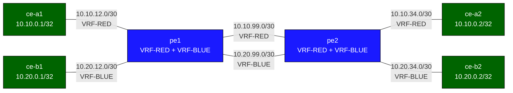

# VRF-Lite — Practice Lab (Arista cEOS)

Two customers, one shared pair of provider routers, completely separate
routing tables — that's VRF-Lite: virtualized routing without MPLS. You
build VRF-RED and VRF-BLUE on two PEs, prove the two customers are
invisible to each other, then deliberately *leak* a route between them and
understand exactly what isolation you just gave up.

## Topology



Each PE holds two VRFs; a separate inter-PE link carries each VRF (no MPLS
— that's what makes it "lite").

| Link | Subnet | VRF |
|------|--------|-----|
| ce-a1 — pe1 | 10.10.12.0/30 | RED |
| pe1 — pe2 (RED) | 10.10.99.0/30 | RED |
| pe2 — ce-a2 | 10.10.34.0/30 | RED |
| ce-b1 — pe1 | 10.20.12.0/30 | BLUE |
| pe1 — pe2 (BLUE) | 10.20.99.0/30 | BLUE |
| pe2 — ce-b2 | 10.20.34.0/30 | BLUE |

CE loopbacks: ce-a1 10.10.0.1, ce-a2 10.10.0.2, ce-b1 10.20.0.1, ce-b2
10.20.0.2.

## How to use this lab

This is a **practice lab**, not a tutorial.

- **Predict before you configure**, **open hints before the solution**,
  **verify** per-VRF with `show ip route vrf` and isolation pings.

## Deploy

```bash
sudo containerlab deploy -t labs/vrf-lite/topology.clab.yml
docker exec -it clab-vrf-lite-pe1 Cli
```

---

## Task 1 — Create the VRFs and place interfaces on pe1

**Objective:** Create VRF-RED and VRF-BLUE on pe1, enable IP routing in
each, and assign the four interfaces (Eth1/Eth2 → RED, Eth3/Eth4 → BLUE)
with their addresses.

**Predict first:** EOS interfaces default to `switchport`. There's an
ordering trap: if you set `ip address` *before* `vrf`, what happens to the
address when you then assign the VRF?

<details>
<summary>Hints</summary>

- `vrf instance VRF-RED` / `ip routing vrf VRF-RED` (and BLUE).
- Per interface: `no switchport`, then `vrf VRF-RED`, **then**
  `ip address`, then `no shutdown`.
- Verify with `show vrf` and `show ip route vrf VRF-RED`.

</details>

<details>
<summary>Solution</summary>

```text
configure terminal
vrf instance VRF-RED
vrf instance VRF-BLUE
ip routing vrf VRF-RED
ip routing vrf VRF-BLUE
!
interface Ethernet1
 no switchport
 vrf VRF-RED
 ip address 10.10.12.2/30
 no shutdown
interface Ethernet2
 no switchport
 vrf VRF-RED
 ip address 10.10.99.1/30
 no shutdown
interface Ethernet3
 no switchport
 vrf VRF-BLUE
 ip address 10.20.12.2/30
 no shutdown
interface Ethernet4
 no switchport
 vrf VRF-BLUE
 ip address 10.20.99.1/30
 no shutdown
```

</details>

<details>
<summary>Check your work</summary>

`show vrf` shows Eth1/Eth2 in RED, Eth3/Eth4 in BLUE; `show ip route vrf
VRF-RED` has the two RED /30s as connected. Prediction answer: assigning a
VRF *removes* any pre-existing IP address from the interface — the address
belongs to a routing context, so changing the context drops it. Hence the
order `vrf` then `ip address`; the classic VRF-Lite bug is "I configured
the IP but the interface has no address" after a late VRF assignment.

</details>

---

## Task 2 — Static routes, then pe2, then prove isolation

**Objective:** Add per-VRF static routes for the CE loopbacks on pe1,
mirror the whole config on pe2, and verify both end-to-end reachability
*within* a VRF and isolation *between* VRFs.

**Predict first:** ce-a1 (VRF-RED) pings ce-b1's loopback 10.20.0.1
(VRF-BLUE). They share the same physical PEs. Will it succeed or fail, and
*why* — is it a missing route or an enforced boundary?

<details>
<summary>Hints</summary>

- `ip route vrf VRF-RED 10.10.0.1/32 10.10.12.1` etc. — every route is
  scoped to a VRF.
- pe2 mirrors pe1 (Eth1 RED inter-PE 10.10.99.2, Eth2 RED to ce-a2, etc.).
- Test with `ping vrf VRF-RED ...` on the PE and source-pings on the CEs.

</details>

<details>
<summary>Solution</summary>

pe1 statics:
```text
ip route vrf VRF-RED  10.10.0.1/32 10.10.12.1
ip route vrf VRF-RED  10.10.0.2/32 10.10.99.2
ip route vrf VRF-BLUE 10.20.0.1/32 10.20.12.1
ip route vrf VRF-BLUE 10.20.0.2/32 10.20.99.2
```

pe2 statics:
```text
ip route vrf VRF-RED  10.10.0.1/32 10.10.99.1
ip route vrf VRF-RED  10.10.0.2/32 10.10.34.2
ip route vrf VRF-BLUE 10.20.0.1/32 10.20.99.1
ip route vrf VRF-BLUE 10.20.0.2/32 10.20.34.2
```

</details>

<details>
<summary>Check your work</summary>

`ce-a1# ping 10.10.0.2 source 10.10.0.1` succeeds (RED end to end);
`ce-a1# ping 10.20.0.1 source 10.10.0.1` **fails**. Prediction answer:
the cross-VRF ping fails because the VRFs are *separate routing tables* —
pe1 has no route to 10.20.0.1 *in VRF-RED* at all, and even overlapping
addresses would be kept apart. It's an enforced boundary, not a missing
route you could add casually. This is the core value proposition: two
customers (even with overlapping address space) coexist on one box,
provably isolated.

</details>

---

## Task 3 — Break the isolation on purpose: route leaking

**Objective:** Leak ce-a1's loopback (10.10.0.1/32) from VRF-RED into
VRF-BLUE on both PEs, and make ce-b1 able to reach it (a shared-service
pattern).

**Predict first:** isolation was the whole point. After you leak one /32,
what isolation property have you *kept* and what have you *lost* — can
ce-b1 now reach *all* of RED, or just the leaked prefix?

<details>
<summary>Hints</summary>

- EOS cross-VRF static: `ip route vrf VRF-BLUE 10.10.0.1/32 10.10.12.1 vrf
  VRF-RED` (next-hop resolved in the other VRF).
- Both PEs need the leak for bidirectional reachability.
- Verify `show ip route vrf VRF-BLUE` shows the leaked /32.

</details>

<details>
<summary>Solution</summary>

On **pe1** (and the equivalent on pe2):
```text
ip route vrf VRF-BLUE 10.10.0.1/32 10.10.12.1 vrf VRF-RED
```

</details>

<details>
<summary>Check your work</summary>

ce-b1 → 10.10.0.1 now works; ce-b1 → 10.10.0.2 (un-leaked) still fails.
Prediction answer: you've kept *most* of the isolation — only the single
explicitly-leaked /32 crosses; the rest of RED is still invisible to BLUE.
Leaking is surgical and intentional, which is the right model for a shared
DNS/NTP service. The danger is doing it sloppily (leaking a summary, or
forgetting the return leak) and silently merging two customers' routing —
in production this is governed by BGP import/export route-targets, not
hand-written cross-VRF statics, precisely so the policy is auditable.

</details>

---

## Verification

```text
show vrf
show ip route vrf VRF-RED
show ip route vrf VRF-BLUE
ping vrf VRF-RED 10.10.0.2
# isolation: ce-a1 ping 10.20.0.1 source 10.10.0.1   -> fails (by design)
```

---

## Challenge questions

No answers provided — reason them through.

1. VRF-Lite carries each VRF on its *own* physical inter-PE link. MPLS L3VPN
   carries all VRFs over *one* labeled core. List the scaling and
   operational differences, and the exact point (number of VRFs or PEs)
   where VRF-Lite stops being practical.
2. Two customers both use 10.10.0.0/24 internally. Explain precisely why
   VRF-Lite handles the overlap on the PEs but creates a problem the moment
   you try to leak a route between them — and what NAT or re-addressing is
   forced.
3. You ran independent OSPF processes per VRF (see Experiment). What
   prevents VRF-RED's OSPF from ever learning VRF-BLUE's LSAs, and how
   would an accidental shared router-id or area design *not* break that
   isolation?
4. Route leaking (Task 3) used a static. Design the equivalent with BGP
   route-targets (import/export) and argue why RT-based leaking is safer
   and more auditable at scale than cross-VRF statics.

## Experiment — OSPF per VRF (replace the statics)

Each VRF gets its own OSPF instance number in EOS:

<details>
<summary>Configuration (pe1; mirror on pe2)</summary>

```text
router ospf 1 vrf VRF-RED
 router-id 10.10.99.1
 passive-interface Ethernet1
interface Ethernet1
 ip ospf area 0.0.0.0
interface Ethernet2
 ip ospf area 0.0.0.0
!
router ospf 2 vrf VRF-BLUE
 router-id 10.20.99.1
 passive-interface Ethernet3
interface Ethernet3
 ip ospf area 0.0.0.0
interface Ethernet4
 ip ospf area 0.0.0.0
```

</details>

Remove the corresponding statics first. The two OSPF processes are fully
independent — RED's OSPF has no awareness of BLUE's.

---

## Troubleshooting

**Interface has no IP after assigning a VRF**
- `vrf` must be set *before* `ip address`; re-add the address after the VRF

**Routes in the VRF table but ping fails**
- The CE's default must point at the PE's IP *in the right VRF subnet*
- Both PEs need routes in both directions (`show ip route vrf ...`)

**Cross-VRF ping unexpectedly succeeds**
- `show vrf` — confirm each interface is in the intended VRF; check for
  an unintended leak
