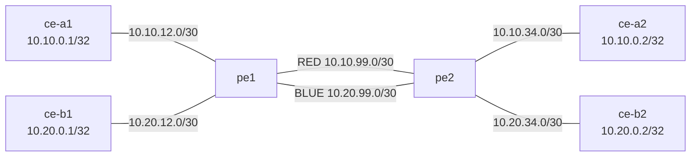

# VRF-Lite — Practice Lab

Build two isolated routing contexts across a pair of native Arista cEOS provider
edges, prove the separation on the wire, and then authorize exactly one
bidirectional cross-tenant `/32` share. The final incident preserves a plausible
static declaration while removing its resolver context, forcing you to
distinguish saved intent from an active forwarding entry.

**Lab type:** Build

## Topology


```mermaid
flowchart LR
    a1["ce-a1\n10.10.0.1/32"] ---|"10.10.12.0/30"| pe1
    pe1 ---|"RED 10.10.99.0/30"| pe2
    pe2 ---|"10.10.34.0/30"| a2["ce-a2\n10.10.0.2/32"]
    b1["ce-b1\n10.20.0.1/32"] ---|"10.20.12.0/30"| pe1
    pe1 ---|"BLUE 10.20.99.0/30"| pe2
    pe2 ---|"10.20.34.0/30"| b2["ce-b2\n10.20.0.2/32"]
```

The PEs are native `ceos:4.35.2F`. The four customer roles are lightweight
`ops-lab:local` Linux endpoints because they only originate and receive test
traffic; they are not learned routers.

| Link | PE interface/address | Endpoint/address | Context |
|---|---|---|---|
| ce-a1—pe1 | pe1 Ethernet1, `10.10.12.2/30` | eth1, `10.10.12.1/30` | VRF-RED |
| pe1—pe2 | pe1 Ethernet2, `10.10.99.1/30` | pe2 Ethernet1, `10.10.99.2/30` | VRF-RED |
| pe2—ce-a2 | pe2 Ethernet2, `10.10.34.1/30` | eth1, `10.10.34.2/30` | VRF-RED |
| ce-b1—pe1 | pe1 Ethernet3, `10.20.12.2/30` | eth1, `10.20.12.1/30` | VRF-BLUE |
| pe1—pe2 | pe1 Ethernet4, `10.20.99.1/30` | pe2 Ethernet3, `10.20.99.2/30` | VRF-BLUE |
| pe2—ce-b2 | pe2 Ethernet4, `10.20.34.1/30` | eth1, `10.20.34.2/30` | VRF-BLUE |

Each endpoint owns the loopback shown in the diagram and has one exact default
route toward its PE.

## How to use this lab

This is a **practice lab**, not a tutorial. Each task gives you an
**objective** and **hints** — your job is to produce the configuration.

- **Predict before you configure.** When a task asks for a prediction,
  commit to an answer before touching the CLI. Being wrong and finding out
  why is the point.
- **Open the hints before the solution.** The solution toggle is the answer
  key — use it to check your work or when genuinely stuck, not as step one.
- **Verify like an operator.** After each task, prove the state is what you
  think it is with `show` commands before moving on.

## Deploy

Import the exact cEOS image and build the shared endpoint image first:

```bash
docker import cEOS-lab-4.35.2F.tar ceos:4.35.2F
docker build -t ops-lab:local images/ops-lab/
./scripts/lab.sh deploy vrf-lite
./scripts/lab.sh cli vrf-lite pe1
```

The PE startup files contain only hostname, global routing, and a benign
Loopback0 scaffold. All VRFs, data-interface ownership, tenant routes, and
cross-VRF policy are student work.

## Task 1 — Build both routing contexts and their interfaces

**Objective:** On both PEs, create exactly VRF-RED and VRF-BLUE, enable IP
routing in each, and place every data interface in the context shown in the
table with its exact address.

**Predict first:** What happens to an EOS interface address if you assign its
VRF after entering the address?

<details markdown="1">
<summary>Hints</summary>

- Create a `vrf instance` before using `ip routing vrf`.
- On each routed port, use `no switchport`; assign the VRF before the address.
- `show vrf` and `show ip interface brief vrf all` expose ownership and state.

</details>

<details markdown="1">
<summary>Solution</summary>

On pe1:

```text
configure terminal
vrf instance VRF-RED
vrf instance VRF-BLUE
ip routing vrf VRF-RED
ip routing vrf VRF-BLUE
interface Ethernet1
 no switchport
 vrf VRF-RED
 ip address 10.10.12.2/30
 no shutdown
interface Ethernet2
 no switchport
 vrf VRF-RED
 ip address 10.10.99.1/30
 no shutdown
interface Ethernet3
 no switchport
 vrf VRF-BLUE
 ip address 10.20.12.2/30
 no shutdown
interface Ethernet4
 no switchport
 vrf VRF-BLUE
 ip address 10.20.99.1/30
 no shutdown
end
```

On pe2:

```text
configure terminal
vrf instance VRF-RED
vrf instance VRF-BLUE
ip routing vrf VRF-RED
ip routing vrf VRF-BLUE
interface Ethernet1
 no switchport
 vrf VRF-RED
 ip address 10.10.99.2/30
 no shutdown
interface Ethernet2
 no switchport
 vrf VRF-RED
 ip address 10.10.34.1/30
 no shutdown
interface Ethernet3
 no switchport
 vrf VRF-BLUE
 ip address 10.20.99.2/30
 no shutdown
interface Ethernet4
 no switchport
 vrf VRF-BLUE
 ip address 10.20.34.1/30
 no shutdown
end
```

</details>

<details markdown="1">
<summary>Check your work</summary>

Both VRFs list exactly two data interfaces per PE, and all eight interfaces
are up/up. Assigning a VRF after an address removes that address because the
interface has changed routing context; the address must be entered afterward.

</details>

## Task 2 — Route each tenant without crossing the boundary

**Objective:** Install four `/32` static routes per PE so both RED loopbacks
and both BLUE loopbacks work in both directions, while cross-tenant tests fail.

**Predict first:** Does sharing physical PEs create any implicit route between
the two VRF tables?

<details markdown="1">
<summary>Hints</summary>

- Every tenant route begins `ip route vrf <context> <prefix> <next-hop>`.
- A local endpoint next hop is on its access `/30`; the remote endpoint next
  hop is the other PE on the tenant's dedicated inter-PE `/30`.
- Use explicit loopback sources when testing so success cannot be mistaken for
  connected-link reachability.

</details>

<details markdown="1">
<summary>Solution</summary>

```text
! pe1
ip route vrf VRF-RED 10.10.0.1/32 10.10.12.1
ip route vrf VRF-RED 10.10.0.2/32 10.10.99.2
ip route vrf VRF-BLUE 10.20.0.1/32 10.20.12.1
ip route vrf VRF-BLUE 10.20.0.2/32 10.20.99.2

! pe2
ip route vrf VRF-RED 10.10.0.1/32 10.10.99.1
ip route vrf VRF-RED 10.10.0.2/32 10.10.34.2
ip route vrf VRF-BLUE 10.20.0.1/32 10.20.99.1
ip route vrf VRF-BLUE 10.20.0.2/32 10.20.34.2
```

</details>

<details markdown="1">
<summary>Check your work</summary>

From the host shell, both directions for each tenant succeed:

```bash
docker exec clab-vrf-lite-ce-a1 ping -c 2 -I 10.10.0.1 10.10.0.2
docker exec clab-vrf-lite-ce-a2 ping -c 2 -I 10.10.0.2 10.10.0.1
docker exec clab-vrf-lite-ce-b1 ping -c 2 -I 10.20.0.1 10.20.0.2
docker exec clab-vrf-lite-ce-b2 ping -c 2 -I 10.20.0.2 10.20.0.1
```

An explicit-source A-to-B test fails. The shared chassis creates no implicit
route: each VRF has an independent RIB and FIB.

</details>

## Task 3 — Make the isolated links visible

**Objective:** Capture sourced tenant ICMP on pe1's Linux-facing interfaces and
prove RED uses only Ethernet2 while BLUE uses only Ethernet4.

**Predict first:** Which addresses should be visible on each inter-PE link, and
should any encapsulation header exist in VRF-Lite?

<details markdown="1">
<summary>Hints</summary>

- EOS data ports are visible as Linux interfaces inside cEOS.
- Bound packet count and duration before generating exactly three pings.
- The repository helper owns and cleans up only the capture processes it
  starts.

</details>

<details markdown="1">
<summary>Solution</summary>

```bash
labs/vrf-lite/capture.sh
```

</details>

<details markdown="1">
<summary>Check your work</summary>

The helper reports exactly three echo requests and three replies for RED on
Ethernet2, and the same BLUE counts on Ethernet4. Neither capture contains the
other tenant. There is no tunnel header: separation comes from routing context
and dedicated links, not encapsulation.

</details>

## Task 4 — Authorize one bidirectional `/32` share

**Objective:** On pe1 only, make ce-a1 and ce-b1 reachable in both directions
by adding exactly two cross-VRF `/32` routes. Leave every other cross-tenant
loopback unreachable.

**Predict first:** Why does a one-way route declaration not make a successful
ping, even when the echo request reaches the destination?

<details markdown="1">
<summary>Hints</summary>

- The EOS 4.35.2F form places `egress-vrf` before the resolver VRF and next hop.
- The destination route lives in the ingress VRF; its next hop is resolved in
  the other VRF.
- Inspect route detail, not only running configuration. Look for the parenthetic
  egress-VRF annotation.

</details>

<details markdown="1">
<summary>Solution</summary>

```text
ip route vrf VRF-BLUE 10.10.0.1/32 egress-vrf VRF-RED 10.10.12.1
ip route vrf VRF-RED 10.20.0.1/32 egress-vrf VRF-BLUE 10.20.12.1
copy running-config startup-config
```

</details>

<details markdown="1">
<summary>Check your work</summary>

ce-a1→ce-b1 and ce-b1→ce-a1 now succeed with explicit loopback sources. Route
detail includes `(egress VRF VRF-RED)` or `(egress VRF VRF-BLUE)`. Tests
involving ce-a2 or ce-b2 still fail, proving the share is two precise `/32`s,
not a merged tenant table. A request and its reply need independent routes.

</details>

## Task 5 — Diagnose a declared route that is not active

**Objective:** Arm an opaque fault, preserve configuration and FIB evidence,
identify why the approved share fails while both tenants remain healthy, and
apply only the focused repair.

**Predict first:** Can a syntactically accepted static remain in saved config
without becoming an active FIB entry?

<details markdown="1">
<summary>Hints</summary>

- Start with `labs/vrf-lite/break.sh`; it is bounded and repeatable.
- Compare running and startup declarations with `show ip route vrf ...` detail.
- Do not rebuild the VRFs or tenant statics: their forwarding still works.

</details>

<details markdown="1">
<summary>Solution</summary>

```bash
labs/vrf-lite/repair.sh
```

The focused configuration change is:

```text
no ip route vrf VRF-BLUE 10.10.0.1/32 10.10.12.1
ip route vrf VRF-BLUE 10.10.0.1/32 egress-vrf VRF-RED 10.10.12.1
copy running-config startup-config
```

</details>

<details markdown="1">
<summary>Check your work</summary>

During the incident, the altered static is saved but absent from the BLUE FIB:
its next hop exists only in RED and no egress resolver context was supplied.
All four same-tenant directions stay healthy while the approved share fails.
After repair, route detail regains its egress-VRF annotation and the full exact
checker passes.

</details>

## Verification

```bash
labs/vrf-lite/solution.sh   # optional exact answer-key convergence
labs/vrf-lite/check.sh
labs/vrf-lite/capture.sh
```

The checker validates exact nodes, images and amd64 platform; endpoint
scaffolds; running and saved task scope; interface state; ordinary and
cross-VRF FIB resolution; four same-tenant paths; both approved share
directions; and all six other explicit-source cross-tenant directions. Its failure text stays
generic so it does not disclose missing answers.

## Challenge questions

1. If ten tenants crossed the same PE pair, compare the link and operational
   scaling of this design with an MPLS L3VPN core.
2. Two tenants use the same service `/32`. What ambiguity appears when one VRF
   tries to import both, and where could translation safely resolve it?
3. Design a review process that prevents an engineer from sharing a `/24` when
   only one `/32` was approved.
4. Without changing the checker contract, what evidence would you collect to
   distinguish an inactive recursive static from packet filtering?

## Troubleshooting

| Symptom | Likely cause | Focused action |
|---|---|---|
| Address disappears after VRF assignment | EOS moved the interface to a new context | Re-enter the address after `vrf` |
| Connected routes exist, remote loopback fails | Remote `/32` static or return static is absent | Inspect both PEs in the same VRF |
| Static is saved but absent from FIB | Its next hop cannot resolve in the declared context | Inspect route detail and egress resolver context |
| All cross-tenant paths work | A broad prefix or unintended import merged policy | Audit every cross-VRF route and remove broad entries |
| Checker rejects an otherwise working path | Extra saved/running state or wrong source path exists | Compare both configuration planes and explicit-source tests |

## Security, reproducibility, and cleanup

Cross-VRF routing is an authorization decision. This lab permits only the two
directions needed for one endpoint pair and explicitly tests negative paths.
The solution and lifecycle helpers accept only answer-free, canonical, or the
intended fault state; they back up both configuration planes before mutation,
use bounded waits, and remove their mode-700 temporary state. Capture cleanup
targets only helper-owned processes.

To start over, recreate the topology so the endpoint setup hooks and cEOS data
links are installed together:

```bash
./scripts/lab.sh destroy vrf-lite
./scripts/lab.sh deploy vrf-lite
```

To remove the lab, run only the destroy command.

This is VRF-Lite with static routes and dedicated inter-PE links. It does not
model MPLS labels, MP-BGP route targets, a shared core, or dynamic routing.
FRR is intentionally absent: EOS is the learned platform and Linux CEs are
traffic endpoints only.
