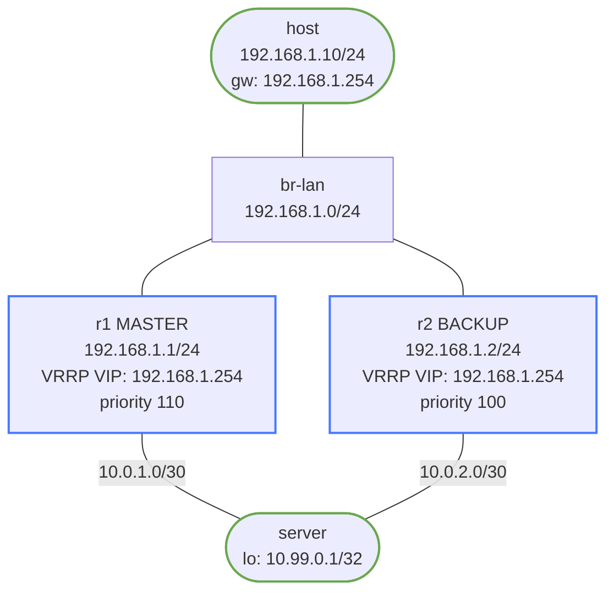

# VRRP (First-Hop Redundancy) — Practice Lab

A host has one default gateway, but a gateway is a single point of failure.
VRRP fixes that: two routers share one virtual IP, hosts point at the VIP,
and a backup takes over within seconds when the master dies — without the
host ever changing its ARP entry. You configure the pair, prove a failover,
and reason about *why* the host doesn't notice.

## Topology



**Pre-configured:** all IP addresses; static routes to the server on r1/r2;
return routes on the server via both; host's default gateway is the VIP
192.168.1.254.

## How to use this lab

This is a **practice lab**, not a tutorial. Each task gives you an objective
and hints; configuration is behind solution toggles.

- **Predict before you configure**, **open the solution to check or when
  stuck**, and **verify** with `show vrrp` and failover pings.

## Deploy

```bash
./scripts/lab.sh deploy vrrp
./scripts/lab.sh cli vrrp r1
```

---

## Task 1 — Configure the VRRP pair

**Objective:** Make r1 the master (priority 110, preempt) and r2 the backup
(default priority) for VRID 1, VIP 192.168.1.254 on Ethernet1.

**Predict first:** the VIP is 192.168.1.254 — an address neither router
*owns* as a real interface IP. What MAC will the host see for that VIP, and
which router answers ARP for it?

<details markdown="1">
<summary>Hints</summary>

- On the LAN interface: `vrrp 1 ip 192.168.1.254`, plus `vrrp 1 priority
  110` and `vrrp 1 preempt` on r1.
- r2 just needs the VIP; priority defaults to 100.

</details>

<details markdown="1">
<summary>Solution</summary>

On **r1**:

```text
interface Ethernet1
 vrrp 1 ip 192.168.1.254
 vrrp 1 priority 110
 vrrp 1 preempt
```

On **r2**:

```text
interface Ethernet1
 vrrp 1 ip 192.168.1.254
```

</details>

<details markdown="1">
<summary>Check your work</summary>

`show vrrp` on r1 shows `State Master`, `Priority 110`, `Virtual MAC
00:00:5e:00:01:01`; r2 shows `Backup`. Prediction answer: the host sees
the **virtual MAC** `00:00:5e:00:01:<VRID>` (here `...01:01`), and whichever
router is master answers ARP for the VIP with that MAC. Because the MAC is
derived from the VRID and is *identical* on whichever router is master, a
failover doesn't change it — which is the whole reason the host never has
to re-ARP (Task 3 proves it).

</details>

---

## Task 2 — Verify steady state and end-to-end path

**Objective:** Confirm the roles and that the host reaches the server
through the VIP.

```text
# on r1:  show vrrp ; show vrrp interface Ethernet1
# on host: ping 10.99.0.1
```

<details markdown="1">
<summary>Check your work</summary>

r1 Master, r2 Backup, and the host pings the server loopback through
192.168.1.254 (currently riding r1). Only the master forwards for the VIP;
the backup sits silent, listening for advertisements. That idle backup is
the cost of active/standby FHRP — half your gateway capacity is unused
until a failure (a tradeoff the challenge questions revisit).

</details>

---

## Task 3 — Break it: fail the master, time the recovery

**Objective:** Shut r1's LAN interface, watch r2 take over, and observe the
host recover — *without changing its ARP entry*.

Break it: `ip link set eth1 down` on r1. Check `show vrrp` on r2.

**Predict first:** how long until r2 becomes master — instantly, or after a
timeout? What's the timer, and does the host have to re-ARP for the VIP to
keep working?

<details markdown="1">
<summary>What you should observe</summary>

r2 transitions to Master after ~3 seconds — three missed 1-second
advertisements — then sends a **gratuitous ARP** so the L2 switches relearn
which port the virtual MAC now lives behind. The host's ARP cache is
untouched (same VIP, same virtual MAC); only the *switch* MAC table moves.
Pings resume in 3–4 s. This is the elegance of VRRP: failover is a
control-plane event between the routers plus an L2 relearn, completely
invisible to the host's IP stack. Sub-second failover would need BFD
(see the bfd-* labs) or tuned timers.

</details>

---

## Task 4 — Preemption: the master reclaims its role

**Objective:** Restore r1 and observe it take the master role back.

Restore: `ip link set eth1 up` on r1.

**Predict first:** r1 comes back with priority 110 > r2's 100, and has
`preempt` configured. Will it reclaim master immediately, or wait? What
would happen if `preempt` were *off*?

<details markdown="1">
<summary>Check your work</summary>

With `preempt`, r1 reclaims master on its first advertisement (priority
110 beats 100) — r1 Backup→Master, r2 Master→Backup. Without `preempt`,
r1 would come back as *backup* and leave r2 as master indefinitely, since
a working master isn't displaced. Preempt is the knob that decides
"always prefer the designated primary" vs. "avoid an extra failover by
leaving whoever's up in charge" — both are valid; the second avoids a
second traffic blip on recovery.

</details>

---

## Key Concepts

- **Virtual MAC** `00:00:5e:00:01:<VRID>` — stable across failover, so
  hosts never re-ARP.
- **Master election** — highest priority (1–254, default 100); tiebreak
  highest IP; the address *owner* (real IP == VIP) always wins at 255.
- **Timers** — master advertises every 1 s; backup declares it dead after
  3 missed (~3 s).
- `show vrrp`, `show vrrp interface <if>`, `debug vrrp events`.

---

## Challenge questions

No answers provided — reason them through.

1. The backup sits idle until failover — half your gateway capacity wasted.
   Design an *active/active* setup using two VRID groups with opposite
   priorities across two VLANs, and explain how it balances load while
   keeping redundancy.
2. r1 is master but its *uplink to the server* fails while its LAN
   interface stays up. With plain VRRP, does failover happen? What feature
   ties VRRP priority to upstream reachability, and how would you configure
   it?
3. VRRP failover takes ~3 s. Walk through exactly where that time goes, and
   which knobs (advertisement interval, BFD) you'd tune for sub-second —
   and the risk of tuning them too aggressively.
4. Compare VRRP with anycast-gateway (as used in the vxlan-evpn lab) for
   first-hop redundancy. Which scales to a large fabric and why, and what
   does VRRP do that anycast gateway doesn't need to?

## Destroy

```bash
./scripts/lab.sh destroy vrrp
```

## Extensions

Optional follow-on ideas (not part of the validated workflow):

- Add interface/object tracking so priority follows upstream reachability.
- Disable preemption and compare steady-state behavior after the master
  returns.
- Capture the gratuitous ARP during failover and map it to host recovery.
