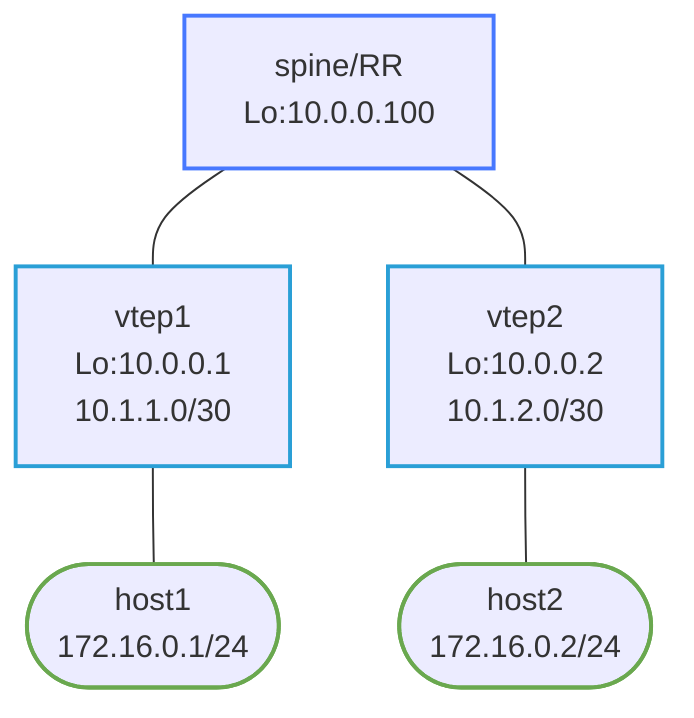

# VXLAN with BGP EVPN — Nokia SR-Linux Reference Lab

A fully-working VXLAN/BGP EVPN lab using Nokia SR-Linux. No Linux bridge setup scripts needed — VXLAN tunneling and EVPN MAC/IP learning are native SR-Linux features. Compare with the `vxlan-evpn` lab for the same design implemented on Arista cEOS.

## How to use this lab

This is a **practice lab** on a working reference build — you observe and
explain rather than configure. **Predict each verification's output
before running it**, then check the note. If you've done the `vxlan-evpn`
(cEOS) lab, treat this as the same design on a YANG-modeled NOS and notice
what changes. The challenge questions are where you reason unaided.

---

## Topology



| Node  | Role              | Loopback    | Underlay link        |
|-------|-------------------|-------------|----------------------|
| spine | BGP RR (EVPN)     | 10.0.0.100  | —                    |
| vtep1 | VTEP + OSPF       | 10.0.0.1    | 10.1.1.0/30 to spine |
| vtep2 | VTEP + OSPF       | 10.0.0.2    | 10.1.2.0/30 to spine |
| host1 | L2 end host       | —           | 172.16.0.1/24        |
| host2 | L2 end host       | —           | 172.16.0.2/24        |

---

## Deploy and access

```bash
# Pull SR-Linux image if not present
docker pull ghcr.io/nokia/srlinux:latest

./scripts/lab.sh deploy vxlan-evpn-srlinux

# SR-Linux CLI
./scripts/lab.sh cli vxlan-evpn-srlinux spine
./scripts/lab.sh cli vxlan-evpn-srlinux vtep1

# Host shells
./scripts/lab.sh bash vxlan-evpn-srlinux host1
./scripts/lab.sh bash vxlan-evpn-srlinux host2
```

---

## Verification

### Step 1 — OSPF underlay

```
# On vtep1
show network-instance default protocols ospf neighbor
```

vtep1 should show a Full adjacency to spine.

```
show network-instance default route-table ipv4-unicast prefix 10.0.0.2/32
```

vtep1 should have an OSPF route to vtep2's loopback — the VXLAN tunnel endpoint.

### Step 2 — BGP EVPN sessions

```
# On spine
show network-instance default protocols bgp neighbor
```

Both vtep1 (10.0.0.1) and vtep2 (10.0.0.2) should show `Established`.

### Step 3 — EVPN routes

**Predict first:** before host1 and host2 ever exchange a packet, will
vtep1 already have *any* EVPN routes from vtep2? If so, which route type,
and what is it for?

```
# On vtep1 — check EVPN routes received from spine
show network-instance default protocols bgp routes evpn route-type 3
```

Type-3 IMET (Inclusive Multicast Ethernet Tag) routes are generated by each VTEP to signal BUM (broadcast/unknown/multicast) forwarding. You should see a type-3 route from vtep2.

After host1 sends traffic (which generates a MAC learning event), type-2 MAC/IP routes appear:

```
show network-instance default protocols bgp routes evpn route-type 2
```

### Step 4 — VXLAN tunnel

```
# On vtep1
show tunnel-interface vxlan1
show network-instance VLAN100
```

Shows the VNI 100 tunnel state and the mac-vrf network instance.

### Step 5 — End-to-end L2 ping

```bash
./scripts/lab.sh bash vxlan-evpn-srlinux host1
ping 172.16.0.2 -c 5
```

Traffic is encapsulated in VXLAN (UDP 4789) between vtep1 (10.0.0.1) and vtep2 (10.0.0.2) over the OSPF underlay.

Check MAC table on vtep1 after successful ping:

```
# On vtep1
show network-instance VLAN100 bridge-table mac-table
```

You should see host2's MAC address learned via EVPN (remote entry from vtep2).

---

## SR-Linux VXLAN/EVPN architecture

**`tunnel-interface vxlan1`** — SR-Linux's native VXLAN interface. The `vxlan-interface 100` sub-entry represents VNI 100. The `egress.source-ip` sets the VTEP source address for outgoing tunnels (must be the loopback that other VTEPs use to reach this VTEP).

**`mac-vrf` network-instance** — SR-Linux's L2 forwarding domain. It contains:

- `interface ethernet-1/2.0` — the host-facing access port (type: bridged)
- `vxlan-interface vxlan1.100` — the VXLAN overlay port
- `protocols.bgp-evpn` — enables EVPN control plane for this VNI

**No `nolearning` hack needed** — In the FRR lab, we must set `nolearning` on the Linux VXLAN interface and rely entirely on BGP EVPN for MAC learning. SR-Linux's `mac-vrf` with `bgp-evpn` enabled automatically prefers BGP EVPN-learned MACs over data-plane learning.

**Control-plane MAC learning** — When host1 ARPs for host2, vtep1 floods the BUM frame to vtep2 via the VXLAN tunnel (using the type-3 IMET route). vtep2 receives the frame, learns host1's MAC, and advertises it as a type-2 EVPN route to spine. spine reflects it to vtep1. Subsequent traffic to host1's MAC from vtep2 goes unicast directly.

---

## Comparison: SR-Linux vs FRR for VXLAN/EVPN

| Aspect | FRR + Linux bridge | Nokia SR-Linux |
|--------|-------------------|----------------|
| VXLAN interface | Linux kernel `ip link add vxlan...` | `tunnel-interface vxlan1` |
| Bridge setup | Manual `ip link add br100`, `ip link set ... master br100` | `mac-vrf` network-instance |
| MAC learning disable | `nolearning` flag on vxlan interface | Not needed — EVPN handles it natively |
| EVPN config | Under `router bgp`, `advertise-all-vni` | Under `mac-vrf`, `bgp-evpn bgp-instance` |
| MPLS sysctl | N/A for VXLAN | Not needed |

---

## Challenge questions

No answers provided — reason them through.

1. Type-3 (IMET) routes exist before any host traffic; type-2 (MAC/IP)
   only appear after a host speaks. Explain the division of labor: what
   does each route type accomplish, and why does flooding (BUM) need to be
   set up *before* any unicast MAC is known?
2. The FRR/cEOS lab needs `nolearning` on the kernel VXLAN interface;
   SR-Linux doesn't. Explain what data-plane MAC learning would do *wrong*
   in an EVPN fabric, and how "prefer control-plane-learned MACs" prevents
   it.
3. This lab uses OSPF as the underlay; `vxlan-evpn` (cEOS) uses eBGP.
   Compare the two underlay choices for a VXLAN fabric — what does each
   give the overlay, and why do many DC designs still prefer eBGP?
4. **Break it:** change vtep2's VNI from 100 to 200 (leaving vtep1 at 100)
   and predict, then verify, what happens to host1↔host2 — does EVPN still
   exchange routes, and where exactly does forwarding fail?

## Cleanup

```bash
./scripts/lab.sh destroy vxlan-evpn-srlinux
```
