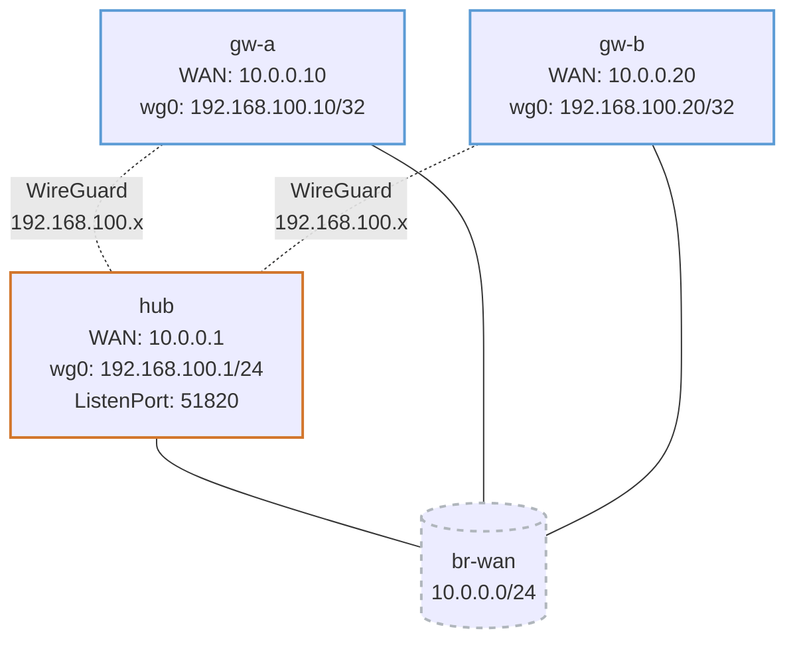

# WireGuard — Practice Lab

WireGuard is the modern VPN that fits in a few thousand lines of kernel
code: no negotiation, no cipher suites, no certificates — just static
key pairs and a property called `AllowedIPs` that does double duty as both
routing and access control. You'll build a hub-and-spoke WireGuard VPN,
prove the traffic is opaque on the wire, and discover that the single most
misunderstood field (`AllowedIPs`) is what makes or breaks it.

## Topology



| Node | WAN IP | WireGuard IP | Role |
|------|--------|--------------|------|
| hub  | 10.0.0.1/24  | 192.168.100.1/24  | server (listens :51820) |
| gw-a | 10.0.0.10/24 | 192.168.100.10/32 | site A (client) |
| gw-b | 10.0.0.20/24 | 192.168.100.20/32 | site B (client) |

## How to use this lab

This is a **practice lab**, not a tutorial.

- **Predict before you configure**, **open hints before the solution**,
  **verify** with `wg show` and a WAN capture.

## Deploy

```bash
docker build -t wireguard-lab:local labs/wireguard/    # once
./scripts/lab.sh deploy wireguard
```

WAN IPs are pre-configured; you generate keys and write
`/etc/wireguard/wg0.conf` on each node.

---

## Task 1 — Generate key pairs

**Objective:** On each node, generate a private key and derive its public
key; collect the three public keys.

**Predict first:** WireGuard has no usernames, passwords, or certificate
authority. Given only static key pairs, *how does the hub know it's
really talking to gw-a* and not an impostor — what binds identity to a
peer?

<details markdown="1">
<summary>Solution</summary>

```bash
./scripts/lab.sh cmd wireguard hub -- bash -c 'wg genkey | tee /etc/wireguard/hub.key | wg pubkey > /etc/wireguard/hub.pub'
./scripts/lab.sh cmd wireguard gw-a -- bash -c 'wg genkey | tee /etc/wireguard/gwa.key | wg pubkey > /etc/wireguard/gwa.pub'
./scripts/lab.sh cmd wireguard gw-b -- bash -c 'wg genkey | tee /etc/wireguard/gwb.key | wg pubkey > /etc/wireguard/gwb.pub'
# print each .pub — you need them for peer configs
./scripts/lab.sh cmd wireguard hub -- cat /etc/wireguard/hub.pub
```

</details>

<details markdown="1">
<summary>Check your work</summary>

Three public keys printed; private keys never leave their device.
Prediction answer: identity *is* the public key — a peer is authenticated
precisely because it can prove possession of the private key matching the
public key you listed. There's nothing else to trust and nothing to
revoke except removing the key. This "the key is the identity" model is
why WireGuard has no PKI and why protecting (and rotating) private keys
is the entire security model.

</details>

---

## Task 2 — Configure the hub and the two spokes

**Objective:** Write `wg0.conf` on each node: hub listens with both spokes
as peers; each spoke points its `Endpoint` at the hub.

**Predict first:** the hub lists each spoke with `AllowedIPs =
192.168.100.X/32`, while each spoke lists the hub with `AllowedIPs =
192.168.100.0/24`. Why is the spoke's value a /24 and the hub's a /32 —
what would break if you swapped them?

<details markdown="1">
<summary>Hints</summary>

- Hub `[Interface]` has `ListenPort = 51820`, no `Endpoint`. Each `[Peer]`
  is a spoke with its /32.
- Spokes have no `ListenPort`; their `[Peer]` (the hub) has
  `Endpoint = 10.0.0.1:51820`, `AllowedIPs = 192.168.100.0/24`, and
  `PersistentKeepalive = 25`.
- Substitute the real public keys from Task 1.

</details>

<details markdown="1">
<summary>Solution</summary>

Hub:

```ini
[Interface]
PrivateKey = <hub.key>
Address = 192.168.100.1/24
ListenPort = 51820

[Peer]   # gw-a
PublicKey = <gwa.pub>
AllowedIPs = 192.168.100.10/32

[Peer]   # gw-b
PublicKey = <gwb.pub>
AllowedIPs = 192.168.100.20/32
```

gw-a (gw-b mirrors with its own address):

```ini
[Interface]
PrivateKey = <gwa.key>
Address = 192.168.100.10/32

[Peer]   # hub
PublicKey = <hub.pub>
Endpoint = 10.0.0.1:51820
AllowedIPs = 192.168.100.0/24
PersistentKeepalive = 25
```

</details>

<details markdown="1">
<summary>Check your work</summary>

Prediction answer: `AllowedIPs` is *both* the routing table and the
inbound filter for a peer. The hub lists each spoke as a /32 because that
spoke may only send (and may only be sent) its own one address. Each
spoke lists the hub as /24 because the hub is the spoke's gateway to the
*whole* overlay. Swap them and you'd either black-hole everything or let
a spoke source-spoof any overlay address. `AllowedIPs` is the field
people get wrong — it's not just routing, it's cryptographic access
control.

</details>

---

## Task 3 — Bring it up and prove it's encrypted

**Objective:** Start WireGuard everywhere, confirm peers and handshakes,
and capture the WAN to show the payload is opaque.

```bash
./scripts/lab.sh cmd wireguard hub -- wg-quick up wg0
./scripts/lab.sh cmd wireguard gw-a -- wg-quick up wg0
./scripts/lab.sh cmd wireguard gw-b -- wg-quick up wg0
./scripts/lab.sh cmd wireguard hub -- wg show
./scripts/lab.sh cmd wireguard gw-a -- ping -c3 192.168.100.20      # via hub
./scripts/lab.sh cmd wireguard hub -- tcpdump -i eth1 -n udp port 51820 -c5
```

<details markdown="1">
<summary>Check your work</summary>

`wg show` lists two peers with recent handshakes after traffic; gw-a can
reach gw-b *through the hub* (hub-and-spoke). The capture shows only
opaque UDP/51820 — no inner addresses, no payload — versus the
clear-text OSPF/BGP you'd see in the routing labs. Note `wg show` only
populates `latest handshake` *after* real traffic: WireGuard is silent
until it has something to send, which is why `PersistentKeepalive` exists
for NAT'd clients (next challenge).

</details>

---

## Task 4 — Break it: the AllowedIPs trap

**Objective:** On the hub, change gw-a's peer `AllowedIPs` to a /32 of the
*wrong* address (e.g. 192.168.100.99/32), reload, and diagnose why gw-a
becomes unreachable.

**Predict first:** gw-a's keys and config are unchanged and the handshake
may even still succeed. Will the hub→gw-a ping work? Where exactly does
the packet die — encryption, routing, or filtering?

<details markdown="1">
<summary>What you should observe</summary>

hub→gw-a fails. The handshake can still complete (keys are valid), but
`AllowedIPs` no longer contains 192.168.100.10, so the hub has *no route*
to encrypt traffic to gw-a toward that peer **and** would reject inbound
packets claiming that source. The failure is in `AllowedIPs`' dual role,
not in crypto or the network — and there's no error, just silence, which
is exactly why mis-set `AllowedIPs` is the #1 WireGuard support issue.
Restore the correct /32 and confirm reachability returns.

</details>

---

## Reference

| Field | Role |
|-------|------|
| PrivateKey | device identity; never shared |
| PublicKey | the peer's identity; listed by peers |
| Endpoint | where to send (clients set it; servers usually don't) |
| AllowedIPs | outbound routing **and** inbound source filter |
| PersistentKeepalive | keeps a NAT mapping alive (clients only) |

WireGuard uses fixed primitives (Curve25519, ChaCha20-Poly1305, BLAKE2s)
— no cipher negotiation, which removes a whole class of downgrade attacks.

---

## Challenge questions

No answers provided — reason them through.

1. WireGuard is silent until it has traffic to send (Task 3). Explain
   exactly why a client behind NAT needs `PersistentKeepalive` but the
   server doesn't, and what happens to the tunnel at the NAT timeout if
   you omit it.
2. Convert this hub-and-spoke into a direct gw-a↔gw-b mesh: what entries
   must each spoke add, and what new operational burden does full mesh
   create that hub-and-spoke avoided (compare to DMVPN's answer)?
3. Contrast WireGuard's "no negotiation, fixed ciphers" with IPsec's
   proposal negotiation (ipsec-basics lab). What does WireGuard gain in
   attack surface, and what does it lose in flexibility/interop?
4. `AllowedIPs` is both routing and access control. Construct a
   misconfiguration where overlapping `AllowedIPs` across two peers
   causes traffic to silently go to the wrong peer, and the rule that
   prevents it.

## Cleanup

```bash
./scripts/lab.sh destroy wireguard
```
