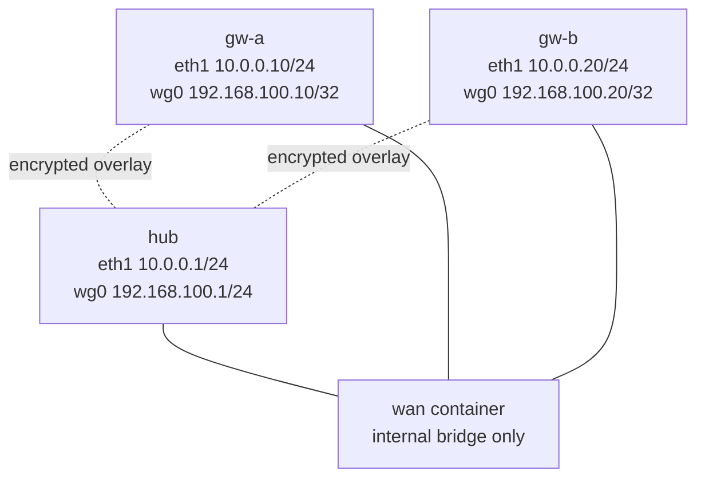

# WireGuard — Practice Lab

Build a three-node WireGuard hub-and-spoke overlay from an empty transport,
then prove how public-key identity, cryptokey routing, source authorization,
and encrypted UDP encapsulation fit together. The routing roles intentionally
use purpose-built Linux: the kernel WireGuard interface and `wg`/`wg-quick`
state are the native reference model being learned, not a substitute for a
router control plane.

## Topology



| Node | Image and role | Transport | Overlay target |
|------|----------------|-----------|----------------|
| `wan` | `ops-lab:local`; incidental Layer 2 segment | `br-wan` joins `eth1`–`eth3` | None |
| `hub` | `wireguard-lab:local`; forwarding hub | `eth1` `10.0.0.1/24` | `wg0` `192.168.100.1/24`, UDP/51820 |
| `gw-a` | `wireguard-lab:local`; spoke A | `eth1` `10.0.0.10/24` | `wg0` `192.168.100.10/32` |
| `gw-b` | `wireguard-lab:local`; spoke B | `eth1` `10.0.0.20/24` | `wg0` `192.168.100.20/32` |

| Link | Purpose |
|------|---------|
| `hub:eth1`—`wan:eth1` | Hub transport attachment |
| `gw-a:eth1`—`wan:eth2` | Spoke A transport attachment |
| `gw-b:eth1`—`wan:eth3` | Spoke B transport attachment |

## How to use this lab

This is a **practice lab**, not a tutorial. Each task gives you an
**objective** and **hints** — your job is to produce the configuration.

- **Predict before you configure.** When a task asks for a prediction,
  commit to an answer before touching the CLI. Being wrong and finding out
  why is the point.
- **Open the hints before the solution.** The solution toggle is the answer
  key — use it to check your work or when genuinely stuck, not as step one.
- **Verify like an operator.** After each task, prove the state is what you
  think it is with operational commands before moving on.

## Prerequisites and preconfigured state

Build the two repository-owned images:

```bash
docker build -t ops-lab:local images/ops-lab/
docker build -t wireguard-lab:local labs/wireguard/
```

`wireguard-lab:local` uses the digest-pinned Debian base and exact package
versions recorded in the lab Dockerfile. Its refresh record and scope are in
`VALIDATION.md`.

The topology preconfigures only the internal WAN segment, transport addresses,
IP forwarding, and private `/etc/wireguard` directories. It does **not** create
keys, `wg0`, peers, routes, or learned configuration. No host-root bridge is
required.

## Deploy

```bash
./scripts/lab.sh deploy wireguard
```

Prove the scaffold before adding an overlay:

```bash
docker exec clab-wireguard-gw-a ping -c 2 10.0.0.1
docker exec clab-wireguard-gw-b ping -c 2 10.0.0.10
docker exec clab-wireguard-wan ip -o link show master br-wan
```

The transport pings should succeed, and the final command should list the
WAN container's three data interfaces.

## Task 1 — Create and protect peer identities

**Objective:** Generate one private/public key pair on each WireGuard node,
leave private keys readable only by root, and collect only the three public
keys for peer enrollment.

**Predict first:** With no username, certificate authority, or negotiated
credential, what makes `gw-a` a distinct identity? What single enrollment
action revokes it?

<details markdown="1">
<summary>Hints</summary>

- `wg genkey` writes a private key; pipe that value to `wg pubkey` to derive
  the public half.
- Set a restrictive `umask` before creating either file.
- A public key is meant to be copied. A private key must never leave its node.

</details>

<details markdown="1">
<summary>Solution</summary>

```bash
for node in hub gw-a gw-b; do
  docker exec "clab-wireguard-${node}" sh -c \
    'umask 077; wg genkey | tee /etc/wireguard/private.key | wg pubkey > /etc/wireguard/public.key'
done

for node in hub gw-a gw-b; do
  printf '%s: ' "$node"
  docker exec "clab-wireguard-${node}" cat /etc/wireguard/public.key
done
```

</details>

<details markdown="1">
<summary>Check your work</summary>

```bash
for node in hub gw-a gw-b; do
  docker exec "clab-wireguard-${node}" \
    stat -c '%a %n' /etc/wireguard/private.key /etc/wireguard/public.key
done
```

Each mode should be `600`. A WireGuard peer is enrolled by its public key and
must prove possession of the corresponding private key. Removing that public
key from the other peer's configuration revokes the identity; there is no
separate account or certificate to disable.

</details>

## Task 2 — Derive and write all three peer configurations

**Objective:** Create a complete mode-`600` `/etc/wireguard/wg0.conf` on every
WireGuard node. The hub must listen for both spokes, and each spoke must send
the entire overlay through the hub without claiming another spoke's source
identity.

**Predict first:** For each peer relationship, list (1) the destination
prefixes that should select that peer for encryption and (2) the inner source
prefixes that peer should be authorized to send. Where should a host prefix be
used, and where should an aggregate be used?

<details markdown="1">
<summary>Hints</summary>

- An `[Interface]` holds the local private key and overlay address. Only the
  hub needs a fixed listen port in this design.
- A `[Peer]` holds the remote public key. `Endpoint` identifies the reachable
  outer address, while `AllowedIPs` describes inner prefix ownership.
- Work from both directions of each flow. A spoke reaches every overlay
  destination through one peer; the hub has a different peer for each spoke.
- `PersistentKeepalive` is useful for predictable idle-lab observations. It is
  operationally required when a peer must retain state in a NAT or firewall,
  not because that peer is generically a "client."
- To enter your own configuration without revealing an answer, use
  `docker exec -i clab-wireguard-NODE sh -c 'umask 077; cat > /etc/wireguard/wg0.conf'`
  and finish input with Ctrl-D.

</details>

<details markdown="1">
<summary>Solution</summary>

Collect only the public keys into host-shell variables:

```bash
hub_public="$(docker exec clab-wireguard-hub cat /etc/wireguard/public.key)"
gw_a_public="$(docker exec clab-wireguard-gw-a cat /etc/wireguard/public.key)"
gw_b_public="$(docker exec clab-wireguard-gw-b cat /etc/wireguard/public.key)"
```

Render the complete hub configuration inside the hub container. The hub's
private key is read only inside that container and the entire output group is
redirected to its local file:

```bash
docker exec \
  -e GW_A_PUBLIC="$gw_a_public" \
  -e GW_B_PUBLIC="$gw_b_public" \
  clab-wireguard-hub sh -c '
    set -eu
    umask 077
    {
      printf "%s\n" "[Interface]"
      printf "PrivateKey = "
      cat /etc/wireguard/private.key
      printf "%s\n" \
        "Address = 192.168.100.1/24" \
        "ListenPort = 51820" \
        "" \
        "[Peer]"
      printf "PublicKey = %s\n" "$GW_A_PUBLIC"
      printf "%s\n" \
        "AllowedIPs = 192.168.100.10/32" \
        "" \
        "[Peer]"
      printf "PublicKey = %s\n" "$GW_B_PUBLIC"
      printf "%s\n" "AllowedIPs = 192.168.100.20/32"
    } > /etc/wireguard/wg0.conf
    chmod 600 /etc/wireguard/wg0.conf
  '
```

Render the complete `gw-a` configuration by importing only the hub's public
key:

```bash
docker exec \
  -e HUB_PUBLIC="$hub_public" \
  clab-wireguard-gw-a sh -c '
    set -eu
    umask 077
    {
      printf "%s\n" "[Interface]"
      printf "PrivateKey = "
      cat /etc/wireguard/private.key
      printf "%s\n" \
        "Address = 192.168.100.10/32" \
        "" \
        "[Peer]"
      printf "PublicKey = %s\n" "$HUB_PUBLIC"
      printf "%s\n" \
        "Endpoint = 10.0.0.1:51820" \
        "AllowedIPs = 192.168.100.0/24" \
        "PersistentKeepalive = 25"
    } > /etc/wireguard/wg0.conf
    chmod 600 /etc/wireguard/wg0.conf
  '
```

Render the complete `gw-b` configuration the same way, with its own local
private key and address:

```bash
docker exec \
  -e HUB_PUBLIC="$hub_public" \
  clab-wireguard-gw-b sh -c '
    set -eu
    umask 077
    {
      printf "%s\n" "[Interface]"
      printf "PrivateKey = "
      cat /etc/wireguard/private.key
      printf "%s\n" \
        "Address = 192.168.100.20/32" \
        "" \
        "[Peer]"
      printf "PublicKey = %s\n" "$HUB_PUBLIC"
      printf "%s\n" \
        "Endpoint = 10.0.0.1:51820" \
        "AllowedIPs = 192.168.100.0/24" \
        "PersistentKeepalive = 25"
    } > /etc/wireguard/wg0.conf
    chmod 600 /etc/wireguard/wg0.conf
  '
```

</details>

<details markdown="1">
<summary>Check your work</summary>

```bash
for node in hub gw-a gw-b; do
  docker exec "clab-wireguard-${node}" test -s /etc/wireguard/wg0.conf
  docker exec "clab-wireguard-${node}" stat -c '%a %n' /etc/wireguard/wg0.conf
done
```

All three files should exist with mode `600`. Do not print them during normal
verification: each contains a private key. The prefix plan is asymmetric by
design. On the hub, each spoke owns only its one `/32`; on a spoke, the single
hub peer owns the overlay `/24` because that peer is the next encrypted hop for
both hub and remote-spoke destinations.

</details>

## Task 3 — Activate and observe the encrypted data path

**Objective:** Activate `wg0` on all three nodes, prove exact hub-to-spoke and
spoke-to-spoke reachability, and capture the simultaneous outer UDP traffic on
the WAN segment.

**Predict first:** Before sending a ping, which `latest handshake` and transfer
counter fields can remain empty or zero? After a `gw-a` to `gw-b` ping, which
hub peer counters must change, and why?

<details markdown="1">
<summary>Hints</summary>

- Bring the listener up before its peers with `wg-quick up wg0`.
- `wg show` exposes identity, endpoint, handshake time, allowed prefixes, and
  transfer counters without printing private keys.
- Start a bounded capture on the hub's outer `eth1` interface before
  generating traffic.
- Spoke-to-spoke traffic enters and exits the hub on `wg0`; the hub therefore
  needs IPv4 forwarding even though no physical forwarding interface changes.

</details>

<details markdown="1">
<summary>Solution</summary>

```bash
docker exec clab-wireguard-hub wg-quick up wg0
docker exec clab-wireguard-gw-a wg-quick up wg0
docker exec clab-wireguard-gw-b wg-quick up wg0

docker exec clab-wireguard-hub ping -c 3 192.168.100.10
docker exec clab-wireguard-hub ping -c 3 192.168.100.20
docker exec clab-wireguard-gw-a ping -c 3 192.168.100.1
docker exec clab-wireguard-gw-a ping -c 3 192.168.100.20
docker exec clab-wireguard-gw-b ping -c 3 192.168.100.10

docker exec clab-wireguard-hub wg show
```

Run the capture and a spoke-to-spoke probe concurrently:

```bash
docker exec clab-wireguard-hub \
  timeout 12 tcpdump -ni eth1 -c 8 udp port 51820 &
capture_pid=$!
sleep 1
docker exec clab-wireguard-gw-a ping -c 4 192.168.100.20
wait "$capture_pid" || true
```

</details>

<details markdown="1">
<summary>Check your work</summary>

All five overlay probes should succeed. `wg show` should report two hub peers,
one peer on each spoke, recent handshakes, and nonzero sent/received bytes.

The hub `eth1` capture should show only outer `10.0.0.x` addresses and
UDP/51820 WireGuard datagrams. It should not expose `192.168.100.x` inner
addresses or ICMP fields.
For `gw-a` to reach `gw-b`, the hub authenticates the decrypted inner source
against `gw-a`'s owned prefix, performs an IP forwarding lookup, selects
`gw-b` by its owned prefix, and encrypts a new outer datagram to that peer.

</details>

## Task 4 — Break-It: diagnose a selective overlay outage

**Objective:** Apply the bounded opaque scenario, localize the failure without
reading the script, repair only the faulty live state, and prove the full
overlay returns. Transport and peer identity are intentionally left intact.

**Predict first:** Can a peer show a recent authenticated handshake while its
inner data is still discarded? Which observations separate transport failure,
key mismatch, route selection, and post-decryption source authorization?

```bash
./labs/wireguard/break.sh
```

Start with this evidence ladder; do not inspect `break.sh`:

```bash
docker exec clab-wireguard-gw-a ping -c 2 10.0.0.1
docker exec clab-wireguard-gw-a ping -c 2 192.168.100.1
docker exec clab-wireguard-hub ping -c 2 192.168.100.10
docker exec clab-wireguard-hub wg show wg0
docker exec clab-wireguard-hub ip route get 192.168.100.10
```

<details markdown="1">
<summary>Hints</summary>

- If the WAN ping succeeds, keep the transport below WireGuard out of the
  suspect set.
- A current handshake proves that the configured public/private key pair can
  authenticate; it does not prove authorization for every inner address.
- Compare `wg show wg0 allowed-ips` with the intended one-peer-per-spoke prefix
  ownership. Treat that output as both a cryptokey-routing table and an inbound
  source-authorization table.
- The interface's connected `/24` route may remain present even when no peer
  owns a particular destination. A route to `wg0` and a peer selection inside
  WireGuard are separate decisions.

</details>

<details markdown="1">
<summary>Solution</summary>

The fault changes only the hub's live prefix ownership for the `gw-a` public
key. Restore that peer's ownership to `192.168.100.10/32`:

```bash
gw_a_key="$(docker exec clab-wireguard-gw-a wg show wg0 public-key)"
docker exec clab-wireguard-hub \
  wg set wg0 peer "$gw_a_key" allowed-ips 192.168.100.10/32
```

The repository repair applies the same minimal change and bounded
postconditions. It is safe to run twice:

```bash
./labs/wireguard/solution.sh
```

</details>

<details markdown="1">
<summary>Check your work</summary>

```bash
./scripts/lab.sh check wireguard
```

The checker should return zero failures. The mechanism is more precise than
"a WireGuard route was wrong": `AllowedIPs` selects an outbound peer for a
destination and validates the decrypted inner source received from that peer.
The hub's connected `192.168.100.0/24` route can still point at `wg0` while no
peer owns `.10`, so the packet can reach the interface and still have no valid
cryptographic next hop. A valid handshake survives because public-key identity
did not change.

WireGuard also does not authorize two peers when ownership overlaps. Assigning
the same prefix to another peer transfers that prefix to the most recently
configured peer; lookup selects one peer rather than granting both peers the
same identity boundary.

The intended broken-state checker contract is narrow and stable: 25 assertions
remain green, while only `hub exact spoke prefix ownership`,
`hub-to-spoke overlay paths`, `spoke-to-hub overlay paths`, and
`forwarded spoke-to-spoke overlay paths` fail. If transport, identities,
interfaces, handshakes, or transfer counters also fail, the lab has drifted
beyond the bounded scenario.

</details>

## Verification

Run the end-state checker from the repository root:

```bash
./scripts/lab.sh check wireguard
```

It verifies the exact four-container/image inventory, WAN bridge and addresses,
key relationships, interface state, listen port, endpoints, peer-prefix
ownership, routes, recent handshakes, transfer counters, hub forwarding, and
all required tunnel paths in 29 stable assertions. It seeds only bounded ICMP
traffic and does not rewrite learner configuration. Each node's continuity
assertion also requires nonempty mode-`600` key/configuration files, derives the
stored identity from the private key, and loads the full `wg-quick` WireGuard
portion into a uniquely named temporary interface. A cleanup trap removes that
interface on success or failure; only its derived public key is compared with
the stored and live identities, so no private or stripped configuration data is
printed.

## Challenge questions

1. Put `gw-a` behind a stateful NAT while leaving `gw-b` directly reachable.
   Where is `PersistentKeepalive` required, what state does it preserve, and
   what observable behavior changes after that state expires?
2. Replace the hub-and-spoke data path with direct `gw-a`–`gw-b` encryption.
   Derive every changed peer, endpoint, and prefix-ownership entry, then explain
   the operational scaling cost.
3. Design two sites that each use the same inner subnet. Why can overlapping
   peer ownership not express the desired policy, and what addressing or
   translation boundary would you add?
4. A peer has a current handshake, increasing receive bytes, and zero useful
   application replies. Rank the next three pieces of evidence you would
   collect and state what each could eliminate.

## Troubleshooting

| Symptom | Likely cause | Focused fix |
|---------|--------------|-------------|
| Deploy reports a missing local image | One of the repository-owned images was not built | Run both build commands from Prerequisites, then deploy again |
| WAN pings fail before `wg0` exists | Transport scaffold or WAN bridge is incomplete | Inspect `wan` bridge ports and each node's `eth1` address; redeploy if setup did not finish |
| `wg-quick up` reports an invalid key | A placeholder, public key, or damaged private key is in the wrong field | Regenerate only the affected key pair and update every peer that enrolls its public key |
| Handshake is absent and the hub `eth1` UDP capture is empty | Endpoint/listen port or outer reachability is wrong | Verify hub UDP/51820, spoke endpoint, and WAN reachability |
| Handshake is current but one inner address fails | Peer prefix ownership does not match intended sources/destinations | Compare `wg show ... allowed-ips` in both directions and restore the narrow ownership entry |
| Hub reaches both spokes but spokes cannot reach each other | Hub forwarding is disabled or a spoke aggregate is missing | Verify `net.ipv4.ip_forward=1` and the spoke's single hub peer owns the overlay aggregate |

## Cleanup

```bash
./scripts/lab.sh destroy wireguard
```

Keys and learner configuration live only inside the disposable lab containers.
Destroying the topology removes them.
