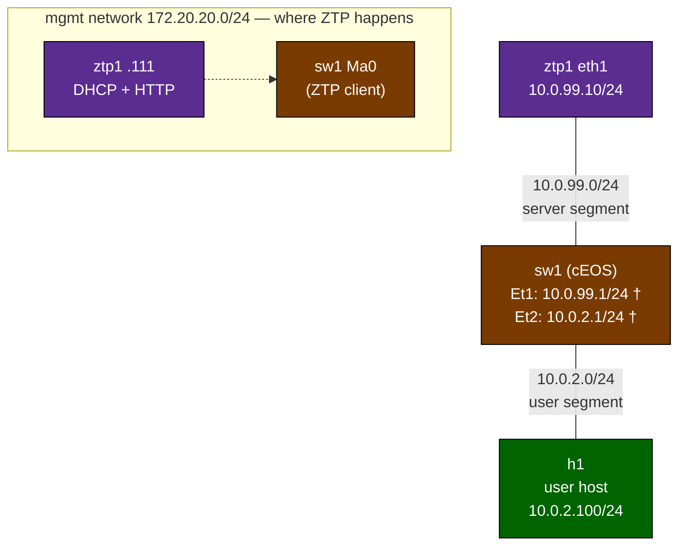

# Zero-Touch Provisioning — Practice Lab

Provision a switch **without touching it**. This is how enterprises
deploy access switches at scale: the box arrives, gets cabled and
powered, DHCPs, learns where its config lives from **DHCP option 67**,
fetches it over HTTP, applies it, and joins the network — no console
cable, no field engineer typing. You build the whole provisioning
service yourself (DHCP server, config repository, the day-0 config it
serves), then factory-reset a real cEOS switch and watch its native
ZTP do the rest. A broken service — the thing you'll actually debug in
production — is the finale.

## Topology

Provisioning rides the **management network**: the switch's ZTP client
DHCPs on every connected interface, but the DHCP server lives on the
OOB mgmt network — which is exactly how most real fleets do it (the
mgmt VLAN carries day-0; the config then brings up production ports).



† sw1's addresses are what ZTP will *install* — at deploy time the
switch has none of this.

### Addressing

| Network | Subnet | Who |
|---------|--------|-----|
| mgmt (provisioning) | 172.20.20.0/24 | ztp1 `.111`, sw1 Ma0 `.121` (post-ZTP static; ZTP lease from `.200–.240`), h1 `.131` |
| server segment | 10.0.99.0/24 | ztp1 eth1 `.10`, sw1 Et1 `.1` (post-ZTP) |
| user segment | 10.0.2.0/24 | sw1 Et2 `.1` (post-ZTP), h1 `.100` |

### Node reference

| Node | Role | State at deploy |
|------|------|-----------------|
| sw1  | cEOS switch | Throwaway "field tech" config (`hostname new-switch`, nothing else) — ZTP replaces it |
| ztp1 | Provisioning server | Addressed; **no services running** — you build DHCP + HTTP |
| h1   | User host | 10.0.2.100/24, default via 10.0.2.1 — dead until ZTP provisions its gateway |

## How to use this lab

This is a **practice lab**, not a tutorial. Each task gives you an
**objective** and **hints** — your job is to produce the configuration.

- **Predict before you configure.** When a task asks for a prediction,
  commit to an answer before touching the CLI. Being wrong and finding out
  why is the point.
- **Open the hints before the solution.** The solution toggle is the answer
  key — use it to check your work or when genuinely stuck, not as step one.
- **Verify like an operator.** After each task, prove the state is what you
  think it is with `show` commands before moving on.

## Deploy

Prerequisites: the cEOS image (`ceos:4.35.2F`, imported per
`docs/getting-started.md`) and `ops-lab:local`
(`docker build -t ops-lab:local images/ops-lab/`).

```bash
sudo containerlab deploy -t labs/ztp-basics/topology.clab.yml
# or: ./scripts/lab.sh deploy ztp-basics
```

Access:

```bash
docker exec -it clab-ztp-basics-sw1 Cli     # EOS CLI
./scripts/lab.sh bash ztp-basics ztp1        # server shell
```

Destroy when done:

```bash
sudo containerlab destroy -t labs/ztp-basics/topology.clab.yml --cleanup
```

---

## Task 1 — Understand why ZTP is *not* running (guided)

**Objective:** find what on sw1's flash is gating ZTP, and state the
gating rule.

```bash
docker exec clab-ztp-basics-sw1 Cli -c 'show hostname'
docker exec clab-ztp-basics-sw1 ls /mnt/flash/
```

**Predict first:** if everything that gates ZTP disappeared from flash
and the switch rebooted, what would it do?

<details>
<summary>Check your work</summary>

The hostname is `new-switch` — the throwaway config a field tech left
behind — and flash holds `startup-config`, which is that config. EOS's
gating rule: ZTP runs at boot **only when flash has neither a
`startup-config` nor a `zerotouch-config` file**. Any saved config
means "someone owns this box already"; `zerotouch-config` (containing
`DISABLE=True`) is the explicit opt-out — the raw cEOS image ships one,
which is why every cEOS lab in this repo has been silently skipping ZTP
(here containerlab assembled flash fresh from your `pre-ztp-config`, so
only the startup-config is doing the gating). Prediction's answer:
with the gate gone, the next boot enters ZTP mode — DHCP on its
interfaces, looking for option 67. Watch for `zerotouch-config` to
*reappear* later: EOS writes it back when ZTP completes, and this lab
uses that as the "done" marker.

</details>

## Task 2 — Build the DHCP half of the provisioning service

**Objective:** make ztp1 a working DHCP server for the mgmt
(provisioning) network that also carries **option 67 (bootfile-name)**
pointing at `http://172.20.20.111:8000/startup-config`.

Work inside ztp1 (`./scripts/lab.sh bash ztp-basics ztp1`). Your file
is `/etc/dnsmasq.conf` — a skeleton with the requirements is already
there.

**Predict first:** the option is called *bootfile*-name and dates from
netboot/TFTP days. What tells the switch to treat it as an HTTP URL
rather than a TFTP filename?

<details>
<summary>Hints</summary>

- `port=0` disables dnsmasq's DNS engine (DHCP only).
- `interface=eth0` + `bind-dynamic` scopes it to the mgmt network and
  survives interface churn (this lab reboots containers).
- Range: `dhcp-range=<from>,<to>,<netmask>,<lease>` — stay inside
  `172.20.20.200–240`, clear of containerlab's own assignments.
- The option line shape: `dhcp-option=option:bootfile-name,"<url>"`.
- Syntax-check with `dnsmasq --test`, then run it: `dnsmasq`
  (it daemonizes; logs to syslog — start it with
  `dnsmasq --log-facility=/var/log/dnsmasq.log` to get a file you can
  tail).

</details>

<details>
<summary>Solution</summary>

`/etc/dnsmasq.conf`:

```text
port=0
interface=eth0
bind-dynamic
dhcp-range=172.20.20.200,172.20.20.240,255.255.255.0,12h
dhcp-option=option:bootfile-name,"http://172.20.20.111:8000/startup-config"
log-dhcp
```

Then:

```bash
dnsmasq --test && dnsmasq --log-facility=/var/log/dnsmasq.log
```

</details>

<details>
<summary>Check your work</summary>

`dnsmasq --test` prints `syntax check OK`; `pgrep -a dnsmasq` shows it
running; `/var/log/dnsmasq.log` shows the DHCP range on eth0. Prediction: nothing in DHCP itself says "HTTP" — option 67 is
just a string. The *client* decides: EOS ZTP inspects the value and
treats anything that parses as a URL as a fetch target (http/https/ftp/
tftp), falling back to "filename on the DHCP-offered TFTP server"
otherwise. That convention is vendor firmware, not protocol — one
reason multi-vendor ZTP segments get messy.

</details>

## Task 3 — Author the config ZTP will deliver

**Objective:** write the complete day-0 configuration into
`/var/www/startup-config` on ztp1 and serve the directory over HTTP on
port 8000. Requirements (also in the skeleton): hostname `branch-sw1`
(*not* `sw1` — that's the container's default hostname, so it can't
prove anything), an admin user, a motd banner containing the line
`PROVISIONED-BY-ZTP`, Management0 static `172.20.20.121/24`, Ethernet1
routed with `10.0.99.1/24`, Ethernet2 routed with `10.0.2.1/24`, IP
routing enabled.

**Predict first:** during ZTP the switch holds a DHCP *lease* from your
pool (10.0.99.100–150), but the config you're serving pins Ethernet1 to
the static 10.0.99.1. What happens to the lease when your config
applies?

<details>
<summary>Hints</summary>

- This file lands verbatim as sw1's startup-config: it's ordinary EOS
  syntax. The repo's standing cEOS rules apply — `no aaa root`,
  `no switchport` on every routed port, `ip routing`.
- Banner syntax: `banner motd` on its own line, banner text, then `EOF`
  on its own line.
- User: `username admin privilege 15 secret <password>`.
- Serve it: `cd /var/www && python3 -m http.server 8000` (add
  `>/var/log/http.log 2>&1 &` so you can tail the access log later).
- Sanity check from ztp1 itself (alpine: `wget`, no curl):
  `wget -qO- http://172.20.20.111:8000/startup-config | head`.

</details>

<details>
<summary>Solution</summary>

`/var/www/startup-config`:

```text
no aaa root
!
hostname branch-sw1
!
username admin privilege 15 secret admin
!
banner motd
PROVISIONED-BY-ZTP
EOF
!
ip routing
!
interface Management0
 ip address 172.20.20.121/24
!
interface Ethernet1
 no switchport
 description to ztp1 (server segment)
 ip address 10.0.99.1/24
!
interface Ethernet2
 no switchport
 description to h1 (user segment)
 ip address 10.0.2.1/24
!
end
```

Then:

```bash
cd /var/www && nohup python3 -m http.server 8000 >/var/log/http.log 2>&1 &
wget -qO- http://172.20.20.111:8000/startup-config | head -3
```

</details>

<details>
<summary>Check your work</summary>

The `wget` returns your config's first lines — if ztp1 can't fetch it,
neither can the switch. Prediction: watch for it in Task 4 — the moment
the fetched config applies, EOS sends a **DHCPRELEASE** and the lease
vanishes; the DHCP identity was scaffolding, used only to *find* the
config. You'll see the release in `/var/log/dnsmasq.log`.

</details>

## Task 4 — Pull the trigger (guided)

**Objective:** factory-reset sw1 and watch ZTP provision it, end to
end, from the server's point of view.

From the repo root, in one terminal:

```bash
./labs/ztp-basics/reset-sw1.sh
```

In a second terminal, watch the service logs on ztp1:

```bash
docker exec clab-ztp-basics-ztp1 tail -f /var/log/dnsmasq.log /var/log/http.log
```

While it boots (~2–3 min), watch the switch's own view of the process:

```bash
docker exec clab-ztp-basics-sw1 Cli -c 'show zerotouch'
docker exec clab-ztp-basics-sw1 bash -c "grep ZTP- /var/log/messages | tail -5"
```

**Predict first:** the switch has three candidate interfaces
(Management0, Ethernet1, Ethernet2). Which will its DHCP request go
out of — and which will get the answer?

<details>
<summary>Check your work</summary>

`show zerotouch` reports `ZeroTouch Mode: Active`, and the EOS log
answers the prediction:
`%ZTP-6-DHCPv4_QUERY: Sending DHCPv4 request on
[ Ethernet1, Ethernet2, Management0 ]` — ZTP tries **every connected
interface**, exactly like hardware fresh from the loading dock. Only
Management0 gets an answer, because that's the network your DHCP
server lives on: in ZTP designs, *the server's placement* — not the
client — decides whether provisioning is front-panel or OOB. Every
~30 s a `%ZTP-6-RETRY` line marks a fresh cycle until one succeeds.
On ztp1, in order: `DHCPDISCOVER` → `DHCPOFFER` carrying
`option: 67 bootfile-name http://172.20.20.111:8000/startup-config` →
`DHCPACK`, then in the HTTP log `"GET /startup-config HTTP/1.1" 200`,
then the **DHCPRELEASE** you predicted in Task 3, then
`%ZTP-6-RELOAD` as EOS reboots itself (inside the container) into
your config. The reset script exits when EOS writes a fresh
`zerotouch-config` to flash — its own "ZTP done" marker. Total: ~3–5
minutes, zero commands typed on the switch.

</details>

## Task 5 — Verify like an operator

**Objective:** prove the switch is running *your* config and forwarding
traffic.

<details>
<summary>Hints</summary>

- Identity: `show hostname`, `show banner motd` (needs privileged mode:
  `Cli -p 15`).
- Data plane: the only path from h1 (10.0.2.100) to ztp1 (10.0.99.10)
  is *through* the routed config ZTP installed.
- The whole end state is scripted: `./labs/ztp-basics/check.sh`.

</details>

<details>
<summary>Check your work</summary>

`show hostname` → `branch-sw1`; the banner prints `PROVISIONED-BY-ZTP`;
from h1, `ping 10.0.99.10` succeeds — that ping enters Ethernet2, is
routed by config no human typed, and exits Ethernet1. `check.sh`
asserts all of it (8 checks). If the ping fails but identity checks pass, your
config is missing `ip routing` or a `no switchport` — which is why the
skeleton nagged you about them.

</details>

## Task 6 — Break it: the switch that never comes back

**Objective:** production reality — a typo'd provisioning service and a
switch stuck in ZTP. Sabotage option 67, reset, and diagnose from the
symptoms only.

On ztp1, change the option 67 URL to end in `/startup-config.cfg` (a
file that doesn't exist), restart dnsmasq
(`pkill dnsmasq && dnsmasq --log-facility=/var/log/dnsmasq.log`), then
run `./labs/ztp-basics/reset-sw1.sh` again.

Symptoms: the reset script's wait spins past the point where Task 4
finished; the switch CLI stays locked. Diagnose from ztp1's two logs,
state the exact failure, then fix the service **live** — without
another reset — and watch the switch recover on its own.

<details>
<summary>Hints</summary>

- Compare this run's log sequence with the healthy Task 4 sequence —
  which step repeats, and which never appears?
- The HTTP access log logs failures too. What status code does the
  switch keep getting?
- ZTP is a retry *loop*, not a one-shot: each cycle re-DHCPs. What does
  that mean for a fix you apply while the switch is still looping?

</details>

<details>
<summary>Check your work</summary>

The DHCP handshake completes every cycle (DISCOVER/OFFER/ACK with your
broken option 67), then the HTTP log shows
`"GET /startup-config.cfg HTTP/1.1" 404` — fetch fails, ZTP throws the
attempt away and loops back to DHCP a few minutes later. Fix
`/etc/dnsmasq.conf` back to `/startup-config`, restart dnsmasq, and do
nothing else: because each ZTP cycle re-DHCPs, the **next cycle picks
up the corrected option 67, fetches a 200, and provisions** — the
still-waiting reset script completes. This is the operational shape of
real ZTP outages: the switch is fine, un-loggable, and infinitely
patient; the fault and the fix both live on the service side.

</details>

---

## Verification

End state, all asserted by `./labs/ztp-basics/check.sh`:

- [ ] dnsmasq and the HTTP server are running on ztp1
- [ ] ztp1's HTTP log shows the switch's `GET /startup-config` → 200
- [ ] sw1's hostname is `branch-sw1` and its banner contains
      `PROVISIONED-BY-ZTP`
- [ ] sw1's flash has `startup-config` and `zerotouch-config` again
- [ ] h1 pings ztp1 *through* the provisioned switch

## Challenge questions

No answers provided — argue them from what you built.

1. You have 400 branch switches and one `/var/www/startup-config`.
   What's the first thing that breaks, and how would you serve
   per-device configs with only the tools in this lab (dnsmasq can
   match clients; HTTP servers can run scripts)? What device property
   would you key on?
2. During ZTP the switch trusts whichever DHCP server answers first.
   Sketch what a rogue DHCP server on the provisioning segment could
   do to a booting switch, and one mitigation at the network layer
   (this repo's `enterprise-access-security` lab has the building
   block) and one at the provisioning layer.
3. Option 67 can also deliver a *script* instead of a config. Name two
   provisioning jobs a flat config file cannot do, for which real
   deployments need the script (think: what must happen *before* the
   config applies on a switch fresh from the loading dock).
4. Mid-ZTP the CLI rejected you. Defend that design choice — then
   describe how you'd troubleshoot a ZTP-looping switch in a dark
   site where you *can't* read the DHCP server's logs.
5. ZTP got sw1 on the network with an admin user and two routed ports.
   The `automation-fundamentals` and `network-automation-netbox` labs
   configure devices *after* they're reachable. Where should the line
   between ZTP-owned config and automation-owned config sit, and what
   goes wrong when teams put everything in the ZTP payload?

## Troubleshooting

| Symptom | Cause | Fix |
|---------|-------|-----|
| No DHCPDISCOVER ever appears in dnsmasq.log after reset | dnsmasq bound to the wrong interface (ZTP happens on the **mgmt** network = eth0), or not running | `interface=eth0` + `bind-dynamic`; `pgrep dnsmasq` |
| dnsmasq log says `error binding DHCP socket` after a reset | `bind-interfaces` (exclusive bind) died when a veth flapped | Use `bind-dynamic`; restart dnsmasq |
| DISCOVER/OFFER loop but never an ACK-then-GET | option 67 missing or malformed, so ZTP has nowhere to fetch from | `dhcp-option=option:bootfile-name,"http://…"` exactly; `dnsmasq --test` |
| DHCP completes, HTTP log stays empty (macOS/Windows Docker Desktop) | EOS firewall agent's iptables commit fails on the linuxkit kernel; default-DROP eats the fetch | Use `reset-sw1.sh` (it re-opens the policies while waiting) rather than a bare `docker restart` |
| GET returns 404 | URL path and file name disagree | This is Task 6 — fix either side |
| ZTP finishes but h1 can't ping ztp1 | Served config missing `ip routing`/`no switchport` — or you restarted sw1 by hand and the data veths died with it | Fix `/var/www/startup-config` and re-run `reset-sw1.sh` (it re-plumbs the links) |
| `show hostname` says `sw1` and you conclude ZTP worked | `sw1` is the *container's* default hostname — it proves nothing | That's why the served config must set `branch-sw1`; check the banner too |

## Extensions

- Serve a *script* via option 67 instead of a config (EOS executes it):
  have it log the switch's serial number to your HTTP server before
  writing the config — the first step toward challenge question 1's
  per-device provisioning.
- Move dnsmasq's pool to a 2-address range and reset twice without
  waiting for the release — watch what lease exhaustion does to ZTP.
- Add option 42 (NTP) and option 6 (DNS) to the offer and check which
  ones EOS's ZTP actually consumes.
